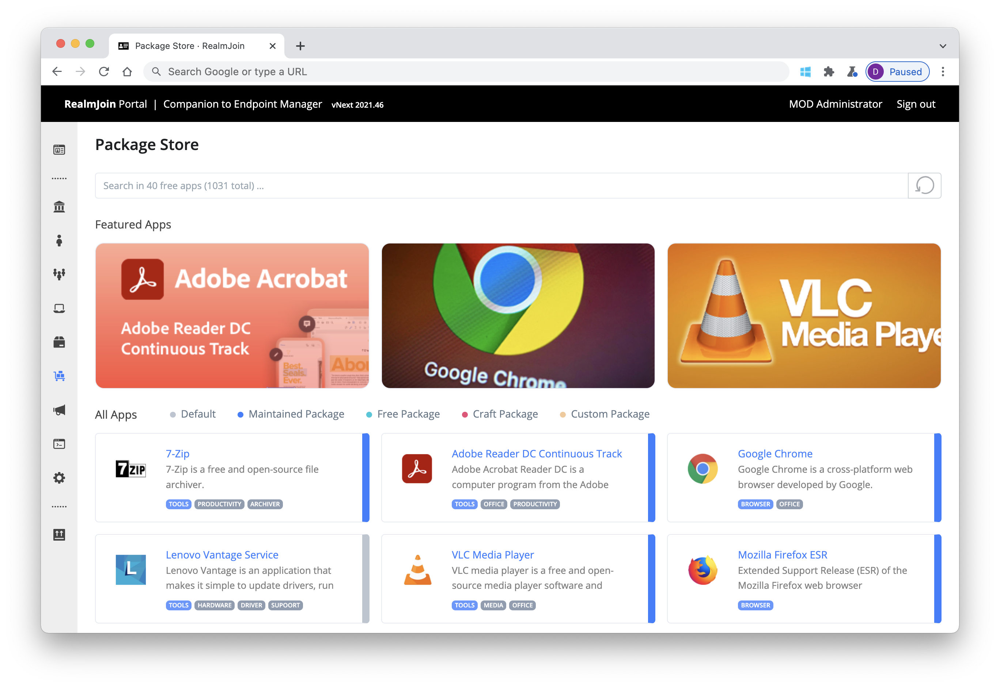

# Overview

RealmJoin is the perfect companion to Microsoft Endpoint Manager. Securely connect to the cloud and manage large Windows 10 ecosystems with software and policies as well as your [Azure AD](https://azure.microsoft.com/en-us/services/active-directory/) based user landscape - without any on premise servers or other local requirements. Manage devices and users no matter if work happens in corporate headquarter or at [Starbucks](https://www.starbucks.com).

Visit [RealmJoin Portal](https://portal.realmjoin.com) to onboard your organization and start your journey.

Additional Information at [www.realmjoin.com](http://realmjoin.com).

Searching the **RealmJoin Classic Documentation?** [Click here](https://docs-classic.realmjoin.com).

## Areas

RealmJoin offers functionality in the following key areas

[Application management](AppManagement/) - Integrates into MS Endpoint Manager and offer a ready to use catalogue of common software packages

[User, Group and Device management](user-group-device-management/) - Integrates into MS Azure AD and allows to interact with objects. + LAPS

[Process Automation](runbooks/) - Leverage Azure Automation to simplify everyday IT operations tasks

See [Navigation ](readme/navigation.md)for more help on how to find what you are looking for.
