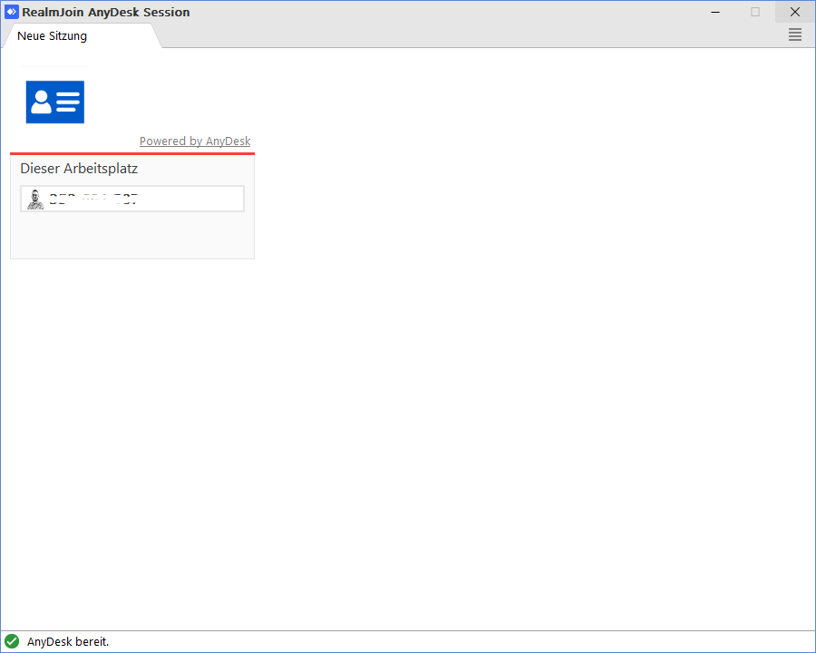

# AnyDesk - That´s how it works

RealmJoin contains the remote desktop tool **AnyDesk**. It allows the access to other computers. AnyDesk can be installed on Windows, macOS, Linux, mobile devices and Raspberry Pi as well.

AnyDesk uses ID numbers to establish connections between two computers. Share your ID number with an other user (this user needs AnyDesk as well). This user has to enter the ID number in the AnyDesk menu. When you accept the request, the other user will have access to your desktop.

You can also select different permissions which you give to the other (remote) user. For example, you can allow or block access to your monitor, to your sound or the control of your keyboard and/or your computer mouse.

## Start a remote session via RJ tray menu

| Task | Image |
| --- | --- |
| 1. Open the RealmJoin tray menu |  |
| 2. Click **Start remote session** | [](./media/anydesk1.png) |
| 3. **RealmJoin AnyDesk Session** menu appears | [](./media/anydesk2.png) |
| 4. Share the given number with the remote user | |
| 5. Finally accept the request | |


<!-- Wird noch ausgelagert auf eine eigene Seite und inhaltlich angepasst

## Install AnyDesk

1. [Download](https://anydesk.com/en/downloads) anydesk.exe
2. Start anydesk.exe
3. Get an AnyDesk-ID. See the following code sample:

```
@echo off
AnyDesk.exe
for /f "delims=" %%i in ('"AnyDesk.exe" --get-id') do set CID=%%i 
echo AnyDesk ID is: %CID%
pause
```

4. Send this AnyDesk-ID to backend (sync)
5. Initiate a LAPS-on-demand (sync)

## Configuration

The configuration of AnyDesk will be the following:

```
{
    "Integration": {
      "AnyDesk": {
        "Enabled": true,
        "BootstrapperUrl": "https://.../.../AnyDesk.exe",
        "UI": { // optional
           "TrayMenuTextEnglish": "Start remote session"
        }
     }
  }

}
```

In regular state it will be the following:

```
"Integration": {
  "AnyDesk": {
    "LastKnownID": "12345678"
  }
}
```
-->