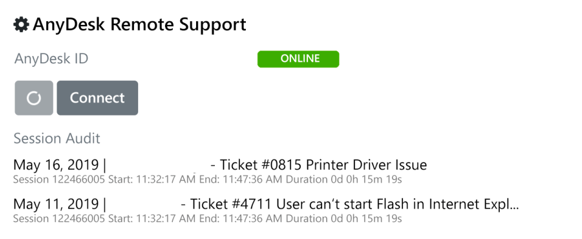
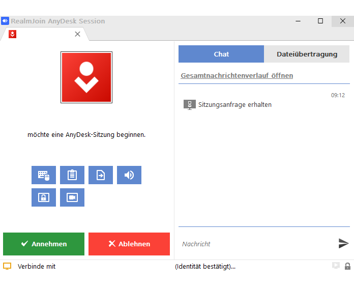

# AnyDesk - That's how it works

RealmJoin contains the remote desktop tool **AnyDesk**. It allows the access to other computers. AnyDesk can be installed on Windows, macOS, Linux, mobile devices and Raspberry Pi as well.

AnyDesk uses ID numbers to establish connections between two computers. Share your ID number with an other user (this user needs AnyDesk as well). This user has to enter the ID number in the AnyDesk menu. When you accept the request, the other user will have access to your desktop.

RealmJoin skips the whole ID number sharing process, because every AnyDesk ID numbers in an organization are linked to single users. An Administrator just needs to know the user and can request for access to the computer. Still the user has to accept this request.

As a user you can select different permissions which you give to other (remote) users. For example, you can allow or block access to your monitor, to your sound or the control of your keyboard and/or your computer mouse.

> [!IMPORTANT]
> When you use the AnyDesk feature (via RealmJoin), it is not possible to start a remote session with external AnyDesk users.

## Start a remote session via RJ tray menu

| Task | Image |
| --- | --- |
| 1. Open the RealmJoin tray menu |  |
| 2. Click **Start remote session** | [](./media/anydesk1.png) |
| 3. The AnyDesk client starts and its current address will be pushed to RealmJoin backend in background. In addition, its visible in the UI. | [](./media/anydesk2.png) |
| 4. This client address will be displayed in RealmJoin portal at the corresponding client and the support staff can initiate the session via clicking **Connect** | [](./media/anydesk3.png) |
| 5. This will automatically start the AnyDesk client | |
| 6. Subsequently, the end user needs to accept the incoming remote session request | [](./media/anydesk4.png) |
| 7. The Connection is established and the support staff can perform his tasks remotely |
| 8. When the job is finished, please **disconnect** from the remote session |

### Get elevated rights

For special support scenarios administrative rights will be needed. A normal remote session starts with standard rights. That requires to elevate the permissions:

| Task | Image |
| ---- | ----- |
| 1. Click the **lightning icon** | |
| 2. Select **Request elevation** | |
| 3. In the new appearing window (Request elevation) choose **Transmit authentication data** | |
| 4. Insert corresponding credentials | |
| 5. On the remote client, a new window **User Account Control** will appear | |
| 6. Confirm it | |
| 7. The support staff is now able to perform administrative tasks. | |


<!-- Wird noch ausgelagert auf eine eigene Seite und inhaltlich angepasst

## Install AnyDesk

1. [Download](https://anydesk.com/en/downloads) anydesk.exe
2. Start anydesk.exe
3. Get an AnyDesk-ID. See the following code sample:

```
@echo off
AnyDesk.exe
for /f "delims=" %%i in ('"AnyDesk.exe" --get-id') do set CID=%%i 
echo AnyDesk ID is: %CID%
pause
```

4. Send this AnyDesk-ID to backend (sync)
5. Initiate a LAPS-on-demand (sync)

## Configuration

The configuration of AnyDesk will be the following:

```
{
    "Integration": {
      "AnyDesk": {
        "Enabled": true,
        "BootstrapperUrl": "https://.../.../AnyDesk.exe",
        "UI": { // optional
           "TrayMenuTextEnglish": "Start remote session"
        }
     }
  }

}
```

In regular state it will be the following:

```
"Integration": {
  "AnyDesk": {
    "LastKnownID": "12345678"
  }
}
```
-->
