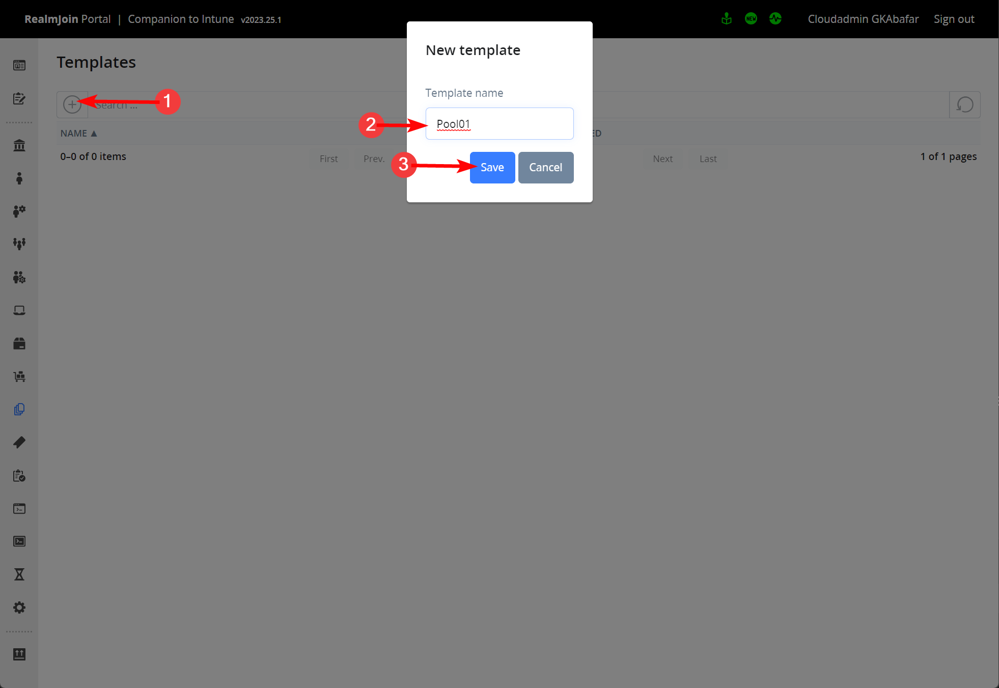
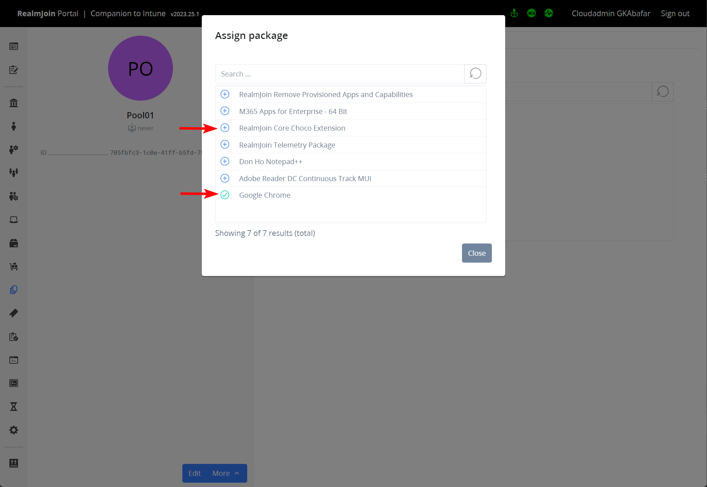

# AVD Templates

## Overview

Using this feature you can define a set (aka template) of applications. This set of applications can then be applied to a computer in a headless / unattended fashion using RealmJoin Client.

This is intended for creating golden images for Azure Virtual Desktop multi-session pooled hosts.

## Permissions

To enable the feature, you must define a [custom role](../realmjoin-settings/custom-roles/) and assign the role to a group or user.

Copy the following definition and make sure to change the GroupID accordingly.

```json
{
  "Rules": [
    {
      "Name": "Allow admins to access the templating feature",
      "Groups": [
        "<Group ID of Admin Group>"
      ],
      "Permissions": [
        "CanReadTemplateTable",
        "CanReadTemplateDetails",
        "CanEditTemplate",
        "CanDeleteTemplate",
        "CanChangeTemplatePackages",
        "CanChangeTemplateTokens"
      ]
    }
  ]
}
```

## Managing templates

### Creating a template

1. Click on the "templates" icon or open the Templates section by entering the url: [https://portal.realmjoin.com/templates](https://portal.realmjoin.com/templates)

<figure><figcaption><p>Templates List</p></figcaption></figure>

2. Select the  icon (1), enter a meaningful name (2) and Click "Save" (3).&#x20;

<figure><figcaption><p>Create a template</p></figcaption></figure>

### Add Applications to a Template

1. Open the template by clicking on its name.
2. To add packages to the template, click the  icon.&#x20;

<figure><figcaption><p>Add packages to a template - 1</p></figcaption></figure>

3. Search for a package and hit the .png>) icon to add it to your template. The list represents all RealmJoin packages you have subscribed to in your environment.
4. Once you are done, click the **Close** button.

<figure><figcaption><p>Add packages to a template - 2</p></figcaption></figure>


Intune Packages can not be assigned using AVD templates.


### Remove Applications from a Template

1. Open the template by clicking on its name.
2. If you want to remove applications, click on **Unassign**. If you want to define arguments overwriting those set on the package level, you can do so by clicking on **Settings**.&#x20;

<figure><figcaption><p>Remote packages from a template</p></figcaption></figure>

### Create a Token

To use the template via RealmJoin Client, you also need a token.&#x20;


Please handle the token with care. If you think the token might have been leaked, revoke it by hitting the **Revoke** button next to the token.&#x20;


1. Create a token, click on the **Tokens** tab.
2. Click the  icon (1), enter a meaningful name (2) and click **Save** (3).&#x20;

<figure><figcaption><p>Create a token</p></figcaption></figure>

## Using a Template&#x20;

### AVD / Headless Provisioning

Collect the template ID and the token you want to use for deployment.

<figure><figcaption><p>Find template ID and token</p></figcaption></figure>

Run the following command from inside your system/VM you want to prepare as golden image:

1. Download RealmJoin: `Invoke-WebRequest -Uri "https://gkrealmjoin.s3.amazonaws.com/win-release/RealmJoin.exe" -OutFile "C:\temp\RealmJoin.exe"`
2. Install RealmJoin: `Start-Process -FilePath "C:\temp\RealmJoin.exe" -ArgumentList "-install" -Wait`
3. Run headless deployment. Make sure to enter your individual template ID and token: `Start-Process -FilePath "C:\Program Files\RealmJoin\RealmJoinService.exe" -ArgumentList " -avdprovision <Template ID> <Template Token>"`

### Logging and Traces

For both, RealmJoin installation and headless deployment, you can add an additional argument `-trace` to extend logging. To check the status/logs during headless deployment, open and periodically refresh realmjoin.log which can be found under `C:\Windows\Logs\`
