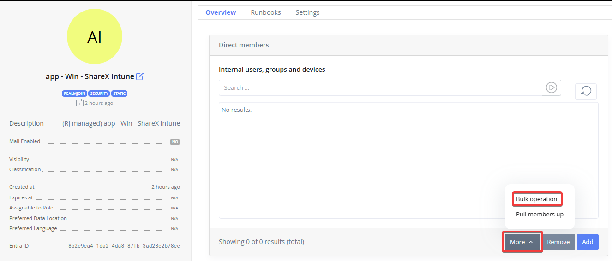
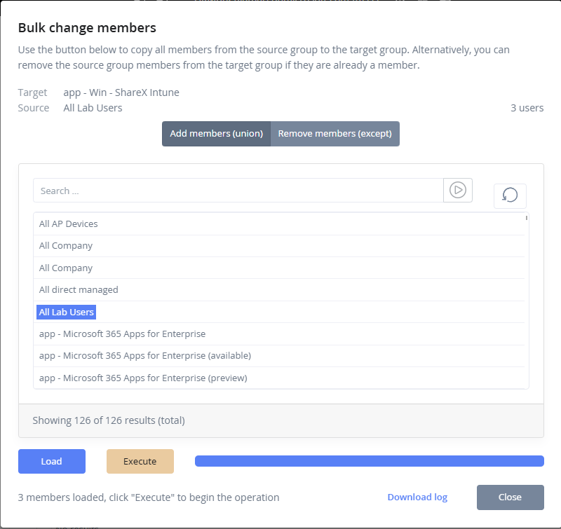
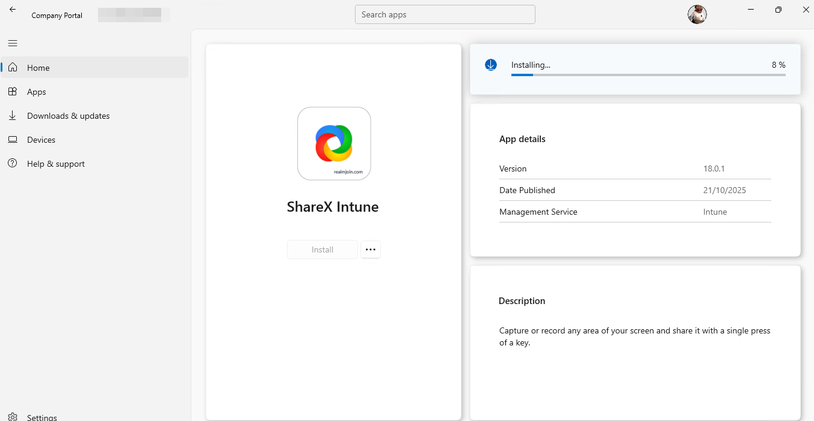
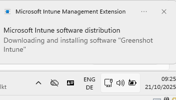

# Migration Guide: RealmJoin to Intune Managed Packages

### Important Strategic Recommendation

**We currently recommend continuing to use RealmJoin managed packages instead of transitioning to Intune managed packages.** The RealmJoin agent provides significantly more features and greater flexibility for package management. Additionally, we highly recommend against running both RealmJoin and Intune managed packages in parallel for the same package or package family. Strategically, your organization should standardize on a single management mechanism across your environment to ensure consistency, reduce complexity, and avoid conflicts.

This migration guide is provided for organizations that have made the strategic decision to transition to Intune managed packages. Please thoroughly evaluate your requirements and consult with your RealmJoin solution architect before proceeding with this migration.

### Key Concept

Detection fingerprints remain consistent throughout the migration process. This means that Intune managed packages will recognize and properly handle devices that previously had RealmJoin managed package instances installed, ensuring continuity of deployment and inventory tracking.

### Migration Process

#### Step 1: Rename the RealmJoin Managed Package

Begin by renaming the existing RealmJoin managed package to free up the package name for reuse. This step is essential as Intune managed packages will use the same or similar naming convention.

**Actions:**

* Access the RealmJoin management portal
* Locate the package in the package management section
* Rename the package with a deprecation indicator (for example, append "\_legacy" or "\_deprecated" to the original name)
* Document the new name for reference

#### Step 2: Subscribe to the Intune Managed Package

After the RealmJoin package has been renamed, proceed with subscribing to the equivalent Intune managed package.

**Actions:**

* Navigate to the RealmJoin store
* Locate and select the package you wish to migrate to
* Complete the subscription process as Intune managed
* Verify that the package is properly registered in your Intune environment

**Note:** Use the original package name (now available after renaming the legacy package) to maintain consistency in your package naming schema.

#### Step 3: Transfer Users Using Bulk Operations (optional)

Transfer users from the RealmJoin managed package to the Intune managed package using the bulk operation function available in RealmJoin.&#x20;

**Actions:**

* Access the managed groups of the Intune package
* Under the _More_ section, select _Bulk Operations_
* Execute the bulk reassignment to the new Intune managed package
* Monitor the operation progress and verify successful transfers

<figure><figcaption>
Selecting the bulk operation feature to copy all users from a existing group
</figcaption></figure> <figure><figcaption>
Execution of the bulk operation. Users are added to the new group, a log is available for your reference.
</figcaption></figure>

### Detection Fingerprint Consistency

An important advantage of this migration approach is that detection fingerprints remain unchanged. The same fingerprint configuration used by the RealmJoin managed package will function seamlessly with the Intune managed package.

**Implications:**

* No need to reconfigure detection rules or fingerprints
* Existing inventory and deployment history remains valid
* Devices that previously received the RealmJoin package version will be correctly identified when transitioning to the Intune version
* Audit trails and compliance reporting remain accurate across the transition

### Post-Migration Verification

After completing the migration, perform the following verification steps:

* Verify all users have been successfully transferred to the Intune managed package
* Confirm that package detection is functioning correctly on client devices
* Check that no users remain assigned to the legacy RealmJoin package
* Review deployment status and ensure packages are installing correctly
* Validate that inventory and reporting data reflects the new Intune managed package

<figure><figcaption>
Available package is installed / updated via the company portal.
</figcaption></figure>

<figure><figcaption>
Mandatory assigned Intune package is updated. 
</figcaption></figure>

### Rollback Considerations

Should issues arise during migration:

* Retain the renamed RealmJoin package for a minimum grace period to enable potential rollback
* Document all migration steps and timestamps for troubleshooting
* Have a clear rollback procedure in place before beginning the migration
* Test rollback procedures in a non-production environment first
* Provide all information including full log files in any support ticket

