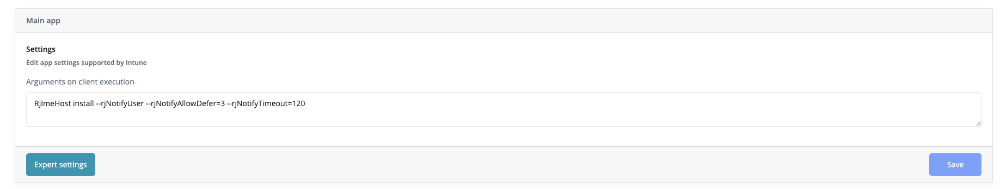
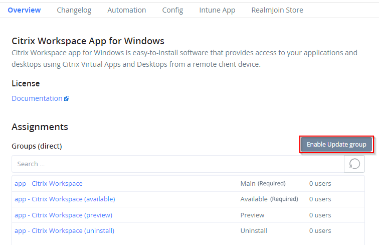
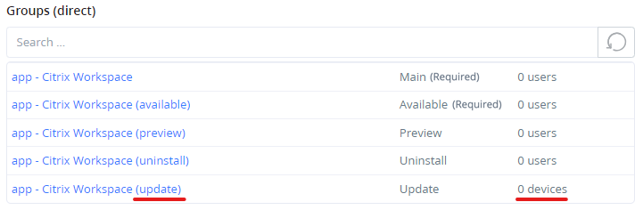

# Package Assignments



## Subscription

On the Overview Tab of a package, you will find buttons, that allow you to import the package from the store into your environment.

<figure><figcaption>
Subscribe Buttons
</figcaption></figure>

They will create a Win32 software package in Intune when pressed. You have two options:

### Managed Deployment

When a Managed packed is chosen, RealmJoin will create Microsoft Entra groups to assign the application to users. These groups can be managed from both the RealmJoin Portal and Microsoft Entra ID. Managed deployment will automatically create four RealmJoin-managed groups:

<figure><figcaption>
Application Groups
</figcaption></figure>

The created Entra ID groups can be managed from both the RealmJoin Portal and Microsoft Entra ID.&#x20;

#### **Main (Blank)**

RealmJoin or Intune will automatically install the application. These applications are mandatory and RealmJoin/Intune will continually attempt to install the application if not found on the device.

#### **Available**



The application will appear in the RealmJoin Agent tray and will require the user to initiate the download and installation

<figure><figcaption></figcaption></figure>



The application will appear in Company Portal -> Apps and will require the user to initiate the download and installation

<figure><figcaption></figcaption></figure>



#### Preview

Users and devices in the Preview group will receive the latest version of the package before the other groups. Preview settings are configurable through the [Automation tab](package-details.md#automation).

#### Uninstall

RealmJoin or Intune will uninstall the package from the assigned users and devices. Adding a user or device to the Uninstall group will remove them from all other groups.

#### Update

Additionally, RealmJoin provides an Update group that is created on demand. The Update group will automatically onboard loose installations of a software title into management.

Click **Enable Update Group** and a new EntraID Group with the suffix "(update)" will be created and software installations also assigned to this group. RealmJoin will dynamically discover installed copies of the software that are unmanaged and add the device it has been discovered on to the update group.

<figure><figcaption>
Enable an Update Group
</figcaption></figure>

Thus, new version of this software will also be installed on these devices to assert deployment of security patches across your environment.

<figure><figcaption>
Update Group Enabled
</figcaption></figure>


Managed packages are the preferred way to deploy software to your users. You can combine it with automated package updates and ensure your users receive latest features and patches.


#### Changing Assignments


Users and devices should only be in one RealmJoin managed group at any given time.


Users and devices can easily be moved across groups using the Managed Users function.

<figure><figcaption></figcaption></figure>

Selecting Main, Preview, Available and Uninstall will add the user to the chosen group and remove the user from all other groups relevant to the package.

Selecting Assign will add users to the Main group by default.

### Basic

Basic packages do not have any associated Microsoft Entra groups. You will have to manually assign groups, devices or users.

Groups, devices and users that are assigned to a Basic package will have their assigned package deployed as soon as possible.

