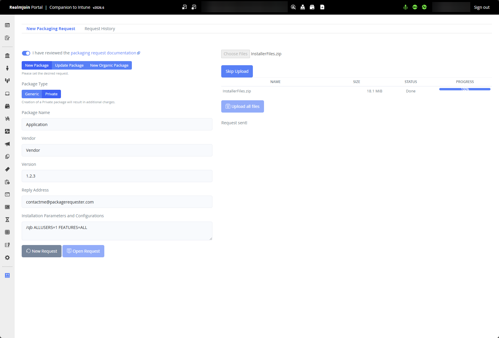
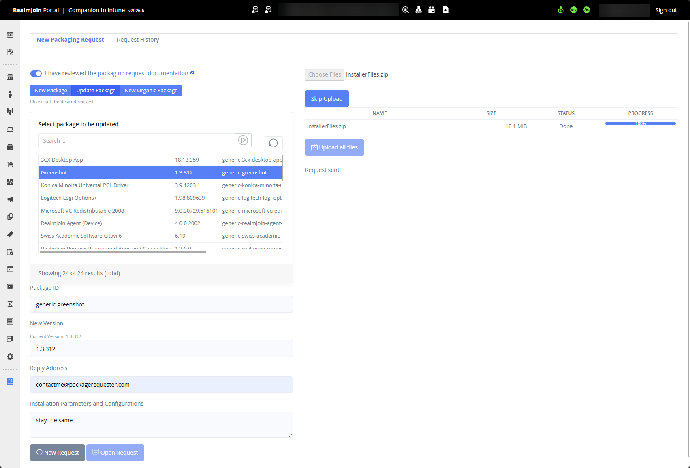

# Packaging Requests

RealmJoin offers a Packaging-as-a-Services (PACKaaS) if application packages are required, that are not already available in the RJ store, or are outdated. This section shall give a comprehensive overview over different scenarios. For more detailed information get in touch with your RealmJoin consultant/partner/support.&#x20;

## Architecture (Win11 & macOS)

The glueckkanja Packaging Factory is currently optimized for Windows 11 application requests, providing comprehensive support and reliable packaging services for the Windows ecosystem. We are actively developing full macOS integration, which will significantly expand our capabilities and introduce hundreds of ready-to-use applications in the RealmJoin store, creating a more comprehensive cross-platform experience for our users.

While macOS packages remain in preview status as we continue to refine our macOS packaging pipeline, we accept macOS application requests on a best-effort basis. Our team will work diligently to accommodate these requests within our current development framework, though please note that processing times and availability may vary as we continue to enhance our macOS integration capabilities.

We appreciate your patience as we work toward delivering the same level of excellence for macOS that our Windows 11 users currently enjoy.

## Request Types

Three different PACKaaS requests are currently available: new package, update existing package and [organic packages](organic-packages.md).&#x20;

### Private vs. generic packaging

#### Generic Packages in RealmJoin

We aim to create packages as **generic** as possible. This allows all settings to be configured via the RealmJoin portal post-app subscription. Our **generic** packages feature unmodified installers provided by vendors, without any customer-specific alterations. These packages are accessible to all customers in the RealmJoin store.

#### Private Packages in RealmJoin

**Custom** packages are exclusively available for customers in their **custom** section of the RealmJoin store. The **custom** namespaces are used for modified installers, including those customized by the vendor for the customer, such as SAP, or for customer-developed apps and similar cases.

We invite customers to share their evaluation on whether an application can be packaged as _generic_ or requires a _custom_ package. However, the final decision is made by the glueckkanja Packaging Factory. Note that _private_ packages incur additional costs.

### New Packages

If an application is not available in the RealmJoin Store, it can be requested for packaging via the RealmJoin Packaging Factory. A valid PACKaaS request must include:

* **Application binaries**, which must always be uploaded for regular packaging requests (a download URL may be added for reference but is **not** sufficient).
* **Documentation** describing all required configuration switches as command‑line parameters, registry keys, configuration files, or similar (screenshots are not accepted; PACKaaS does not include Scripting‑as‑a‑Service).
* **Packaging type selection**, specifying whether the application should be created as a _generic_ package (when no customer‑specific data is included) or as a _private/custom_ package (additional fees may apply). The Packaging Factory may change a request from generic to private if justified; for example, when customer‑specific details are identified during processing. Customers will be informed of such changes before the request is completed.
* **A contact email address**, which may differ from the currently authenticated user’s email.
* **Installation parameters**, which may be entered directly in the request instead of embedding them in the ZIP file.
* **Use of “skip upload”**, which is allowed only when updating or adding parameters to an existing package—binaries must still be provided for all standard packaging requests.

<figure><figcaption>
RealmJoin packaging request form for new requests. 
</figcaption></figure>

### Package Updates

If an application is required in a newer version than the one available in the RealmJoin Store, the same processes and requirements apply as for new package requests. When the updated binary behaves identically to the existing version, command‑line parameters may be omitted from the request. A dropdown list is available showing all packages currently subscribed to within the tenant, and update requests can only be submitted for those subscribed packages.

<figure><figcaption>
RealmJoin package request form for package updates.
</figcaption></figure>


Note: Additional switches, new parameters or configuration files for an existing package are considered updates and shall be requested the identical way.



Tickets, Files and Setup

Please note that:

* all update and new package requests necessitate the provision of both binaries and documentation detailing the required command line parameters.
* if an update request does not entail changes from the previous version, the submission of new parameters is not required.&#x20;
* the request creates a ticket. All communication will be handled in this ticket, and it will only be sent to the account that created it. If this account does not have any active mailbox, the requester will not get any information.&#x20;
* the software requester role can be assigned to any user group in the tenant, therefore, an ADM account may not be required.&#x20;
* organic packages and PACKaaS might be not available right away, please get in touch with support@realmjoin.com if a feature is missing


