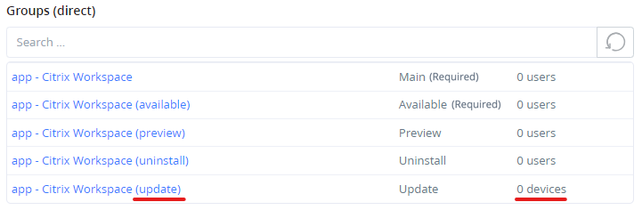

# Update Group

Managed apps deployed via Intune as **Available** are installed on demand by users from the Company Portal. Intune does not push newer versions to devices that already have such an app installed — an **Available** assignment only ever offers the *current* version to devices that do not have the app yet. As a result, Available‑deployed apps are **not kept up to date natively**.

The optional **Update Group** closes this gap. When enabled per package, RealmJoin detects existing installations and temporarily brings them up to date by assigning the affected devices as **Required (Mandatory)** — without changing the package's normal **Available** assignment.


The Update Group can be enabled for both Intune‑managed and RealmJoin Agent‑managed packages. It is most relevant for **Intune Available** apps, since the RealmJoin Agent already keeps Available packages up to date on its own (see [Auto upgrade](package-settings.md#expert-settings)).


## How it works



### Enable the Update Group per package

On the package's detail page, choose **More → Enable update group** (see [Enable additional and restore default groups](package-deployment.md#enable-additional-and-restore-default-groups)). RealmJoin creates a dedicated Entra ID group with the `(update)` suffix and assigns it to the app with the **Required** install intent. The group is managed entirely by the RealmJoin Portal and must not be edited manually.



### RealmJoin detects outdated installations

Using Intune reporting ("detected apps") data across the tenant, RealmJoin identifies every device that has the software installed at a version *older* than the latest subscribed and assigned version in the package.



### Outdated devices are temporarily assigned as Required

Detected outdated devices are added to the Update Group. Because the group carries the **Required** intent, Intune installs the new version on those devices as a mandatory deployment — overriding the "Available, on demand" behavior just for the update.



### Devices are removed once up to date

On a later run, devices that report the current version (or are no longer detected as outdated) are removed from the Update Group. They revert to the package's normal **Available** assignment. Membership is reconciled automatically.



<figure><figcaption>
Update Group Enabled
</figcaption></figure>

## Requirements and scope

* The package must have a **newer version subscribed and assigned**. If no newer version exists, no device is considered outdated and nothing is assigned.
* Detection relies on Intune reporting data, so a device must have reported its installed apps to Intune to become eligible.
* By default the Update Group targets **all** reported devices in the tenant. To restrict this, assign the **"Eligible for Update Group"** permission to specific device groups in the portal settings. Once this permission is assigned to at least one group, the feature only processes devices within those groups.


The Update Group is a temporary, automated **Required** assignment used purely to carry updates. Devices move in and out of it automatically — do not add or remove members manually, and do not reuse the `(update)` group for other assignments.

