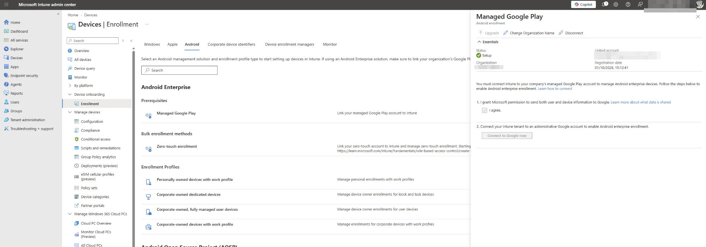
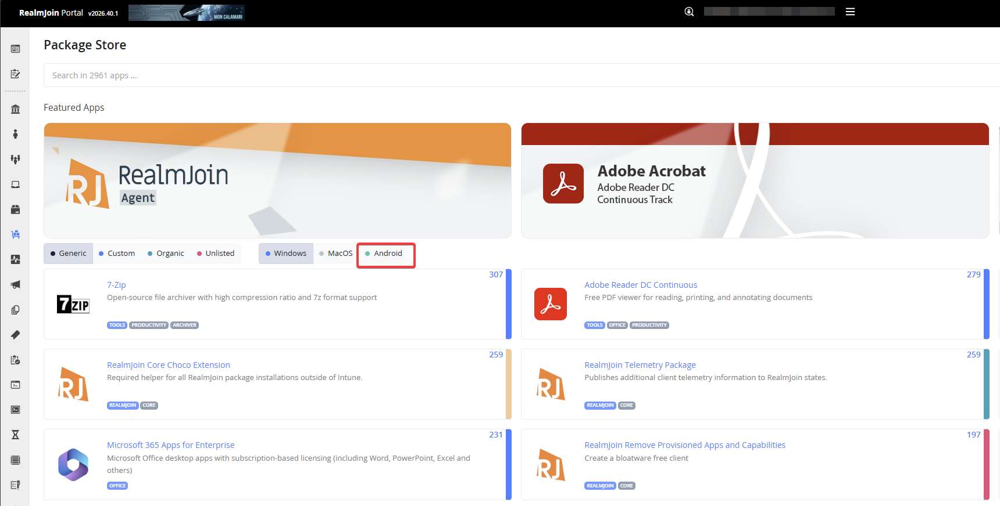
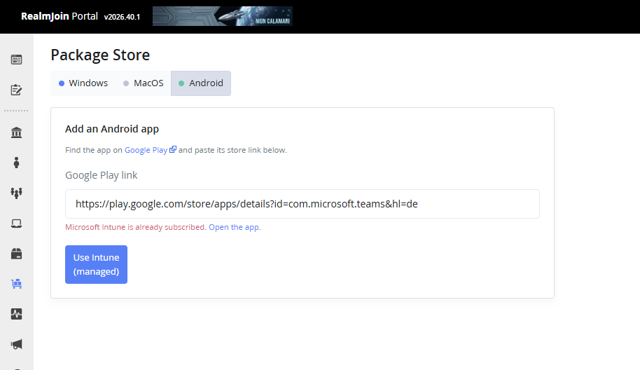
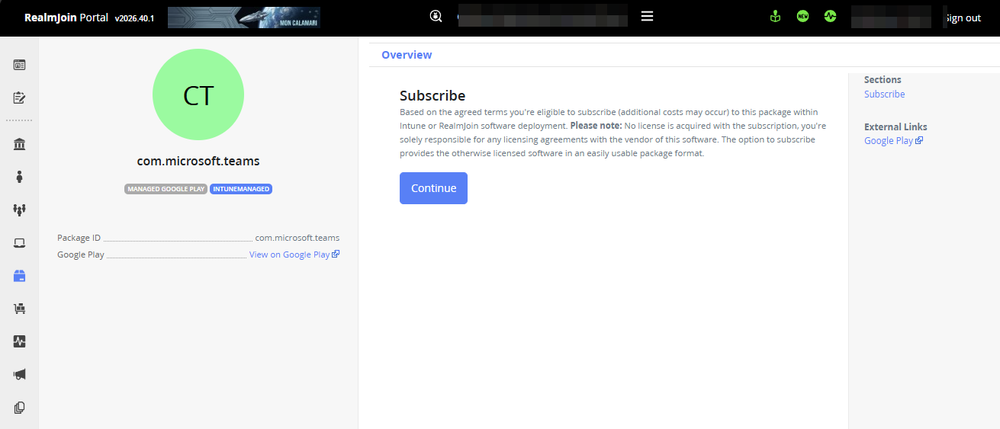
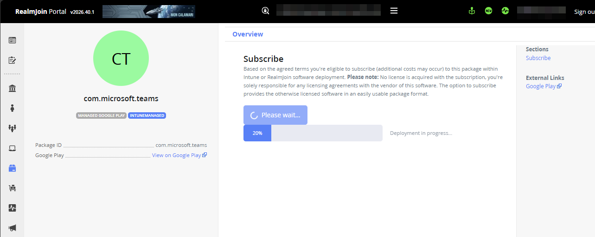
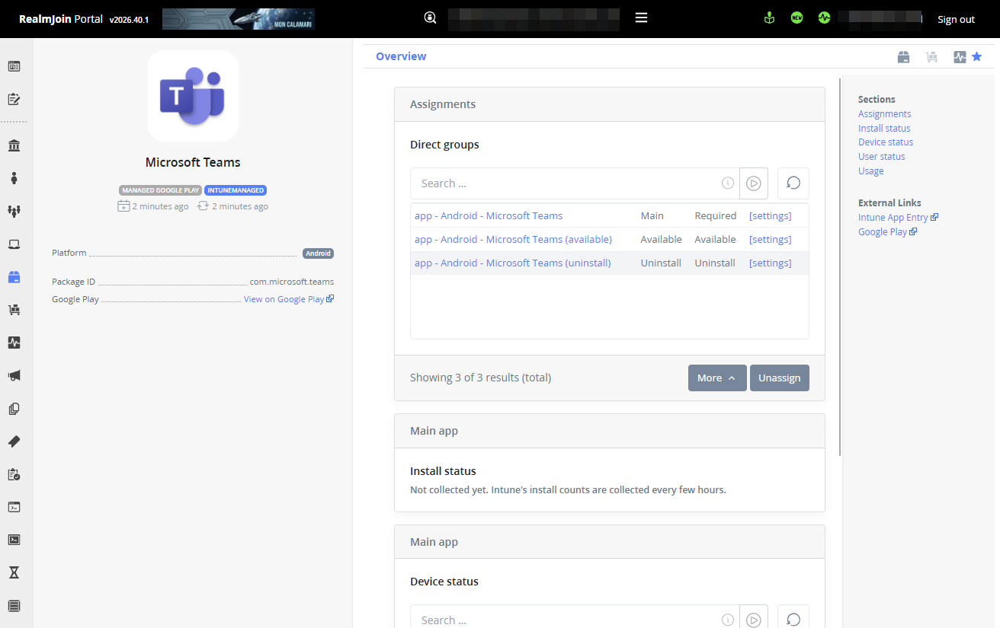
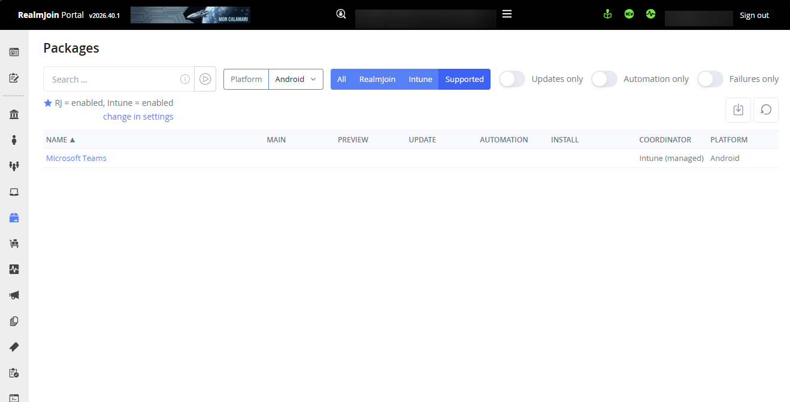

# Android Apps (Managed Google Play)

The RealmJoin Portal can add Android apps from **Managed Google Play** to your Intune tenant and deploy them with the same RealmJoin-managed groups you know from Windows and macOS packages.

Android apps work differently from the rest of the [Package Store](package-store/):

* There is **no RealmJoin catalogue** for Android. You pick any app on [Google Play](https://play.google.com/store/apps) and paste its store link.
* Apps are always deployed as **Intune managed** apps (Managed Google Play store apps). Deployment via the RealmJoin Agent is not available.
* **Google owns the version lifecycle.** Updates are delivered by Google Play, so there are no versions, no Preview group and no [Update Group](update-group.md) for Android apps.
* Name, icon and description come from Google Play and **cannot be changed** in the RealmJoin Portal.


This is the first iteration of Android app management in RealmJoin. Scope and handling may still change.


## Prerequisites

Complete all of the following **before** asking for the feature to be activated. RealmJoin checks the Managed Google Play connection when the feature is switched on and refuses activation if it is missing.



### Connect Intune to Managed Google Play

This is done once per tenant by an Intune Administrator or Global Administrator.

1. Open the [Microsoft Intune admin center](https://intune.microsoft.com).
2. Go to **Devices → Enrollment → Android → Prerequisites → Managed Google Play**.
3. Tick **I agree** and select **Connect to Google now**.
4. Sign in with the Google account that should own your Managed Google Play enterprise and complete the wizard.

<figure> Enrollment > Android in Intune"><figcaption><p>Managed Google Play under Devices → Enrollment → Android (connected, status Setup)</p></figcaption></figure>


**Tenant administration → Connectors and tokens → Managed Google Play** only shows the connection status and the scope tag for synced apps. It no longer offers the option to connect a Google account.


After connecting, the status shows **Setup** together with the linked account. On **Tenant administration → Connectors and tokens → Managed Google Play** the status must no longer show **Not provisioned**.

If you use a scope tag on that page, make sure the admins working with Android apps are assigned to it. Otherwise they cannot see the synced apps in Intune.



### Grant the Graph permission to the RealmJoin Portal

The RealmJoin Portal app needs the Microsoft Graph application permission **`DeviceManagementConfiguration.ReadWrite.All`**. It is used to read the Managed Google Play connection status and to approve and sync apps into your Managed Google Play enterprise.

This permission cannot be granted from the **Features** tab in the RealmJoin Portal yet. Run the following script instead. Replace `<YOUR-TENANT-ID>` with your Entra ID tenant ID.


```powershell
<#
.SYNOPSIS
    Grants the RealmJoin Portal app the Microsoft Graph application permission
    "DeviceManagementConfiguration.ReadWrite.All" (required for Android deployment via Managed Google Play).

.NOTES
    Run as Global Administrator or Privileged Role Administrator of the target tenant.
    Requires the Microsoft Graph PowerShell SDK:  Install-Module Microsoft.Graph -Scope CurrentUser
#>

$TenantId    = "<YOUR-TENANT-ID>"                         # e.g. 00000000-0000-0000-0000-000000000000
$PortalAppId = "b0130885-16be-4c6f-83de-5b1042b5d2e3"     # RealmJoin Portal
$GraphAppId  = "00000003-0000-0000-c000-000000000000"     # Microsoft Graph
$Permission  = "DeviceManagementConfiguration.ReadWrite.All"

Connect-MgGraph -TenantId $TenantId -Scopes "Application.Read.All", "AppRoleAssignment.ReadWrite.All" -NoWelcome

$portalSp = Get-MgServicePrincipal -Filter "appId eq '$PortalAppId'"
if (-not $portalSp) { throw "RealmJoin Portal service principal not found in tenant $TenantId. Onboard RealmJoin first." }

$graphSp = Get-MgServicePrincipal -Filter "appId eq '$GraphAppId'"
$appRole = $graphSp.AppRoles | Where-Object { $_.Value -eq $Permission -and $_.AllowedMemberTypes -contains "Application" }

$existing = Get-MgServicePrincipalAppRoleAssignment -ServicePrincipalId $portalSp.Id -All |
    Where-Object { $_.ResourceId -eq $graphSp.Id -and $_.AppRoleId -eq $appRole.Id }

if ($existing) {
    Write-Host "$Permission is already granted to RealmJoin Portal." -ForegroundColor Green
}
else {
    New-MgServicePrincipalAppRoleAssignment -ServicePrincipalId $portalSp.Id `
        -PrincipalId $portalSp.Id -ResourceId $graphSp.Id -AppRoleId $appRole.Id | Out-Null
    Write-Host "Granted $Permission to RealmJoin Portal." -ForegroundColor Green
}

Disconnect-MgGraph | Out-Null
```


The script can safely be run more than once; it does nothing if the permission is already granted. Allow a few minutes for the new permission to take effect.


The **Features** tab may offer to **downgrade** `DeviceManagementConfiguration.ReadWrite.All` to `DeviceManagementConfiguration.Read.All` because it is no longer needed for health scripts. If you use Android apps, **do not downgrade**. Android app deployment stops working without the write permission.




### Request activation

Android app deployment is a tenant feature that is activated by RealmJoin on request. Send a short request to [support@realmjoin.com](mailto:support@realmjoin.com) and include your tenant ID or name.

The feature requires **Intune deployment** to be active for your tenant as well.



## Add an Android app



### Open the Package Store and select Android

In the RealmJoin Portal, open the [Package Store](package-store/) and select **Android** in the OS filter. The filter only appears once the feature is activated.

<figure><figcaption><p>Android OS filter in the Package Store</p></figcaption></figure>



### Copy the app's Google Play link

Find the app on [Google Play](https://play.google.com/store/apps) and copy the link from the browser's address bar, for example for Microsoft Teams:

`https://play.google.com/store/apps/details?id=com.microsoft.teams`

Pasting only the package name (`com.microsoft.teams`) works as well.



### Paste the link and subscribe

Paste the link into the **Google Play link** field and select **Use Intune (managed)**. RealmJoin checks that the app exists on Google Play and that it is not already subscribed in your tenant, then opens the app's subscription page. Select **Continue** to start the subscription; there is nothing else to configure.

<figure><figcaption><p>Google Play link pasted. If the app already exists, the portal links to it instead</p></figcaption></figure>

<figure><figcaption><p>Subscription page of a Managed Google Play app</p></figcaption></figure>



### Wait for the subscription to finish

RealmJoin now processes the subscription in the background and shows its progress:

1. The app is approved in your Managed Google Play enterprise and an Intune sync is started.
2. RealmJoin waits until the app appears in Intune. This can take a few minutes.
3. The deployment groups are created and assigned to the app.

<figure><figcaption><p>Subscription in progress</p></figcaption></figure>

When it is done, the app page shows the created groups and assignments.

<figure><figcaption><p>Subscribed app with its RealmJoin-managed groups</p></figcaption></figure>

The app is also listed under **Packages**; set the **Platform** filter to **Android** to show only Android apps.

<figure><figcaption><p>Packages list filtered to Android</p></figcaption></figure>



## Deploy the app

RealmJoin creates three Entra ID groups per Android app and assigns them in Intune. The names follow your tenant's group naming template; with the default template they look like this (example for Microsoft Teams):

| Group                                       | Intune assignment | Purpose                                               |
| ------------------------------------------- | ----------------- | ----------------------------------------------------- |
| `app - Android - Microsoft Teams`           | Required          | The app is installed automatically.                   |
| `app - Android - Microsoft Teams (available)` | Available         | Users can install the app from the managed Play Store. |
| `app - Android - Microsoft Teams (uninstall)` | Uninstall         | The app is removed from the device.                   |

Add users or devices to these groups from the app's page in the RealmJoin Portal, the same way as for other packages (see [Package Configuration and Assignments](package-deployment.md)). Android apps get no Preview or Update group, because Google Play delivers updates.

## Troubleshooting

| Message in the RealmJoin Portal                               | What to do                                                                                                                                         |
| ------------------------------------------------------------- | -------------------------------------------------------------------------------------------------------------------------------------------------- |
| *Android deployment is not enabled for this tenant.*          | The feature has not been activated yet. See [Request activation](#request-activation).                                                            |
| *Managed Google Play is not connected*                        | Intune is not connected to Managed Google Play. See [Connect Intune to Managed Google Play](#connect-intune-to-managed-google-play).              |
| *… missing the DeviceManagementConfiguration.ReadWrite.All permission …* | Run the [permission script](#grant-the-graph-permission-to-the-realmjoin-portal) and wait a few minutes.                              |
| *This app was not found on Google Play.*                      | Check the link. It must be a `play.google.com/store/apps/details?id=…` link of a publicly available app.                                          |
| *… is already subscribed* / *is already being subscribed*     | The app already exists in your tenant or its subscription is still running. Open the existing app instead.                                       |

If a subscription does not finish, RealmJoin retries it automatically. If the app still does not appear after some time, check the **Last sync** status under **Tenant administration → Connectors and tokens → Managed Google Play** in Intune and contact [support@realmjoin.com](mailto:support@realmjoin.com).
