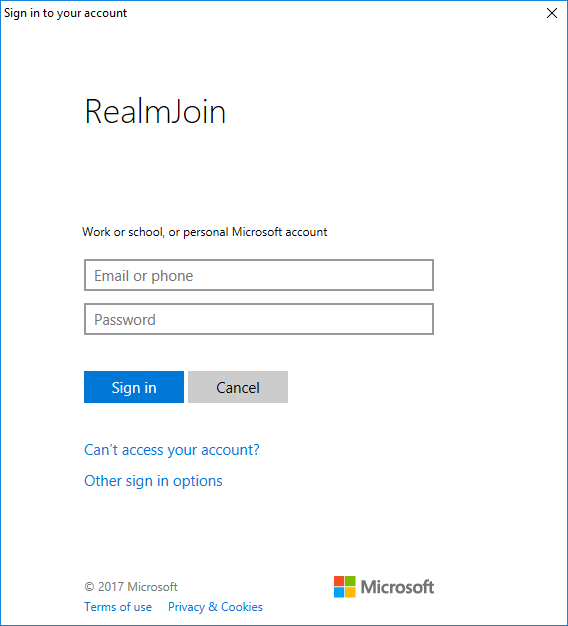
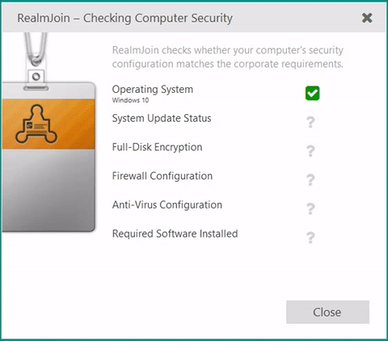
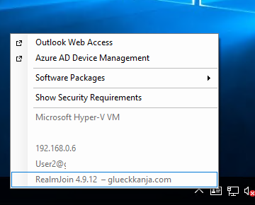
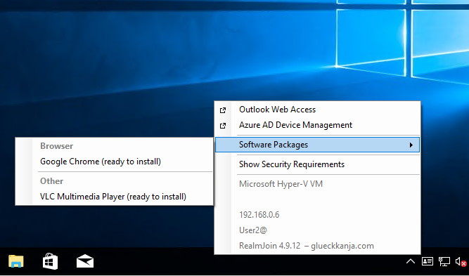
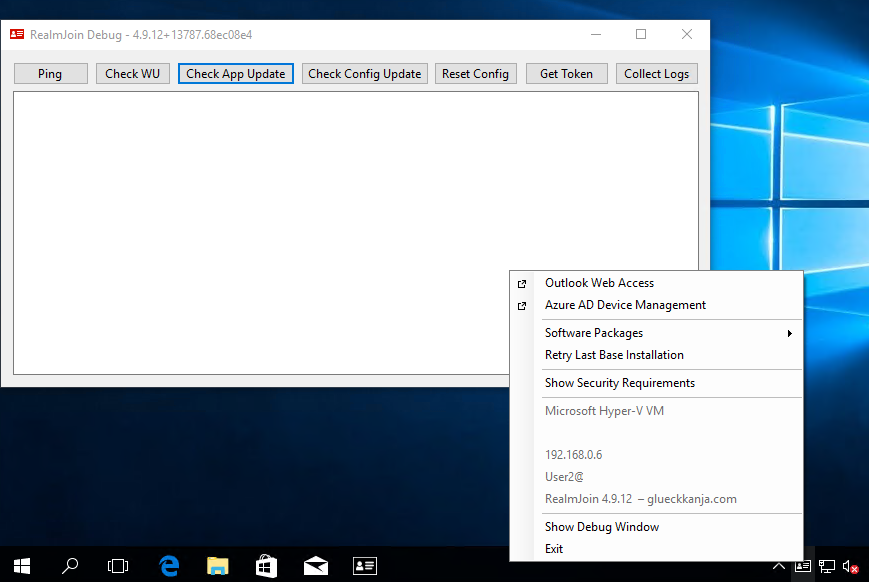

---
# required metadata

title: Initial Start before RealmJoin v4.15
description:
keywords:
author:
editor: lars.thiele
gk.date: 2019-06-18
---

# Initial Start before RJ v4.15

When RealmJoin is enrolled and started for the first time, it asks for the user identity and then calls to the cloud service for a policy.  

  

RealmJoin **Security Requirement** assessment does some pre-checks (Encryption, Patch Level, Firewall, Anti-Virus, etc. – this is optional and can be replaced in parts by Intune-Health-Check). In the last step, all mandatory software will be installed (**black screen installation**). During this installation, any interaction with the client is suppressed.  
  

If no error occurs during deployment, RealmJoin is ready to use.

## Client usage

After being successfully installed, RealmJoin is automatically started on the user login and is permanent active in the background. It is represented with an ID card icon. Clicking on the icon opens up the RealmJoin client menu.  
It contains basic information in the lower and a number of links in the upper part. The selector **Software Packages** opens a second context menu with all the software packages that are allocated to the user.
  

  
If an user wishes to install any of the listed software, he/she is only required to select the package to start the installation.
  
  
  
The installation mode depends on the packages selected: If those are only user mode packages, they are installed immediately. In case of a higher permission level, RealmJoin starts a service (realmjoinservice.exe) and installs the packages with the **SYSTEM** user account.

## Debug mode

To open a debug window, press and hold **Shift** + **Strg** and click the RealmJoin icon. This reveals **Show Debug Window** as a further entry at the end of the context menu. Show Debug Window contains seven different diagnostic tools.  
If a device is not able to be addressed by the server or can not connect to the back-end, this tool will provide the user with the tools for the first steps of diagnosis.

Beside Show Debug Window **Retry base installation** is a further entry that reveals. Retry base installation allows an user to reinstall the RealmJoin client.  
Additionally, when the client tray menu is opened in debug mode, all software packages are shown with a package version number.

  

**Collect Logs** is a quick way to access all log files, which will be saved in a zip-file to the users desktop. See section [Troublehooting](../appendix/troubleshooting.md) for a detailed description of the RealmJoin debug window and its features.