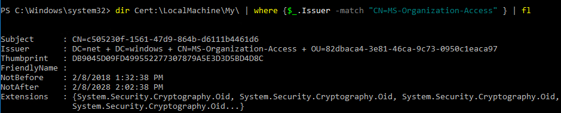
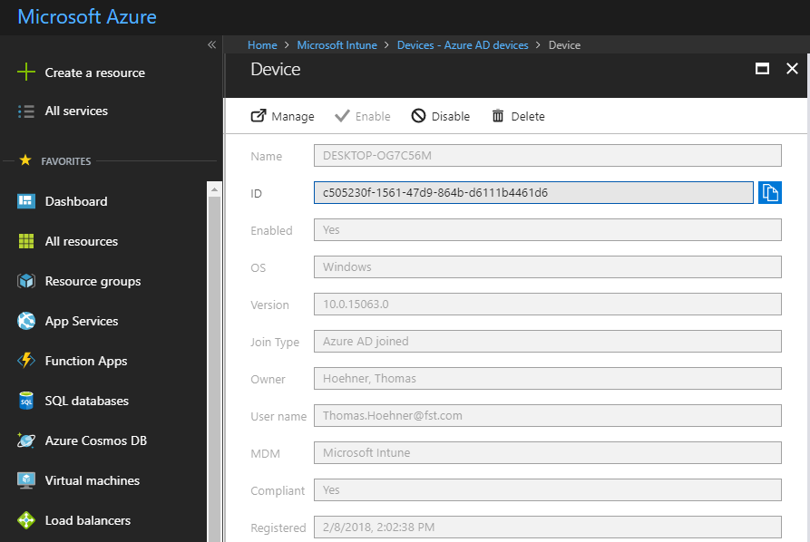
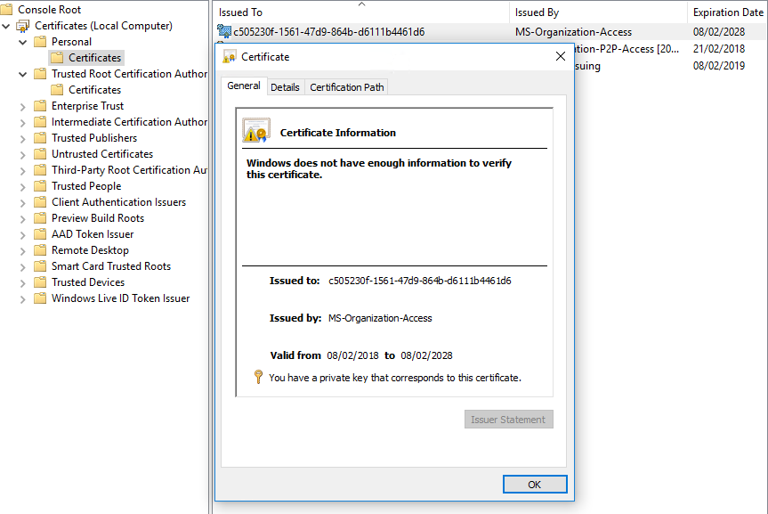

---
# required metadata

title: Appendix
description: Additional information and details to RealmJoin
keywords:
author:
editor: lars.thiele
gk.date: 2019-06-18
---

# Supplement
  
## Protocol Handler

It is possible to install RealmJoin packages using an URL-link.  
The correct format for this command consists of the ``realmjoin:`` call, the subcommand ``install`` and the package ID, e.g. ``generic-google-chrome``.  
The complete link therefore would be written as:  
``realmjoin:install:generic-google-chrome``.  
The package has to be assigned for the user in the RealmJoin back-end.  

## NoGraph Option

To install RealmJoin without Graph API consent, the registry key

```Powershell
Computer\HKEY_LOCAL_MACHINE\SYSTEM\CurrentControlSet\Services\realmjoin\Parameters\NoGraph
```

can be set to `1`.  
It is also possible to set this key during the installation of RealmJoin as a argument for the **msi**:  

``msiexec /i "RealmJoin.msi" NOGRAPH=1``.

## 3rd Party NuGet Packages

https://packages.gkdatacenter.net/

### PowerShell Modules

#### PSIni

* Used to read and write ini files from within Chocolatey or craft packages
* Source & License: https://www.powershellgallery.com/packages/PsIni
* Project Home: http://lipkau.github.io/PsIni/

Use: Deploy as package through RealmJoin (or add dependency in nuspec, e.g.: `<dependency id="PSini" version="[2.0,3.0)" />`)<br>
Import: `Import-Module "$env:ProgramData\chocolatey\lib\PSini\PsIni.psm1"`

<!-- Der folgende Inhalt wird nach der Umstellung des Doku-Designs eine eigene Sektion erhalten - aktuell liegt er hier im Appendix-->

## RealmJoin Workflow

The RealmJoin workflow describes the detailed process after RealmJoin is deployed via Intune MDM Channel (single MSI software deployment) to the client.

To understand how RealmJoin detects and authenticates the device and the related user we must investigate the Azure AD/Intune device enrollment process first:

1. After the user successfully authenticates against Azure AD by providing username, password and MFA, the **Azure AD Device Registration Service** generates a key pair for the device certificate.
2. Generates a **Certificate Signing Request** (CSR) using the key pair. Signs CSR data with private key plus public key in request.
3. Generates a second key pair that will be used to bind SSO tokens physically to the device when authenticating to Azure AD later on. This key is typically called **storage/transport key** (Kstk) and is derived from **Storage Root Key** (SRK) of the device **Trusted Platform Module** (TPM). The way the binding of the SSO token to the device is achieved by storing into the TPM a corresponding symmetric session key (encrypted to Kstk) issued along with the SSO token upon authentication to Azure AD.
4. Send a device registration request to **Azure DRS** passing along the ID token, the generated CSR and the public portion of the Kstk along with its attestation data.

Once the request comes to Azure DRS the service will validate the token, will create a corresponding device object in Azure AD and will generate and send back a certificate to the device. The API in turn will install the certificate into the **LocalMachine\mystore**

To check the related cert please use the following command:

dir Cert:\LocalMachine\My\ | where { $_.Issuer -match "CN=MS-Organization-Access" } | fl

[](./media/rj-workflow1.png)

The related **Azure AD Device ID** can be checked here:

[](./media/rj-workflow2.png)

Having this information available out of the related certificate, RealmJoin is now able to start the provisioning process without the need of a dedicated user authentication/interaction. RealmJoin knows about the Azure AD Device ID out of the above described device certificate information and can start all processes running within the system context for this device and the corresponding user account.

[](./media/rj-workflow3.png)

### Initial run

As RealmJoin is aware about the Azure AD Device ID and the related user account, it will immediately start (after the regular OOBE process finished) to apply the device checks and install the users' software within the system context of the device. After completion of this initial run, RealmJoin will trigger a device restart.

After a device restart RealmJoin will prompt the user for an authentication confirmation - no credentials like password needed here! Now RealmJoin can proceed with all user based device and software configuration settings.

1. RealmJoin will ask the user for its **Second Identity** - this feature is only available when a **Legacy Active Directory Authentication Provider** should be involved into the users' network resource scope by providing **NTML tokens** for on-prem file or print services.
2. The build in RealmJoin "Security Requirements" assessment does some **pre-checks**:

- System Update Status: not enforced
- Full-Disk Encryption: enforced
- Firewall Configuration: enforced
- Anti-Virus Configuration: not enforced  

> [!NOTE]
> These checks are customizable (enforce/not enforce) and will be replaced by the **Intune Device Health Check** in future.

During the initial run of RealmJoin, the **BitLocker Drive Encryption** will be enabled and enforced. User interactivity is not necessary. The related BitLocker recovery key is escrowed into Azure AD.

> [!NOTE]
> To find this key is required, please use this URL (admin only)
