---
# required metadata

title: AnyDesk in RealmJoin
description: This is an overview and explanation about the AnyDesk feature in RealmJoin
keywords:
author: 
editor: lars.thiele
gk.date: 2019-06-18
---

# AnyDesk in RelamJoin

RealmJoin contains the remote desktop tool **AnyDesk**. It allows the access to other computers. AnyDesk can be installed on Windows, macOS, Linux, mobile devices and Raspberry Pi as well.

AnyDesk uses ID numbers to establish connections between two computers. Share your ID number with an other user (this user needs AnyDesk as well). This user has to enter the ID number in the AnyDesk menu. When you accept the request, the other user will have access to your desktop.

RealmJoin skips the whole ID number sharing process, because every AnyDesk ID numbers in an organization are linked to single users. An Administrator just needs to know the user and can request for access to the computer. Still the user has to accept this request.

As a user you can select different permissions which you give to other (remote) users. For example, you can allow or block access to your monitor, to your sound or the control of your keyboard and/or your computer mouse.

> [!IMPORTANT]
> When you use the AnyDesk feature (via RealmJoin), it is not possible to start a remote session with external AnyDesk users.

## Prerequirements

To integrate AnyDesk in RealmJoin you have to set some prerequirements - KeyVault and Application Insights.

### KeyVault

Cloud applications and services use cryptographic keys and secrets to help keep information secure. Azure Key Vault safeguards these keys and secrets. When you use Key Vault, you can encrypt authentication keys, storage account keys, data encryption keys, .pfx files, and passwords by using keys that are protected by hardware security modules (HSMs).

### Create KeyVault

The following table shows you the steps for Azure KeyVault Creation:

| Task | Image |
| ---- | ----- |
| 1. Open [Azure Portal](https://portal.azure.com) | |
| 2. Start with **Create a resource** | [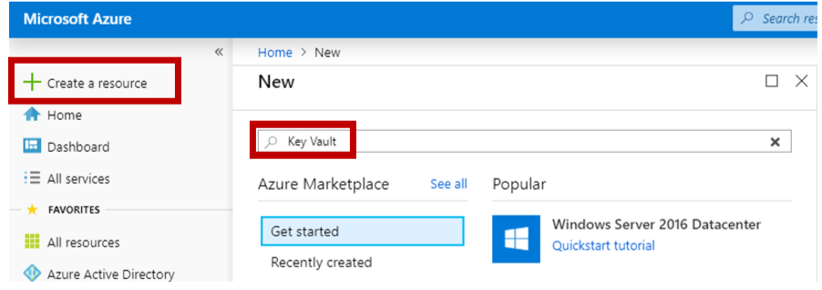](./media/keyvault1.png) |
| 3. In the search field type in **Key Vault** and conform with enter |  |
| 4. On the detail page click **Create** | [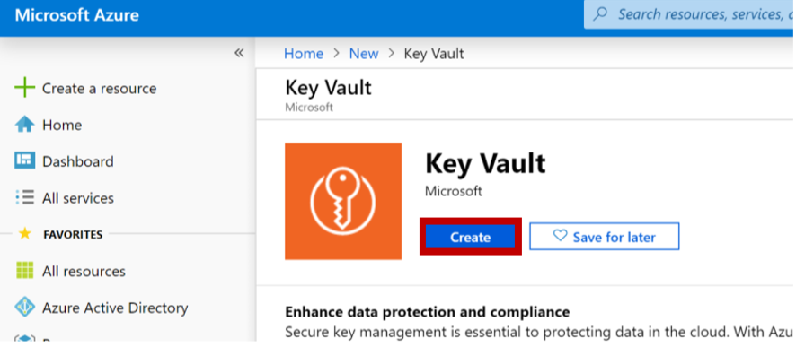](./media/keyvault2.png) |
| 5. **Name**, **Subscription**, **Resource Group** and **Location** are required fields | [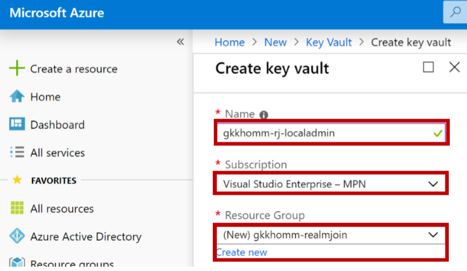](./media/keyvault3.png) |
| 6. Conform with **Create** an wait for successful deployment | |
| 7. Open the recently created Key Vault | |
| 8. Click **Add new** to add a new access policy | [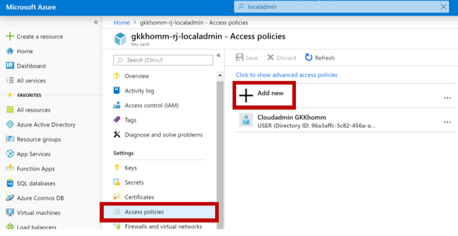](./media/keyvault4.png) |
| 9. Select **Key, Secret & Certificate Management** as template and add **RealmJoin** as principal | [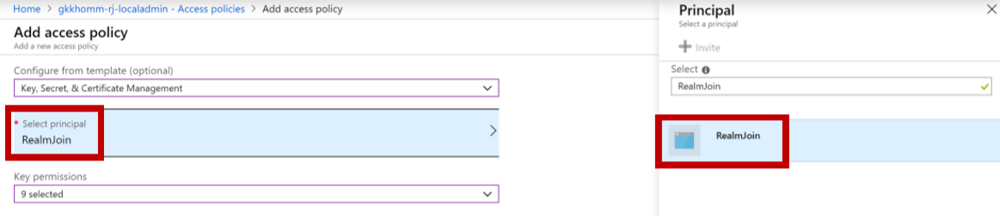](./media/keyvault5.png) |
| 10. For **Cryptographic Operations** add Decrypt, Encrypt, Unwrap Key, Wrap Key, Verify and Sign | [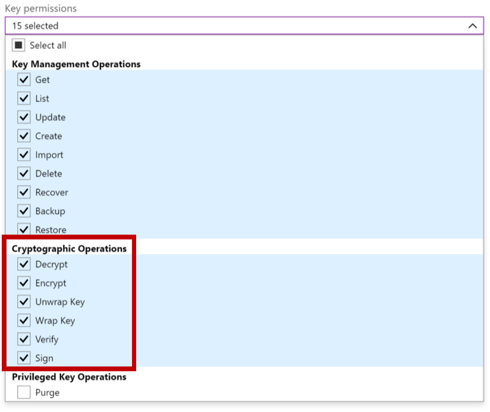](./media/keyvault6.png) |
| 11. Confirm with **Ok** and **Save** | |
| 12. Finally, go to **Overview** and share the **DNS Name** with the [Glück & Kanja support](mailto:product.support@glueckkanja.com)  | [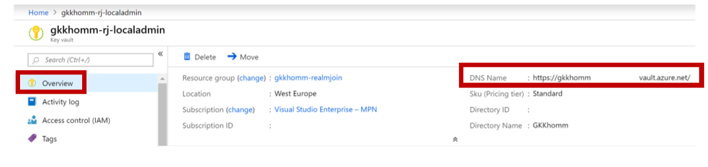](./media/keyvault7.png) |
| **Example Value**: https://contoso-rj-laps.vault.azure.net/ | |

### KeyVault Storage of Secrets

RealmJoin will not be store the secret in any proprietary storage but instead create an **Azure KeyVault Secret** to store it in a secure and auditable way. The KeyVault API is documented here:

https://docs.microsoft.com/en-us/rest/api/keyvault/setsecret/setsecret

The entry in KeyVault will be added with the device name as a key and the plain GUID as the secret value. See the following example screenshot:

[](./media/keyvault8.png)

[](./media/keyvault9.png)

## Application Insights

Application Insights is an extensible Application Performance Management (APM) service for web developers on multiple platforms. Use it to monitor your live web application. It will automatically detect performance anomalies. It includes powerful analytics tools to help you diagnose issues and to understand what users actually do with your app.

### Create App Insight for generic auditing

[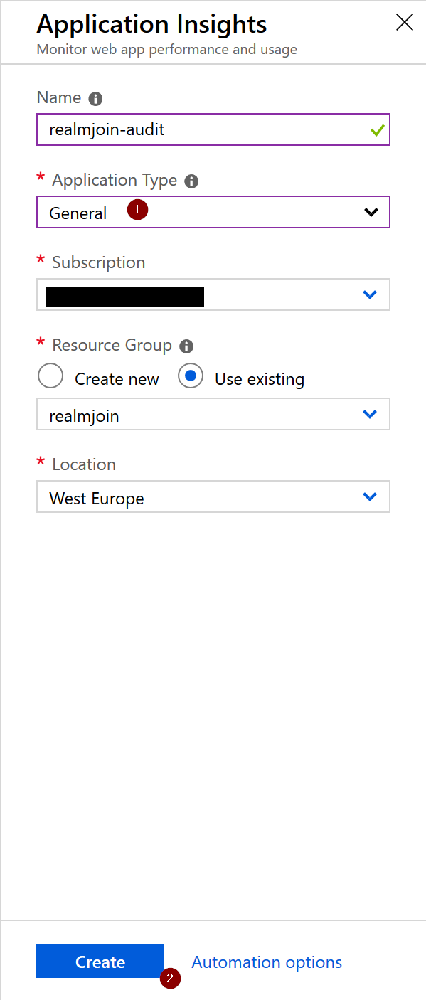](./media/appinsights1.png)

Navigate to **Application Insights**. Click **+ Add** and do the following:

1. Set **Application Type** to **General**  
2. Set **Resource Group** to **Use existing**
3. Click **Create**

Then, copy the field **Instrumentation Key** and send it to [GK Support](mailto:product.support@glueckkanja.com).  
Example value: ```a74393bd-2dee-4a10-9df3-66c8c2b2a9ec```

### App Insight - Reporting

To start a reporting, click **Search**

[](./media/appinsights2.png)

An overview appears, which looks like the following example:

[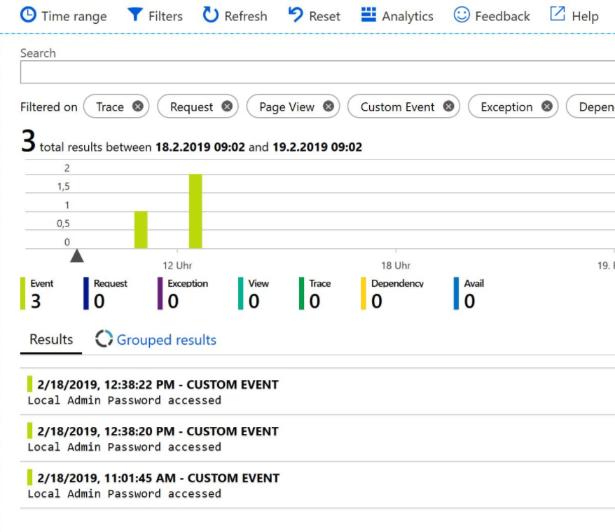](./media/appinsights3.png)

## AnyDesk deployment

Before you can start with a AnyDesk session, you have to set few settings.

| Task | Image |
| ---- | ----- |
| 1. Log in to [AnyDesk](https://my.anydesk.com/login) | |
| 2. Customize your AnyDesk client | [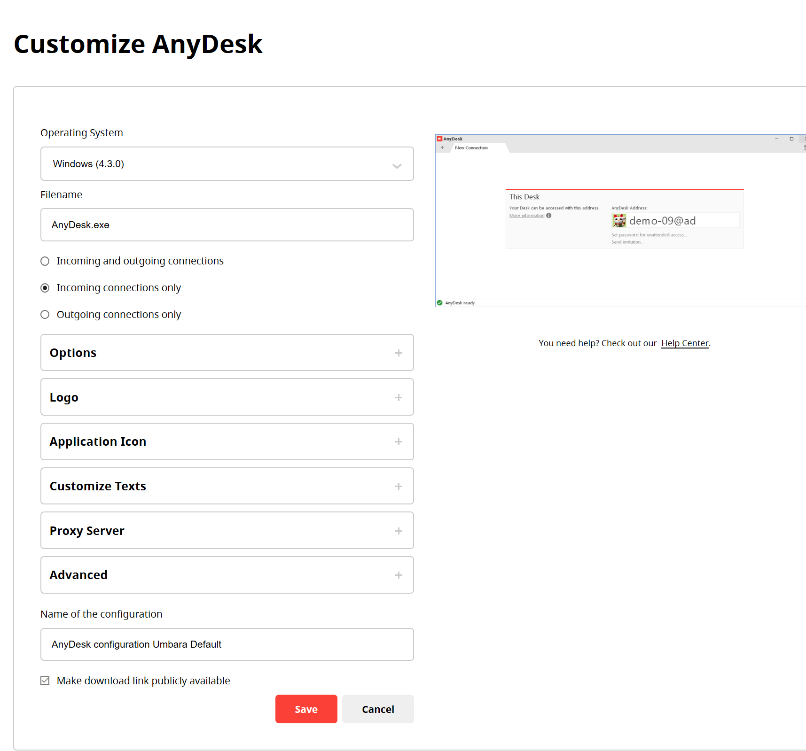](./media/anydesk7.png) |
| 3. Select **Make download link publicly available**
| 3. Click **Save** to confirm your settings | |
| 4. The **Custom Client Details** page will appear | [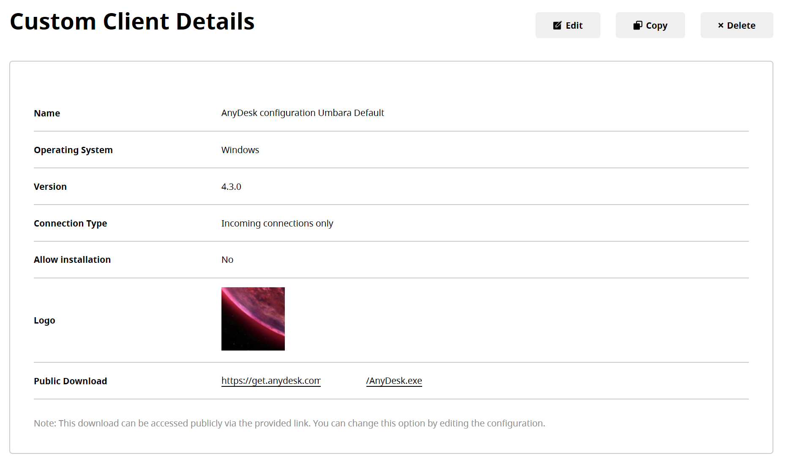](./media/anydesk8.png) |
| 5. Select the following **Options**: | [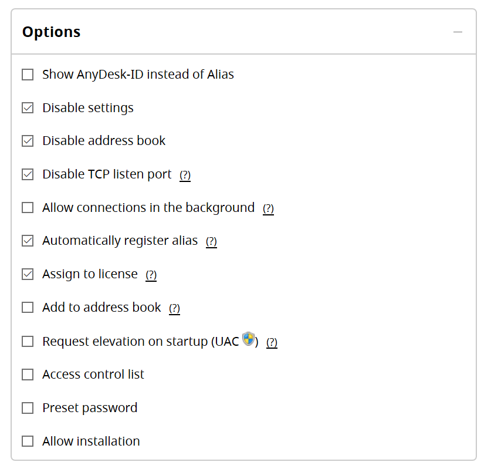](./media/anydesk8_2.png) |
| - Disable Settings | |
| - Disable address book | |
| - Disable TCP listen port | |
| - Automatically register alias | |
| - Assign to license | |
| 6. Copy or save the **Public Download** URL. You need it for **AnyDesk Group Settings** | |

## AnyDesk Group Settings

Choose a group and click the number in the SE-field (SE = Settings).

[](./media/anydeskSE.png)

The Group Setting side will appear. Click **+Add Setting** in the upper right corner.

[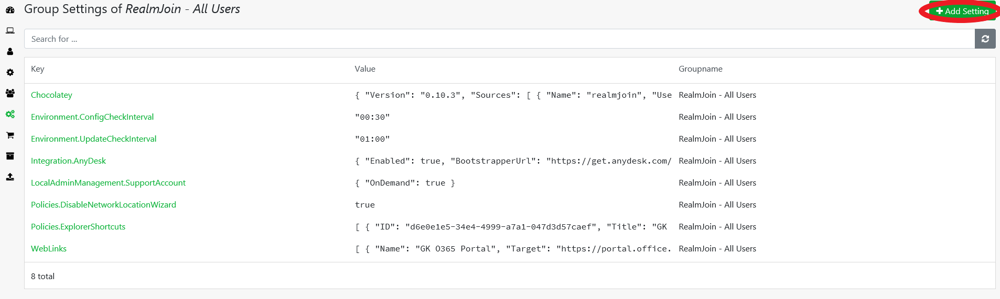](./media/anydeskSE2.png)

Use JSON to configure AnyDesk. There are three different policies to configure AnyDesk.

The following JSON contains all configurations:

**Key** = Integration  
**Value** = {"AnyDesk: {
          "Enabled": true,
          "BootstrapperUrl": "https://.../.../AnyDesk.exe",
          "Ui": {TrayMenuTextEnglish": "Start remote session} } }

> [!IMPORTANT]
> The BootstrapperUrl is your **Public Download** Url from AnyDesk Custom Client Details.

It is also possible to split this single JSON from above, in three different JSON policies:

**Key** = Integration.AnyDesk.Enabled  
**Value** = true

and

**Key** = Integration.AnyDesk.BootstrapperUrl  
**Value** = "https://.../.../AnyDesk.exe"

and

**Key** = Integration.AnyDesk.UI.TrayMenuTextEnglish  
**Value** = "Start remote session"

The following JSON is possible as well (we recommend this JSON):

**Key** = Integration.AnyDesk  
**Value** = {"Enabled":true, BootstrapperUrl": "https://.../.../AnyDesk.exe", "UI":{"TrayMenuTextEnglish": "Start remote session"} }

[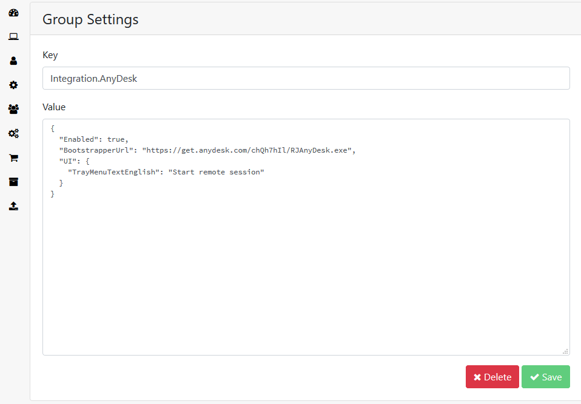](./media/anydeskSE3.png)

## Backend Integration

After you customize your Client, AnyDesk will send you an email. This mail contains your **Contract ID**, your **License ID** and your **API Password**. Send these IDs and the password to the [Glück & Kanja support](mailto:support@glueckkanja.com). If you do so, Glück & Kanja will integrate a AnyDesk API in your RealmJoin Portal.

[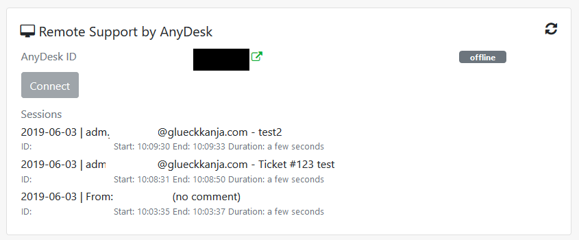](./media/anydesk9.png)

## Start a remote session via RealmJoin tray menu

| Task | Image |
| --- | --- |
| 1. Open the RealmJoin tray menu |  |
| 2. Click **Start remote session** | [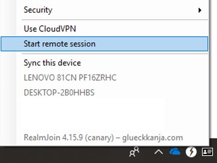](./media/anydesk1.png) |
| 3. The AnyDesk client starts and its current address will be pushed to RealmJoin backend in background. In addition, its visible in the UI. | [](./media/anydesk2.png) |
| 4. This client address will be displayed in RealmJoin portal at the corresponding client and the support staff can initiate the session via clicking **Connect** | [](./media/anydesk3.png) |
| 5. This will automatically start the AnyDesk client | |
| 6. Subsequently, the end user needs to accept the incoming remote session request | [](./media/anydesk4.png) |
| 7. The Connection is established and the support staff can perform his tasks remotely |
| 8. When the job is finished, please **disconnect** from the remote session |

### Get elevated rights

For special support scenarios administrative rights will be needed. A normal remote session starts with standard rights. That requires to elevate the permissions:

| Task | Image |
| ---- | ----- |
| 1. Click the **lightning icon** | |
| 2. Select **Request elevation** | [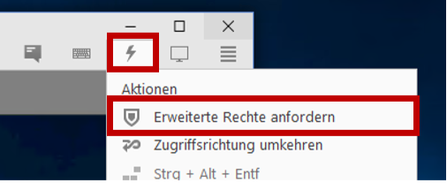](./media/anydesk5.png) |
| 3. In the new appearing window (Request elevation) choose **Transmit authentication data** | |
| 4. Insert corresponding credentials | |
| 5. Then, click **OK** | [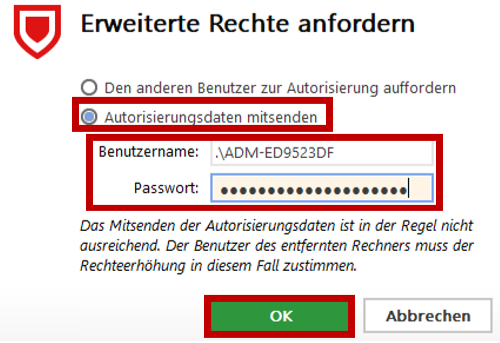](./media/anydesk6.png) |
| 5. On the remote client, a new window **User Account Control** will appear | |
| 6. Confirm it | |
| 7. The support staff is now able to perform administrative tasks. | |
