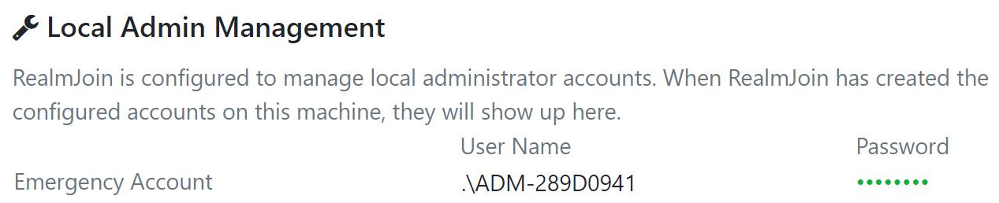
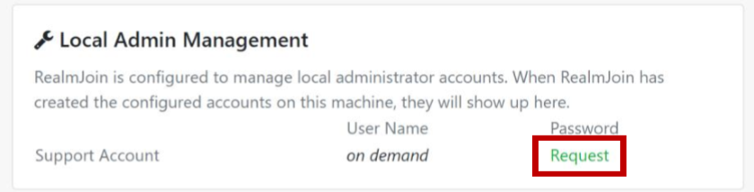
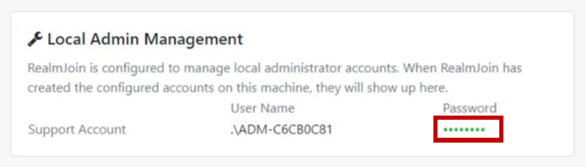

---
# required metadata

title: Local Administrator Password Soluation and RealmJoin
description: This is an overview and explanation about the LAPS feature in RealmJoin
keywords:
author: 
editor: lars.thiele
gk.date: 2019-06-18
---

# Local Administrator Password Solution and RealmJoin

Local Administrator Password Solution (short LAPS) is a Microsoft tool which will solve the issue of using an identical password on every Windows computer.

With RealmJoin it is possible that you can manage administrators, either for local support or remote support. Of course you can create accounts as well. RealmJoin saves encrypted passwords at customers site and RealmJoin records accesses to these passwords.

## Prerequirements

### Application Insights

Application Insights are an important part of LAPS. Click [here](../support/anydesk.md#application-insights) to see details about Application Insights:

## Access

When a support member needs to access a secret, RealmJoin will provide an interface to get account and password. When this happens, an update-secret command will be send to the client and the admin account will be recreated.

<!-- Screenshot der UI einfügen - Jan Berdel nach einem Screenshot fragen -->

## Administrator Account Types

Two different account types are available. An **Emergency Administrator Account** and a **Support Administrator Account**

### Emergency Administrator Account

This account type will be created by default and is **available persistently** on the device. Thus, it is possible to get administrative access even when there is no internet connection available or when facing other connection problems.

A corresponding RealmJoin policy can trigger the creation of a persistent administrator account. The following process will be passed:

1. Starting point: Existing or new client with RealmJoin  
a) Existing client (Azure AD joined, Intune managed, RealmJoin agenda installed)  
b) New client (initialization during OOBE, Azure AD join, Intune enrollment, installation of RealmJoin and deployed software)

2. RealmJoin policy triggers RealmJoin agent to create a persistent administrator account on the client.
3. RealmJoin agent transfers the encrypted password to the RealmJoin backend.
4. RealmJoin backend stores the cyphertext into a customer owned [Azure Key Vault](../support/anydesk.md#keyvault).

A requirement for this process is a successful deployment of corresponding policy to the client.

#### Use in case of support

A support staff needs local administrative rights in field support (e. g. for troubleshooting connectivity issues). Therefore, he/she must go through the following steps:

1. The staff visits the RealmJoin WebUI. On the device details he/she will see the name of the administrator account and can request the password when clicking on the dotted text.

2. RealmJoin pulls the password from Azure Key Vault and displays it.
3. The staff is now able to get elevated rights with entering this username and password in the UAC credential prompt or performing a re-login as an administrator.
4. When the staff has finished all tasks, he/she logs out of the account.
5. The previously used account will be deleted after a defined period and a new one will be generated (following to steps already described).

### Support Administrator Account

A support account will be generated **on demand** and is designed for **one-time use**.

A support staff can trigger the creation of a temporal administrator account. The following process will be passed:

1. Starting point: Existing or new client with RealmJoin  
a) Existing client (Azure AD joined, Intune managed, RealmJoin agent installed)  
b) New client (initialization during OOBE, Azure AD join, Intune enrollment, installation of RealmJoin and deployed software)

2. A Support staff requests a support account via RealmJoin WebUI
3. This triggers RealmJoin agent to create a temporal administrator account on the client.
4. RealmJoin agent transfers the encrypted password to the RealmJoin backend.
5. RealmJoin backend stores the cyphertext into customer owned [Azure Key Vault](../support/anydesk.md#keyvault).

Requirements for this process:

* Successful deployment of corresponding of client.
* User is logged in and RealmJoin agent is running.
* Internet connectivity.

### Configuration Policies

RealmJoin offers multiple policies to configure local administrator account management that are described in the following table:

| Policy (Key) | Value (Sample) | Description |
| ------------ | -------------- | ----------- |
| LocalAdminManagement.Inactive | true/false | Deactivates or activates local administrator management |
| LocalAdminManagement.CheckInterval | "00:30" | Interval for configuration checks (hh:ss) |
| LocalAdminManagement.[EmergencyAccount/SupportAccount].NamePattern | "ADM-(HEX:8) | Username of the admin. HEX:8 stands for **8-digit random hex-code** |
| LocalAdminManagement.[EmergencyAccount/SupportAccount].DisplayName | "RealmJoin Local Administrator" | Display name of administrator account (appears on Windows) |
| LocalAdminManagement.[EmergencyAccount/SupportAccount].PasswordCharSet | "!#%+23456789:=?@ABCDEFGHJK LMNPRSTUVWXYZabcdefghijkmn opqrstuvwxyz"  | Charset of the password |
| LocalAdminManagement.[EmergencyAccount/SupportAccount].PasswordLength | 20 | Password length |
| LocalAdminManagement.[EmergencyAccount/SupportAccount].PasswordPreset | 1 | Predefined password templates (PasswordCharSet and PasswordLength not necessary) |
| LocalAdminManagement.[EmergencyAccount/SupportAccount].MaxStaleness | 01:00 | Time after account will be removed/refreshed (when logged out after use) |
| LocalAdminManagement.SupportAccount.OnDemand | true/false | Create support account on demand (account will expire after 12 hours) |

It is possible to assign these policies based on user groups. E. g. deactivate local administrator management for all users except a specific group. See the following table:

| Key | Value | Groupname |
| --- | ----- | --------- |
| Local.AdminManagement.Inactive | true | RealmJoin - All Users |
| Local.AdminManagement.Inactive | false | CFG - RealmJoin-EnableSupportAdmin |

#### Use in case of support

The support staff visits the RealmJoin WebUI again (depends on the **Configuration check interval**) and follows these steps:

1. On the device details he/she will see the name of the temporal administrator account. The account creation will be started when clicking on **Request**.

> [!NOTE]
> After a certain time, the credentials will appear. Click the dotted password field to request the password.

2. RealmJoin pulls the password from Azure Key Vault and displays it.

3. The staff is now able to get elevated rights with entering this username and password in the UAC credential prompt or performing a re-login as an administrator.
4. When the staff has finished his tasks, he/she logs out of the account.
5. The previously used account will be deleted after a defined period