---
# required metadata

title: Multi-User Devices
description:
keywords:
author: 
editor: lars.thiele
gk.date: 2019-06-18
---

# Multi-User Devices

Multi-User Devices allow an administrator to provision devices intended to be used by more than one user. A tool for Multi-User Devices is **Device Enrollment Manager** (short DEM).

DEM is an Intune permission that can be applied to an Azure Active Directory user account and lets the user enroll up to 1,000 devices. A DEM account is useful for scenarios where devices are enrolled and prepared before handing them out to the users of the devices.

## Preparations

Before you can start with a device enrollment you have to do some preparations.

### Create User Group(s) For Primary Users

A new user group (security group) is necessary that contains all Primary users (PU). Add one and let Glück & Kanja mark this group as **Primary Users** (obtain Azure AD Object ID)

### Software Packages

In case of **multi-user devices** some changes to the software packages might be necessary. RealmJoin provides **Main Script Restrictions** that are important in that case.

* Default value (if nothing is selected): **Only primary**
* Software assignments for the primary user (member of mentioned group) will be inherited to secondary users (and available for installation and doing updates).

## Assignment and Configuration

Practically software packages should be configured like that:

1. Packages that should be **installed** through PU when **setting up** its client initially:

[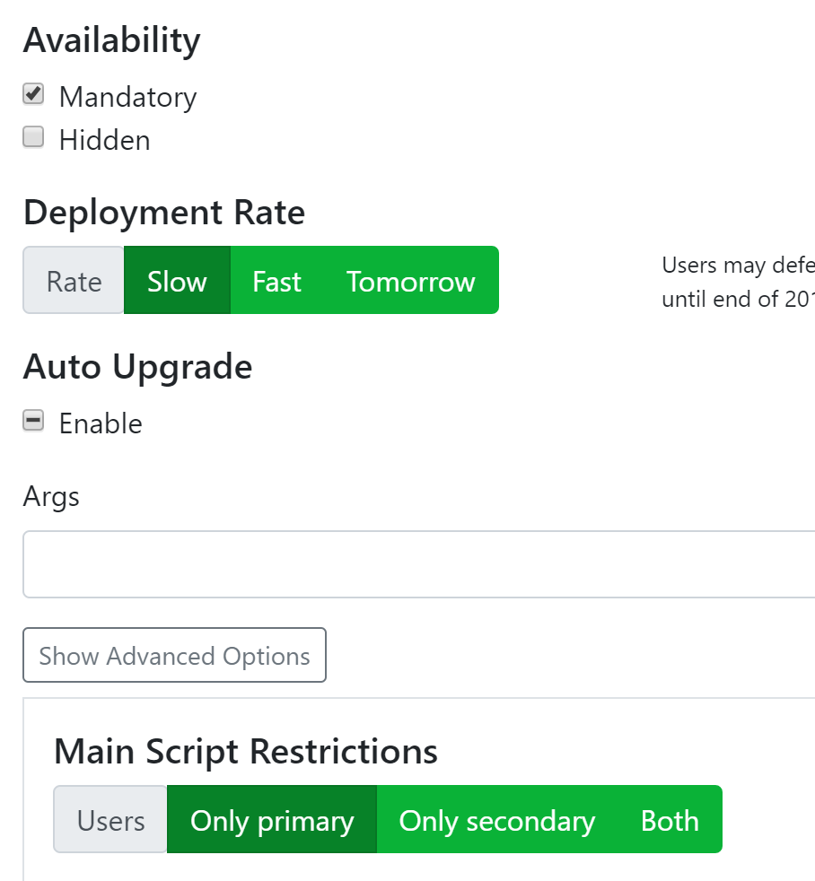](./media/dem1.png)

(these packages can be updated by primary and secondary users)

2. Packages that should be **available for installation**:

[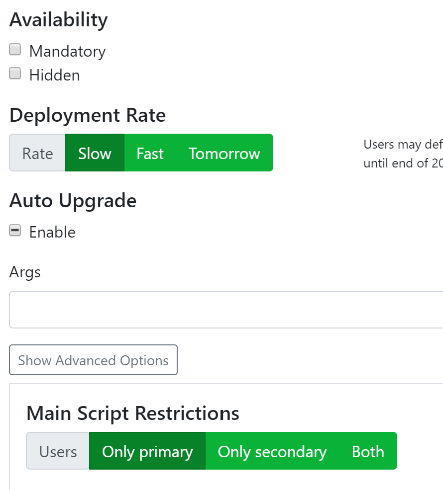](./media/dem2.png)

(these packages can be installed by primary and secondary users)

3. Packages that should be **available for installation** only through secondary users:

[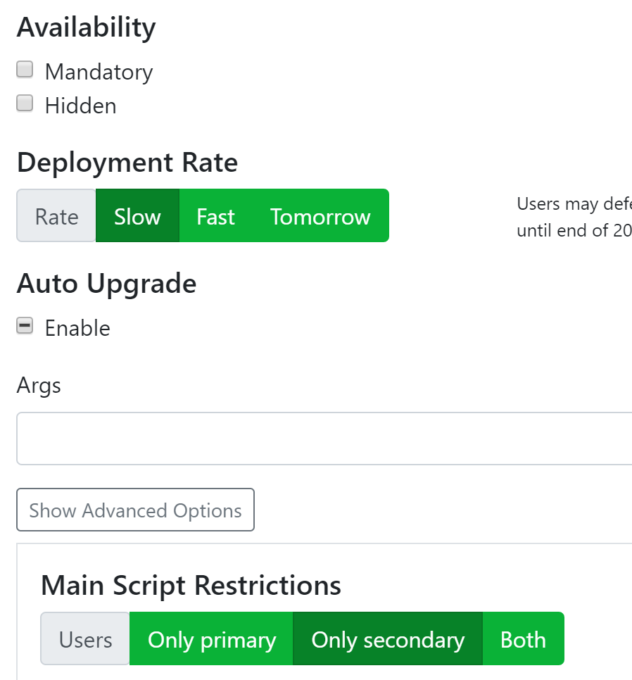](./media/dem3.png)

4. Packages that should be **available for installation** through primary and secondary users **in any case**:

[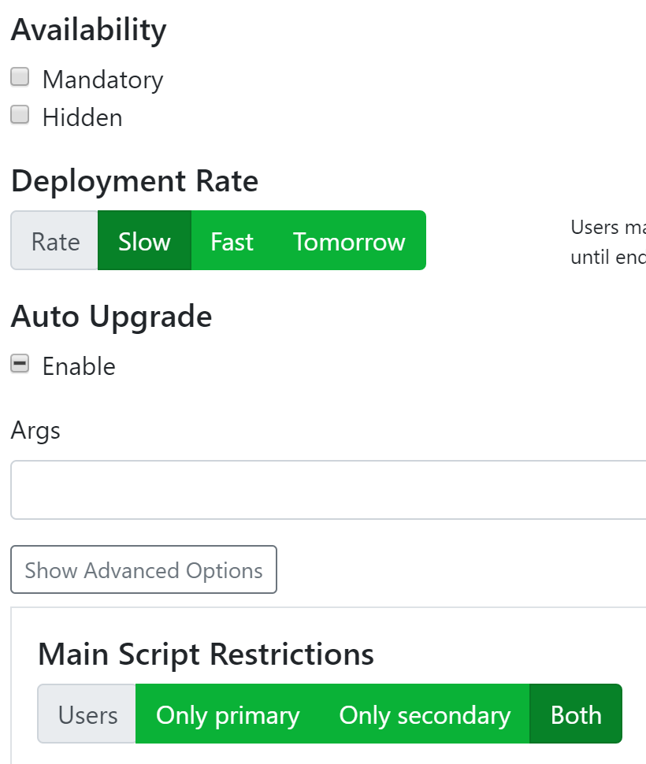](./media/dem4.png)

> [!CAUTION]
> Secondary users can install such applications on any device

## Device Setup

A new and clean device will be set up with the Primary User account:

[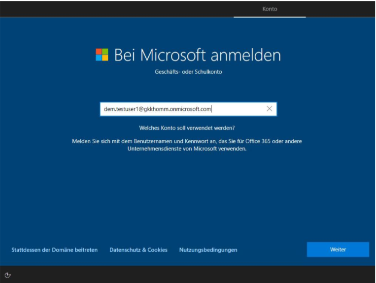](./media/dem5.png)

Depending on configuration second factor authentication will be enforced:

[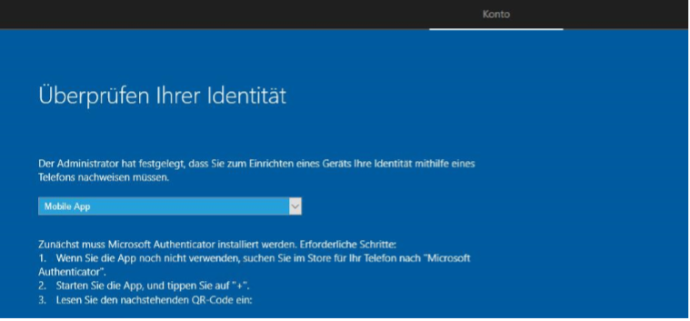](./media/dem6.png)

Device enrollment and provisioning will start:

[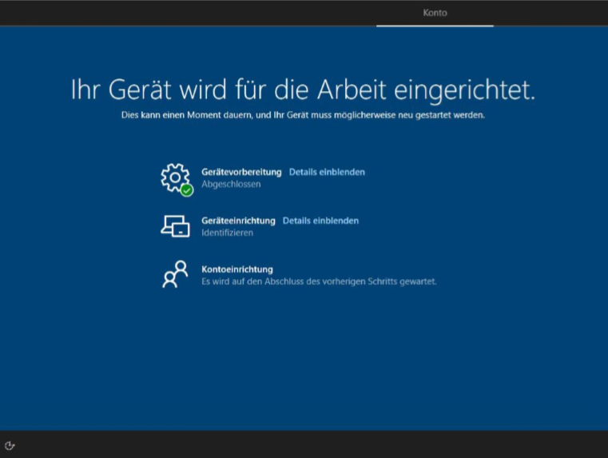](./media/dem7.png)

Prompt for Windows Hello setup appears (depending on configuration):

[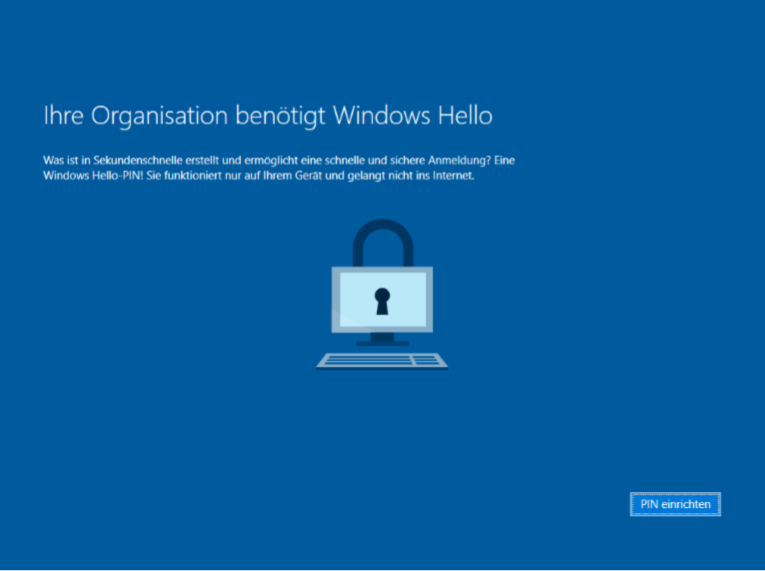](./media/dem8.png)

After that, RealmJoin will start and install the defined set of software for the PU (marked as mandatory:)

[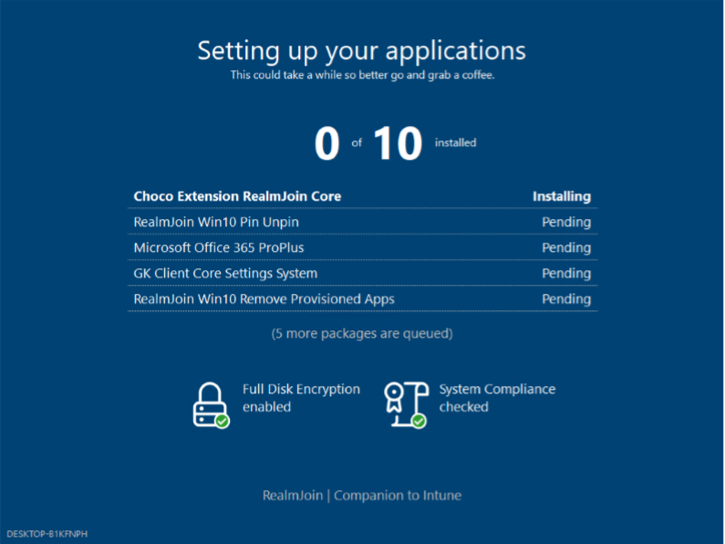](./media/dem9.png)

## Secondary User Experience

Secondary Users are now able to log in:

[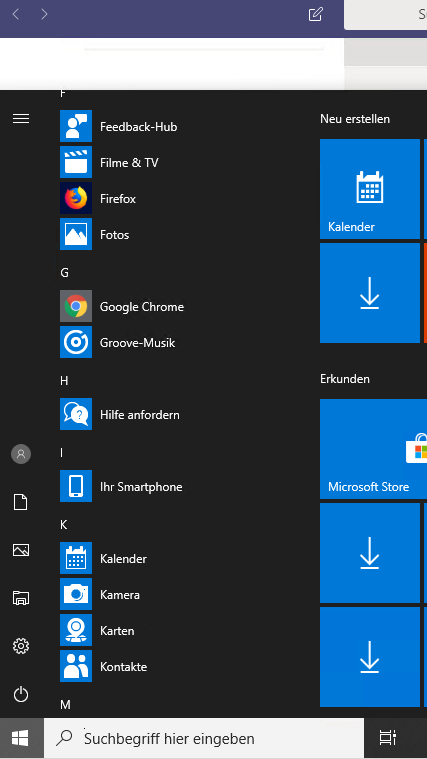](./media/dem12.png)

Software assigned and installed by PU should be available:

[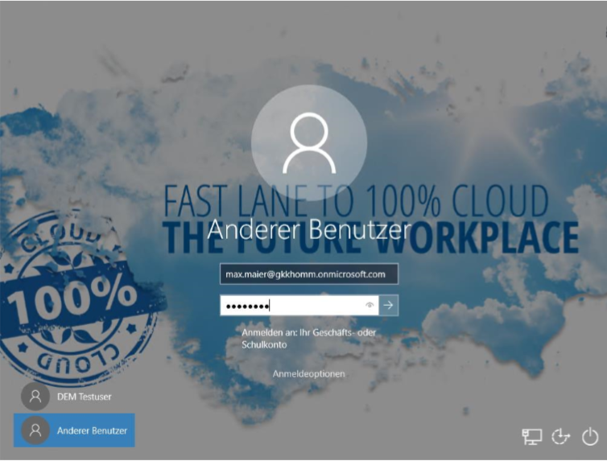](./media/dem11.png)

Additional software can be installed by this secondary user (see [Software packages](../support/multi-user-devices.md#software-packages))

[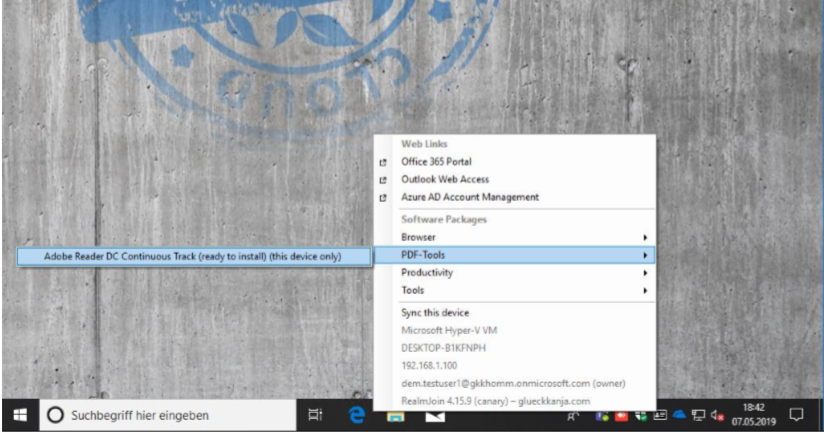](./media/dem13.png)

[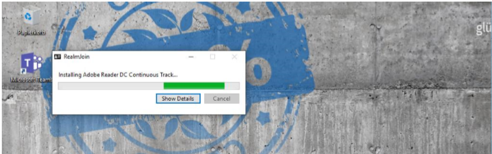](./media/dem14.png)

[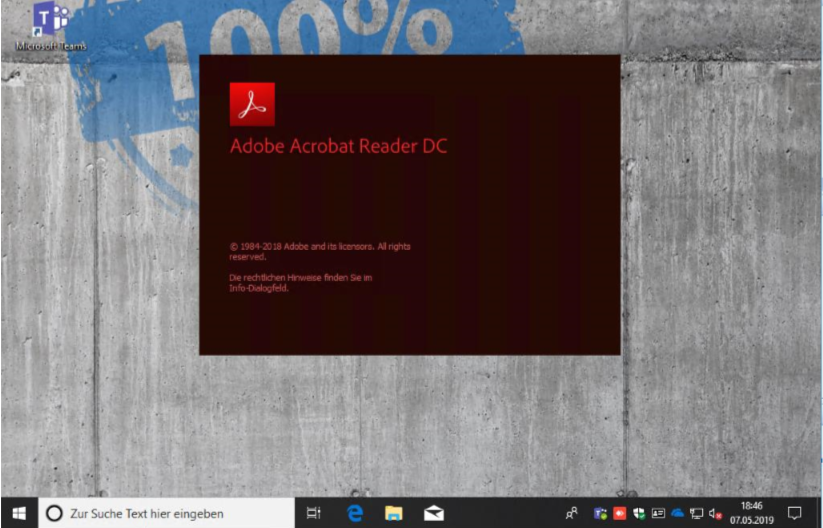](./media/dem15.png)

## Use Case

Your Multi-User Devices group is marked as DEM group in your RealmJoin-Backend. All rolled out devices are marked as well and the installation behavior will change too.

You can see the mark in the UI:

[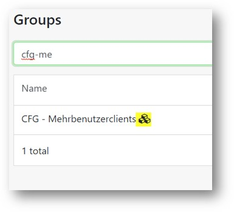](./media/dem16.png)

[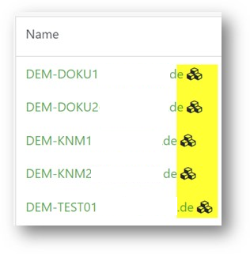](./media/dem17.png)

[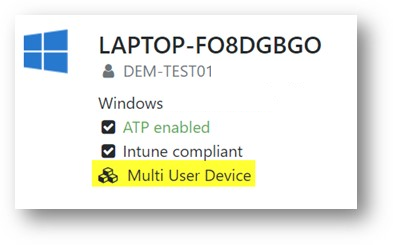](./media/dem18.png)

> [!NOTE]
> * Mandatory assignments for DEM-Accounts result in a assignment for all users of a client
> * Non-mandatory assignments will not be installed automatically. Neither for DEM-accounts nor for other accounts of the client
> * You can assign directly or via groups
> * Software assignments for regular users will not be executed.

<!-- 

### Multi-Factor Authentication 

tbd

-->

### Use Case Summary

1. Create user-accounts (AAD-only)  
2. Assign users to groups  
    a) CFG - Multi-User Clients  
        * Intune policies  
        * Groups are marked as "Multi-User" groups  
    b) LIC - Intune  
        * Intune license assignment  
    c) APP - OD - Workforcer-ESD  
        * Assignment of Workforce-ESD-Application
3. Add user as DEM in Intune
4. Add software direct to user  
    a) Mandatory: If you want an automatically installation  
    b) Non-mandatory: If you want an optional software installation by users
5. MFA Setup
    a) OOBE-Rollout of a client  
    b) https://aka.ms/SetupMFA  
    c) Choose auth application + mobile phone number + an alternate mobile phone number
