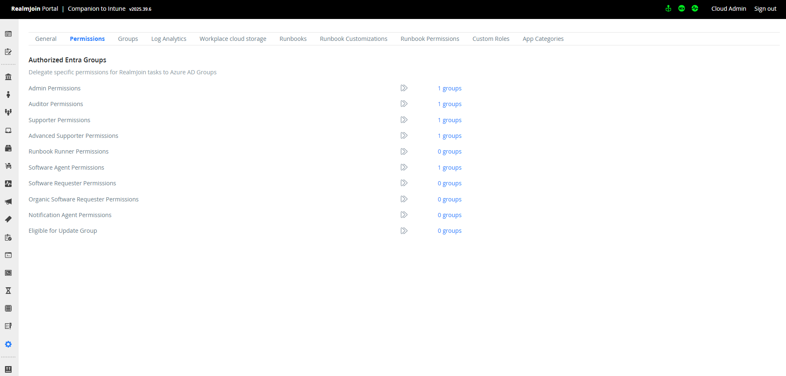

# Connecting Azure Automation

## Overview



To enable RealmJoin Portal to deliver [runbooks ](../runbooks/)for automating daily tasks, you must connect an [Azure Automation](https://learn.microsoft.com/en-us/azure/automation/overview) Account. This Automation Account will act as the host for your runbooks and provide the [permissions](azure-ad-roles-and-permissions.md) required for the runbooks to function within your environment.

## Considerations&#x20;

The Automation Account's [Managed Identity](https://learn.microsoft.com/en-us/azure/active-directory/managed-identities-azure-resources/overview) requires extensive [permissions ](azure-ad-roles-and-permissions.md)in your environment, such as the ability to modify group or user objects in Entra ID or manage mailboxes in Exchange Online. Limit administrative access to this account to prevent misuse of these privileges.

When using an existing Automation Account, note that RealmJoin Portal automatically creates, updates and removes runbooks coming from the [shared online repository of runbooks](https://github.com/realmjoin/realmjoin-runbooks). This functionality may not be supported in an existing Automation Account. If uncertain, we recommend creating a dedicated Azure Automation Account for RealmJoin Runbooks.

## Prerequisites

* Global Administrator privileges
* Access to PowerShell with the [Az](https://learn.microsoft.com/en-us/powershell/azure/?view=azps-15.3.0) module or [AZ CLI](https://learn.microsoft.com/en-us/cli/azure/?view=azure-cli-latest)
* Contributor permissions on an Azure subscription
* [Runbook requirements](azure-ad-roles-and-permissions.md)

## Instructions



### Create an Azure Automation Account

1. Navigate to your [Azure Portal > Automation Accounts](https://portal.azure.com/#create/Microsoft.AutomationAccount)&#x20;
2. Create a new Automation Account
3.  In the Basics tab, choose your desired Subscription, Resource Group, Automation Account Name and Region<br>

    <figure><figcaption></figcaption></figure>


A separate Resource Group for your Automation Account is recommended


4.  In the Advanced tab, ensure the System Assigned Managed Identity is enabled

    <figure><figcaption></figcaption></figure>


5. Select Review + Create and create your Automation Account
6. Navigate to the Resource Group containing your Azure Automation Account
7. In the IAM tab, assign the Azure Automation Account as a Contributor



### Assign Permissions to Azure Automation Account

The RealmJoin shared runbooks use the Azure Automation's system assigned managed identity to interact with Entra ID, MS Graph API etc.

Managed Identity permissions cannot currently be granted through the Azure Portal. Use Microsoft Graph or PowerShell to assign these permissions.

1. Download the following PowerShell scripts and JSON files to the same folder. \
   The script will assign the full permission set required by RealmJoin. Roles and permissions can be reviewed in the [Requirements](azure-ad-roles-and-permissions.md) section and adjusted as needed in the JSON files.




















2.  Note down the Object ID of the Azure Automation Account's Managed Identity in Account Settings > Identity

    <figure><figcaption></figcaption></figure>


3. Open a PowerShell window.
4. Navigate to the folder containing the downloaded files

```
cd c:\temp\myfolder
```

5. Unblock scripts if necessary\
   
6. Assign MS Graph Permissions to your Azure Automation Account using GrantAppPermToEntApp.ps1, replacing xxxxxxxx-xxxx-xxxx-xxxx-xxxxxxxxxxxx with your Automation Account's Object ID

```
. .\GrantAppPermToEntApp.ps1 -enterpriseAppObjId "xxxxxxxx-xxxx-xxxx-xxxx-xxxxxxxxxxxx" -permissionsTemplate .\RJvNextPermissions.json
```

7. Assign Entra ID Admin Roles to your Azure Automation Account using AssignAzureADRoleToEntApp.ps1 replacing xxxxxxxx-xxxx-xxxx-xxxx-xxxxxxxxxxxx with your Automation Account's Object ID

```
. .\AssignAzureADRoleToEntApp.ps1 -objectId "xxxxxxxx-xxxx-xxxx-xxxx-xxxxxxxxxxxx" -rolesTemplate .\RJvNextRoles.json
```

8. The Azure Automation Account should now have the correct permissions to execute Runbooks<br>



### RealmJoin Runbook Configuration - Part 1

1.  In RealmJoin Portal go to '[Settings -> Runbooks](https://portal.realmjoin.com/settings/runbooks-configuration)'.<br>

    <figure><figcaption></figcaption></figure>
2.  Fill in the Tenant ID, Subscription ID and Resource Group name belonging to the Azure Automation Account\
    The Tenant ID in the [Entra ID Overview page](https://portal.azure.com/#blade/Microsoft_AAD_IAM/ActiveDirectoryMenuBlade/Overview)

    <figure><figcaption></figcaption></figure>
3.  Copy the script in red underneath _ResourceGroup._\
    This script creates a Service Principal in Entra ID with access to your Automation Account, allowing RealmJoin to manage, run and monitor runbooks.\
    The script is updated based on the inputs for Tenant ID, Subscription ID and Resource Group.<br>

    <figure><figcaption></figcaption></figure>
4. Leave the wizard open for now. We will return shortly in part 2.



### Granting Access for RealmJoin to Azure Automation


You can use [Azure CloudShell](https://docs.microsoft.com/en-us/azure/cloud-shell/overview), so you don't need to install and authenticate a local copy of AZ CLI.


1.  Run the script copied previously in PowerShell.

    <figure><figcaption></figcaption></figure>


2.  Note down the values for `appId` and `password`.\
    The App Registration "RealmJoin Runbook Management" will be created.<br>

    .png>)



### RealmJoin Runbook Configuration - Part 2

1. In RealmJoin Portal return to the open window/wizard for '[Settings -> Runbooks](https://portal.realmjoin.com/settings/runbooks-configuration)'
2. Fill in the missing values for `appId` and `password` created in the last step
3. Fill in the name of the Automation Account created [previously](./#create-an-azure-automation-account)
4. Choose the Branch of the shared runbook repository you want to follow. \
   If unsure, please choose `production` \
   All runbook branches may be viewed here: [https://github.com/realmjoin/realmjoin-runbooks](https://github.com/realmjoin/realmjoin-runbooks)
5. Choose the same location as your Azure Automation Account to make sure your runbooks are executed in the correct [Azure region](https://docs.microsoft.com/en-us/azure/availability-zones/az-overview)

.png>)

6. Press "Save" to start the initial import of runbooks. Please leave this window open until you see the message "Sync completed".

.png>)


