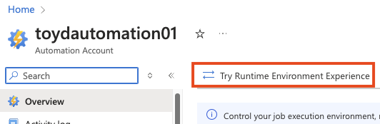

# Runbooks



RealmJoin provides administrators with the ability to automate tasks by using [Azure Automation](https://learn.microsoft.com/en-us/azure/automation/overview) to execute [PowerShell Runbooks](https://docs.microsoft.com/en-us/azure/automation/automation-runbook-types#powershell-runbooks). &#x20;

Runbooks are scripts, automating tasks that normally must be executed by a support engineer / operator or administrator. Automating these tasks lowers the risk of manual error and allows better auditing of actions.

Some common tasks RealmJoin can help you automate include:

* User lifecycle operations (onboarding/offboarding users)
* Creating Temporary Access Passes (TAPs)
* Reporting M/O365 license usage
* Managing email aliases

You can offer RealmJoin Portal to your support and administration teams to simplify and improve the quality of your day-to-day operations.

.png>)

### Migration to PowerShell Runtime Environments

RealmJoin is currently in the process of migrating from Windows PowerShell v5.1 to a PowerShell v7.4 [Runtime Environment](https://learn.microsoft.com/en-us/azure/automation/manage-runtime-environment).&#x20;


Make sure the "Runtime Environment" experience in your Automation Account is enabled.


<figure><figcaption></figcaption></figure>

When running a [sync](./#syncing-from-the-shared-repository), a custom PowerShell Runtime Environment "RJ-PowerShell-7.4" will be created, synced runbooks will be moved to this environment. If needed, required PowerShell modules will automatically be imported.


Due to **varying process durations** that might cause errors like 404, please **sync again**. Additionally, wait a few minutes before starting the first runbook after the migration.



**Custom / non-synced runbooks will not be upgraded automatically.**

You can use Azure Portal and use "Edit in Portal" on these runbooks to manually migrate them. Make sure to "publish" the runbooks for the change to take effect.


<figure><figcaption></figcaption></figure>

## Common Runbooks

RealmJoin maintains a [shared online repository of runbooks](https://github.com/realmjoin/realmjoin-runbooks). They aim to cover many common operations found in most environments. The runbooks are continuously updated and improved. Of course, you can include your own custom runbooks, too.

RealmJoin Portal allows you to import these runbooks via [RealmJoin Runbook Management App](../connecting-azure-automation/required-permissions.md#b31d828b-8bcb-45fc-8d72-5418777a5376) into your environment and offers your support and administration staff an easy, non-technical interface to the tasks the runbooks cover.

### Syncing from the Shared Repository

You can trigger a sync from the shared repository to your Azure Automation account by clicking "Sync runbooks with upstream" at

[https://portal.realmjoin.com/settings/general](https://portal.realmjoin.com/settings/general)

.png>)

Wait for the "Sync completed" message. Please keep the browser window open while the sync process is running.

As described in the [naming convention](naming-conventions.md) this will add, update and if needed remove runbooks from the connected Azure Automation Account to be in sync with RealmJoin's shared repository. This ensures that your runbooks are up to date, including improvements, fixes and new features.

## Customization

You can customize existing and new runbooks to your environment. For example, you can&#x20;

* Use templates for common pieces of information, like office locations
* Prefill / preconfigure parameters, like to not allow deleting user object when offboarding
* Hide certain inputs/parameters

See [Runbook Customization ](runbook-customization.md)for more details.

## Scopes

Runbooks in RealmJoin Portal are scoped to the different types of objects in your environment. Some runbooks operate on the tenant / organization level, like creating a license report. Some runbooks are scoped on a per user basis, like resetting a password. RealmJoin Portal uses this scoping to offer the right runbooks in the right context.

See [Naming Conventions](naming-conventions.md) to learn about how runbooks are scoped to certain objects in your environment.

## Access Control

Access/Permissions to use certain runbooks can be granularly given on a runbook level. For example, Runbook Permissions could help you:

* Only allow access to this runbook to the 3rd level operators&#x20;
* Only allow our VIP support crew to change the CEO's email address

See [Runbook Permissions](runbook-permissions.md) for details on how to implement such rules in your environment.
