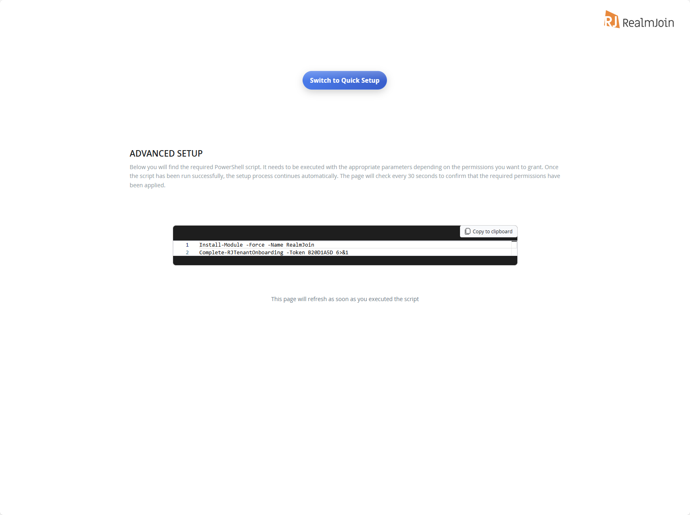
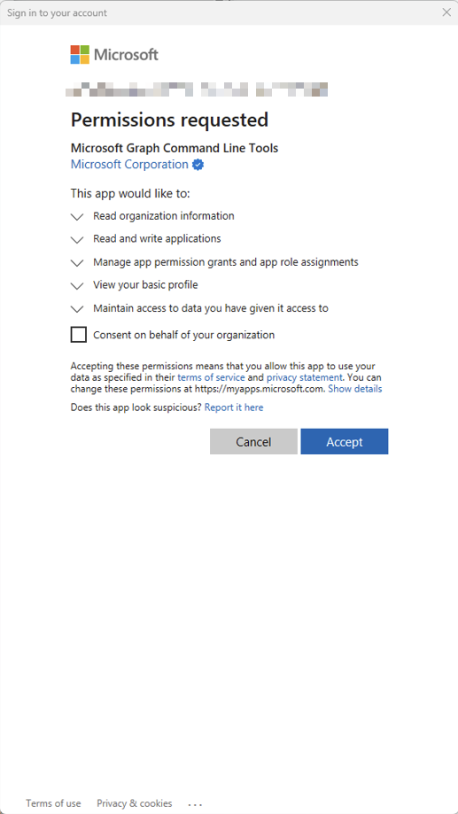
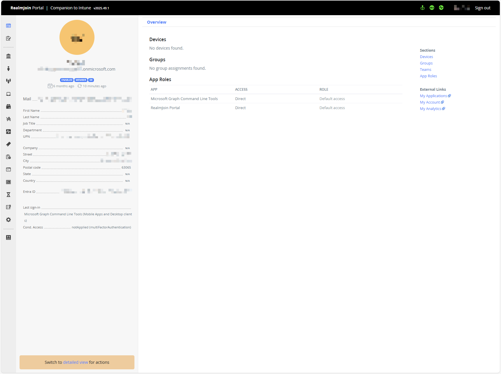

# Advanced Setup

The RealmJoin PowerShell module automates the setup of your RealmJoin tenant. It:

* Creates the required Microsoft Entra ID service principals for the RealmJoin applications
* Assigns the appropriate Microsoft Graph permissions based on the features you select
* Configures RealmJoin features (Portal, Intune LAPS, Autopilot, device actions, remediation scripts, security features)
* Cleans up legacy applications from previous configurations

The module is published on the [PowerShell Gallery](https://www.powershellgallery.com/packages/RealmJoin).

## Prerequisites


The required Azure PowerShell modules (`Az.Accounts`, `Az.Resources`, `Az.Automation`) are installed automatically in the versions the module pins, for the current user, the first time you run a command.


* **PowerShell 5.1** or later (Windows PowerShell or PowerShell 7)
* An account that can **create service principals and grant application permissions** in Microsoft Entra ID — for example *Global Administrator* or *Privileged Role Administrator*
* Sign-in happens through `Connect-AzAccount`, which uses the **Azure PowerShell** first-party application. Tenants that restrict user consent may need an administrator to grant admin consent to that application first.
* Access to the [PowerShell Gallery](https://www.powershellgallery.com/packages/RealmJoin) to install the module


Since version 2.0, the module signs in with the **Azure PowerShell** application and the `Az` modules. Earlier versions used the Microsoft Graph PowerShell application instead — if your tenant only consented to that one, consent to the Azure PowerShell application is needed once.


## Recommended Setup

The setup command displayed by the RealmJoin Portal will provide permissions for:

* Core features
* Intune LAPS
* Sign-in data
* Remediation scripts
* Autopilot
* Intune device actions

To add all features or individual features, see [Other Commands](advanced-setup.md#other-commands).



#### Open PowerShell on Windows/Mac

We recommend installing and running the RealmJoin PowerShell module in a **freshly opened** PowerShell session on your own device rather than in Azure Cloud Shell. The module requires exact versions of the `Az.*` modules; if a different version is already loaded in the session — which is typically the case in Cloud Shell — it stops with a version conflict that cannot be resolved without opening a new session.

An elevated ("Run as administrator") session is not required: modules are installed with `-Scope CurrentUser`.



#### Copy and Run the RealmJoin Onboarding Script

The script will prompt you to sign in to Azure. Use an account that can create service principals and grant application permissions, for example your Global Administrator.

```powershell
Install-Module -Force -Name RealmJoin
Complete-RJTenantOnboarding -Token 1234ABCD 6>&1
```


**About `6>&1`:** These commands write their progress updates to PowerShell's Information stream. The `6>&1` redirection displays that output in the console — without it you won't see the detailed progress messages during execution.


<figure><figcaption></figcaption></figure>

<figure><figcaption></figcaption></figure>



#### Begin using RealmJoin

Once finished, the script will launch the RealmJoin Portal

<figure><figcaption></figcaption></figure>



## Other Commands

### Interactive Setup

For a guided, menu-driven experience covering tenant setup, configuration changes, the Log Analytics workspace and the Automation Account:

```powershell
Show-RJInteractiveSetup
```

To review the available features before configuring anything:

```powershell
Show-RJFeatureInfo
```

### Custom Configuration

#### Default Features

Enables the mandatory core portal functionality plus the default optional features (everything except the RealmJoin Client):

```powershell
New-RJTenant 6>&1
```

#### Minimal Features (only mandatory features)

```powershell
New-RJTenant -Features @() 6>&1
```

#### Full Feature Set

```powershell
New-RJTenant -All 6>&1
```

#### Read-Only Permissions

Assigns read-only permissions where available (for example, `Group.ReadWrite.All` becomes `Group.Read.All`):

```powershell
New-RJTenant -ReadOnly 6>&1
```

#### Custom Feature Selection

```powershell
New-RJTenant -Features @('RealmJoinPortal', 'IntuneLAPS', 'Autopilot') 6>&1
```

### Updating Existing Configuration

`Update-RJTenant` adjusts an already-configured tenant. The alias `Complete-RJTenantOnboarding` can be used interchangeably with `Update-RJTenant`.

#### Add New Features

```powershell
Update-RJTenant -AddFeatures @('SecurityFeatures') 6>&1
```

#### Remove Features

```powershell
Update-RJTenant -RemoveFeatures @('ShowSignin') 6>&1
```

#### Switch to Read-Only Permissions

```powershell
Update-RJTenant -ReadOnly 6>&1
```

#### Preview Changes

```powershell
Update-RJTenant -AddFeatures @('SecurityFeatures') -WhatIf 6>&1
```

### Azure Resources

The module also deploys the companion Azure resources RealmJoin uses. These are not Graph permission features and are not selected with `-Features`:

* `Set-RJLogAnalyticsWorkspace` — deploys the Log Analytics workspace with its custom tables and Data Collection Rules, see [Connecting Azure Log Analytics Workspace](../../monitoring-and-logs/log-analytics.md)
* `Set-RJAutomationAccount` — deploys the RealmJoin Automation Account with a managed identity and the permissions it needs, see [Connecting Azure Automation](../../automation/connecting-azure-automation/)

Both commands are generated with the matching parameters and an onboarding token on the relevant settings page in the RealmJoin Portal.

## Available Features

Use these feature names with the `-Features`, `-AddFeatures`, and `-RemoveFeatures` parameters. Mandatory features are always enabled. The default configuration (`New-RJTenant` without parameters) enables the features marked below; **SecurityFeatures** and **Client** have to be selected explicitly.

| Feature              | Description                                                                | Default |
| -------------------- | -------------------------------------------------------------------------- | :-----: |
| `RealmJoinPortal`    | Core portal functionality for user self-service and admin interaction (mandatory) | ☑️ |
| `IntuneLAPS`         | Retrieve and manage local admin passwords via Intune LAPS                  | ☑️ |
| `ShowSignin`         | Display user sign-in history and audit logs                                | ☑️ |
| `Autopilot`          | View Windows Autopilot deployment profiles and status                      | ☑️ |
| `DeviceIntuneActions`| Execute privileged device actions (sync, restart, wipe, etc.)              | ☑️ |
| `DeviceHealthScript` | Manage and deploy PowerShell remediation scripts to devices                | ☑️ |
| `BitLockerRecoveryKeys` | View BitLocker recovery keys for managed devices                        | ☑️ |
| `WindowsDeviceUpdateEnrollment` | Manage Windows Device Updates enrollment                        | ☑️ |
| `SecurityFeatures`   | Advanced threat protection and security analytics (requires MDE licenses)  |    |
| `Client`             | RealmJoin Agent — client application for device management                 |    |

## Troubleshooting


**"Insufficient privileges"** — creating service principals and granting application permissions requires an appropriately privileged account, for example *Global Administrator* or *Privileged Role Administrator*. See [Prerequisites](advanced-setup.md#prerequisites).



**"Need admin approval" or a consent error during sign-in** — sign-in uses the **Azure PowerShell** first-party application. If your tenant restricts user consent, an administrator has to grant admin consent to that application once.



**"RealmJoin module is outdated - execution cannot proceed"** — every command verifies once per session that you are running the latest published version. Install the current version, then close the session and open a new one:

```powershell
Install-Module -Name RealmJoin -Force -Scope CurrentUser
```



**A module version conflict is reported** — an `Az.*` module in a version other than the one the module pins is already loaded. This cannot be fixed in the running session: close PowerShell, open a new session and run the command again.


If the module cannot be found, confirm the PowerShell Gallery is available and reinstall:

```powershell
Get-PSRepository
Install-Module -Name RealmJoin -Force -Scope CurrentUser
```

### Getting Help

```powershell
Get-Help New-RJTenant -Full
Get-Help Update-RJTenant -Examples
Get-Help Show-RJInteractiveSetup -Detailed
```
