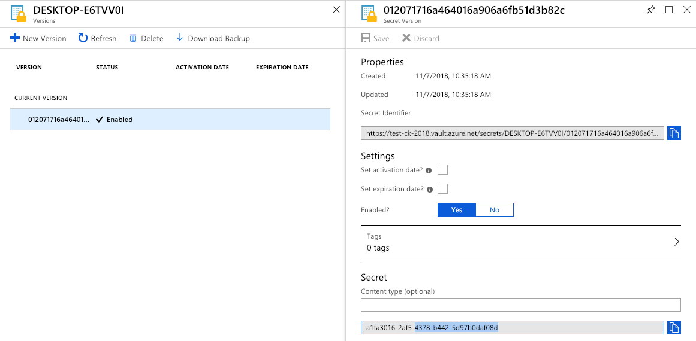
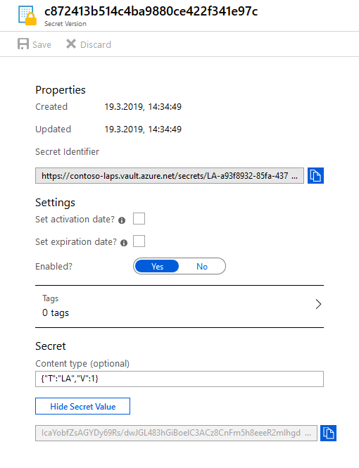

# KeyVault

Cloud applications and services use cryptographic keys and secrets to help keep information secure. Azure Key Vault safeguards these keys and secrets. When you use Key Vault, you can encrypt authentication keys, storage account keys, data encryption keys, .pfx files, and passwords by using keys that are protected by hardware security modules (HSMs).

## Create KeyVault

**Name**, **Subscription**, **Resource Group** and **Location** are required fields.

1. Click **Access policies**
2. Then click **Add new**
3. Select **Key, Secret, & Certificate Management**
4. Click **Select principal**
5. Choose **RealmJoin**
6. Then click **Select**
7. Navigate to **Key permissions**
8. Select the shown **Cryptographic Operations**

Click **OK** in the **Add access policy** blade and click **OK** in the **Access policies** blade. Finally click **Create**.  
Then copy the field **DNS Name** and send it to [GK Support](product.support@glueckkanja.com).  
Example value: https://contoso-rj-laps.vault.azure.net/

## KeyVault Storage of Secrets

RealmJoin will not be store the secret in any proprietary storage but instead create an **Azure KeyVault Secret** to store it in a secure and auditable way. The KeyVault API is documented here:

https://docs.microsoft.com/en-us/rest/api/keyvault/setsecret/setsecret

The entry in KeyVault will be added with the device name as a key and the plain GUID as the secret value. See the following example screenshot:

