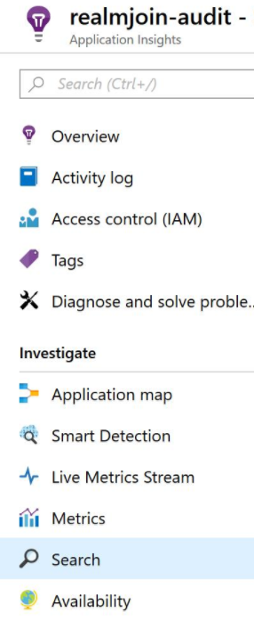

# How to - Local Administrator Password Solution

Local Administrator Password Solution (short LAPS) is a Microsoft tool which will solve the issue of using an identical password on every Windows computer.

## Windows 10 Local Admin Recovery Account

RealmJoin will introduce a new feature to help support teams when there is a need for a local admin account on Windows 10 devices. The implementation assumes a rare and restricted use of these accounts and takes care of a very strict process.  
The feature is disabled by default and needs to enabled for all or groups of devices by policy.

### Step 1: Local Account Creation

The RealmJoin agent creates a local account with random name and password based on a Globally Unique Identifier (GUID). The steps are similar to the following commands:

> - powershell -c ```[guid]::NewGuid().ToString()```  
a1fa3016-2af5-4378-b442-5d97b0daf08d
> - net user /add RJ-a1fa3016-2af5 4378-b442-5d97b0daf08d
> - net localgroup administrators RJ-a1fa3016-2af5 /add
> - wmic useraccount where ```Name='RJ-a1fa3016-2af5'``` **set PasswordExpires=false**

The guarantees that the account and password are strong and a mass brute force is without success. Then the GUID will send to RealmJoin Cloud service API.

### Step 2: KeyVault Storage of Secrets

RealmJoin will not store the secret in any proprietary storage but instead create an **Azure KeyVault Secret** to store the GUID in a secure and auditable way. The KeyVault API is documented here:

https://docs.microsoft.com/en-us/rest/api/keyvault/setsecret/setsecret

The entry in KeyVault will be added with the device name as a key and the plain GUID as the secret value. In the above example of **Step 1** the result is shown in the following screenshot:

[](./media/rj-laps1.PNG) <!-- [](media/ap-3.PNG) dieses Format bei Einbetten in die RJ-Doku beachten -->

### Step 3: Access

When a support member needs to access a secret RealmJoin will provide an interface to get account and password. When this happens, an update-secret command will be send to the client and the admin account will be recreate within an adjustable time frame with repetition of **Step 1 and 2**.

## Prerequirements

### Create KeyVault

[](./media/rj-laps2.PNG)

**Name**, **Subscription**, **Resource Group** and **Location** are required fields.

1. Click **Access policies**
2. Then click **Add new**
3. Select **Key, Secret, & Certificate Management**
4. Click **Select principal**
5. Choose **RealmJoin**
6. Then click **Select**
7. Navigate to **Key permissions**
8. Select the shown **Cryptographic Operations**

Click **OK** in the **Add access policy** blade and click **OK** in the **Access policies** blade. Finally click **Create**.  
Then copy the field **DNS Name** and send it to [GK Support](product.support@glueckkanja.com).  
Example value: https://contoso-rj-laps.vault.azure.net/

### Create App Insight for generic auditing

[](./media/rj-laps3.PNG)

Navigate to **Application Insights**. Click **+ Add** and do the following:

1. Set **Application Type** to **General**  
Set **Resource Group** to **Use existing**
2. Click **Create**

Then, copy the field **Instrumentation Key** and send it to [GK Support](product.support@glueckkanja.com).  
Example value: ```a74393bd-2dee-4a10-9df3-66c8c2b2a9ec```

### App Insight - Reporting

To start a reporting click **Search**

[](./media/rj-laps4.PNG)

An overview appears, which looks like the following example:

[](./media/rj-laps5.PNG)

## On-demand account

An on-demand account only will be created when a client will be set it in the back-end, when its needed. Otherwise a common administrator account is in use with an identical password on every computer in a domain.

## Group Configuration

| Key | Default Value | Sample Value | Description |
| --- | ------------- | ------------ | ----------- |
| **LocalAdminManagement.EmergencyAccount** | | | |
| .NamePattern | "ADM-{HEX:8}" | "Admin-{HEX:4}" | |
| .DisplayName | "RealmJoin Local Administrator" | "Local Emergency Admin" | |
| .PasswordCharSet | See notes[^1] | "0123456789ABCDEFabcdef" | |
| .PasswordLength | 20 | 30 | |
| .MaxStaleness | | "00:45" | Delete and recreate profile 45 min. after last use. |
| **LocalAdminManagement.SupportAccount**| | | |
| .NamePattern | !ADM-{HEX:8}" | "Admin-{HEX:4}"
| .DisplayName | "RealmJoin Local Administrator" | "Local Support Admin" | |
| .PasswordCharSet | See notes[^1] | "0123456789ABCDEFabcdef" | |
| .PasswordLength | 20 | 30 | | |
| .MaxStaleness | | "08:00" | Delete and recreate profile 8 hours after last use. |
| .OnDemand | | true | Create support account only when requested through RealmJoin Portal. Account will expire after 12 hours. |
| LocalAdminManagement.Inactive | | true | Kill switch. Remove all accounts from all clients |

[^1] Excludes similar looking characters:  
```!#%+23456789:=?@ABCDEFGHJKLMNPRSTUVWXYZabcdefghijkmnopqrstuvwxyz```