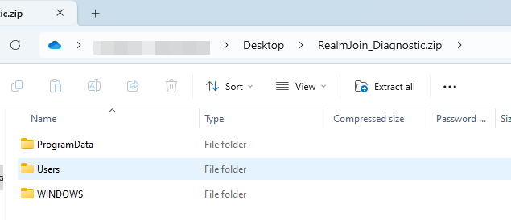

# Package Installation Issues

This guide will focus on troubleshooting failed RealmJoin software package installations.


This guide is only valid for software deployment using the RealmJoin client (not intunewin).

Especially the convenient way of collecting the required logfiles, directly on the client as well as remotely using the RealmJoin portal, only works with the RealmJoin tray application rolled out to your clients.

When using intunewin deployment, the logfiles will need to be collected manually from the clients, the most relevant folder being `C:\WINDOWS\Logs\RealmJoin`.


## Required log files

Without log files a failed software package installation cannot be properly troubleshooted.\
The required log files needed for troubleshooting failed installations reside in several location on the local client:

* `C:\WINDOWS\Logs\realmjoin*.log`
* `C:\WINDOWS\Logs\RealmJoin`
* `%LOCALAPPDATA%\RealmJoin\tray*.log`
* `%LOCALAPPDATA%\RealmJoin\Logs`
* `C:\ProgramData\chocolatey\logs\`
* `C:\Users\Public\Documents\RealmJoin`

Please always provide the ZIP file containing the logs with any service request raised to the RealmJoin support.

<figure><figcaption>
File structure of a RealmJoin exported logs ZIP file
</figcaption></figure>

\
The following chapters will explain how to obtain the logs, how to analyze them, and will explain some common issues and fixes for these common issues.
