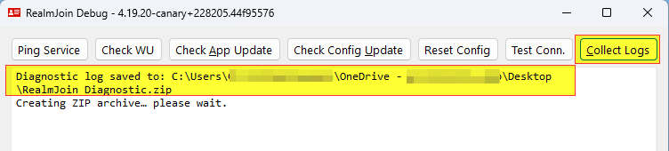
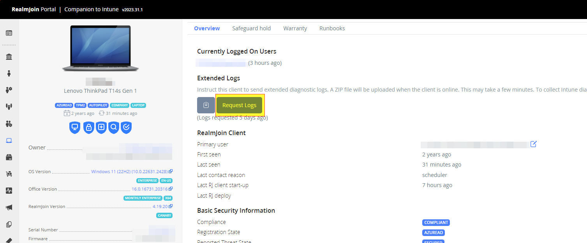

# Collecting Logfiles

There are two main methods on how to easily collect the log files from an affected device.\
Logs can either be obtained directly on the client or remotely using the [RealmJoin Portal](https://portal.realmjoin.com).\
Both ways will result in the same ZIP file.

## On the client

The easiest way to collect the logs is using the built-in _Collect Logs_ feature of the RealmJoin client:

1. Hold `CTRL+Shift` while clicking on the RealmJoin tray icon.
2. Select `Show Debug Window` (2nd item from the bottom).
3. In RealmJoin debug window click on the `Collect Logs` button.
4. A ZIP-file called `RealmJoin_Diagnostic.zip` will be created on the user's desktop.
5. This ZIP-file contains all important logs for troubleshooting failed installations.

<figure><figcaption>
Collecting logs on the client using RealmJoin debug window
</figcaption></figure>

## Remotely using the RealmJoin portal

Log files can also be requested remotely using the RealmJoin portal.


For this feature to work, the client needs to be online and have a running RealmJoin tray. Also, you will need to wait for the next RealmJoin client sync cycle to complete until the log file download will be available. The usual sync cycle is 30 minutes, which is the maximum wait time.

The sync can be forced from the client by running `Sync this device` from the RealmJoin tray menu.


1. Open the [RealmJoin Portal](https://portal.realmjoin.com)
2. Search for the affected device and open the device page.
3. On the `Overview` tab, search for the section `Extended Logs`
4. Click on the `Request Logs` button.
5. Wait until the logs are availble, if the client is online the maximum wait time is around 30 minutes.
6. Click the download button left to the `Request Logs` button to download the ZIP file containing the logs.


The log ZIP file download is available to every user that has access to the RealmJoin Portal, not only the requesting account.


<figure><figcaption>
Requesting Logs using the RealmJoin Portal
</figcaption></figure>
