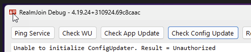

# Fixes for common issues


**Only use these fixes in the described scenarios!**&#x20;

**These are not intended to be applied blindly as they may do more harm if applied unnecessarily.**


## BranchCache issues

* Error message `There is not enough space on the disk` (may also occur localized, depending on Windows OS language) in download phase, chocolatey exit code `404`:
  1. Open an elevated PowerShell
  2. Run `Clear-BCCache -Force`
* Error message `The supplied object has not been initialized` (may also occur localized, depending on Windows OS language) in download phase, chocolatey exit code `404`:
  1. Open an elevated PowerShell
  2. Run `Reset-BC -Force`
* Error message `Error - hashes do not match. Actual value was '123abcd'`:
  1. Open an elevated PowerShell
  2. Run `Reset-BC -Force`&#x20;


We strongly recommend deploying the **Reset or Clear BranchCache** Remediation Script with a daily schedule. It can be found in the [Remediation Scripts](../../../automation/remediation-scripts.md) section of the RealmJoin Portal.&#x20;

By using this method the above mentioned BranchCache issues will proactively be detected and automatically remediated (if possible).


## Missing / wrong Package arguments 

1. Check the `chocolatey.log` file for the value(s) of `packageParameters` in the section `RJAppDeployToolkit: Resulting Variables`
   * These are the actual value(s) used for the installation and passed by the RealmJoin backend.
2. If they are not the value(s) you would expect, check the package assingment in the RealmJoin portal for group / user override values.

## Corrupt .nupkg file

If you see the following error in the `chocolatey.log`  the .nupkg file got corrupted:&#x20;

`[ERROR] - Unable to read package from path 'generic-package-id\generic-package-id.nupkg'.`&#x20;

Often it can also be observed that the .nupkg file is 0 bytes in size.

Steps to fix this issue:

1. Navigate to `C:\ProgramData\chocolatey\lib`
2. Delete folder `generic-package-id`&#x20;

## Broken chocolatey config 

1. Delete contents of folder `C:\ProgramData\chocolatey\config`
2. Delete System Variable `ChocolateyInstall` :
   * Use GUI: Run `sysdm.cpl` -> Tab `Advanced` -> `Environment Variables...`
   * Use (admin) cmd, run: `REG delete "HKLM\SYSTEM\CurrentControlSet\Control\Session Manager\Environment" /V ChocolateyInstall`
3. Reboot
4. RealmJoin tray will reinstall chocolatey, let the system settle for 5-10 minutes.
5. If you experience missing items in the RealmJoin tray menu, reboot again.

## General Setup issues 

**As these are very individual, this is just a collection of general troubleshooting steps to help narrow down the issue.**

* Check for log file(s) in `C:\WINDOWS\Logs\RealmJoin\Packages\<package-id>\`.
  * Try to analyze the log file(s) and find the issue.
* If no log file is present, or not helpful, try manually running the setup in GUI mode, to see possible error messages.
  * IMPORTANT: RealmJoin system packages are always installed using the built-in `NT AUTHORITY\SYSTEM` account, so it is best to use a tool like `psexec` to run the installation from that account.
  * Most of the time running the installation using a standard local admin account will provide the same error so running from `NT AUTHORITY\SYSTEM` may not be necessary.

### Package not available to install / not showing in RealmJoin tray menu 

* Check if package is correctly assigned to user or user is member of assigned group
* Check if package is not assigned hidden (use Debug Mode to see hidden assigned packages)
* Check if user is primary user of the client, alternatively check if package is configured to be available to secondary users

## ConfigUpdater unauthorized 

<figure><figcaption>
The RJ agent can not access the configuration
</figcaption></figure>

The primary issue causing this problem is that the access token was not refreshed automatically as expected. Typically, access tokens are updated automatically to ensure uninterrupted access to resources. However, in this case, the expected process failed, leading to the token becoming outdated and thus resulting in access issues. This highlights the importance of ensuring that the automated token refresh mechanisms are functioning correctly to prevent similar issues in the future. Addressing this root cause will help maintain consistent access and avoid disruptions in

1. Delete the RealmJoin token file:
   * Path: `%LOCALAPPDATA%\RealmJoin`
   * RJ 4.19 and below `token2.dat`
   * RJ 4.20 and up: `msal_cache.dat`
2. Reboot
