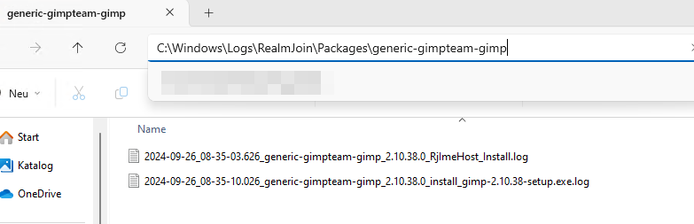

# Intunewin Debugging

As intunewin packages do not utilize the RealmJoin agent for installing applications, but Intune, the logging is different.&#x20;

### Logfile locations

Intunewin deployed application packages write three different logfiles.&#x20;

* RJImeHost logs: $env:Systemroot\Logs\RealmJoin\Packages\\\<package-id>\date\_package-id\_RjImeHost\_Install.log
* Package installer logs: if available: $env:Systemroot\Logs\RealmJoin\Packages\\\<package-id>\\\*.log
* Generell IME logs: C:\ProgramData\Microsoft\IntuneManagementExtension\Logs\intuneManagementExtension.log

<figure><figcaption></figcaption></figure>

The following RjImeHost.log lines state the installation command:&#x20;

```
OUT: 240926-083509.886+02:00| DEBUG: Entered function 'Install-RealmjoinPackage' with parameters [{"Key":"silentArgs","Value":["/VERYSILENT /ALLUSERS /LOG=\"%LOGFILEPATH%\""]},{"Key":"installerFileName","Value":"gimp-2.10.38-setup.exe"},{"Key":"installerFileChecksum","Value":"e3515980c9012eed67cf78f1151d216725529e95676c16f5ff7478d46230ddab"}]
OUT: 240926-083512.671+02:00| Running installer...
OUT: 240926-083512.702+02:00| DEBUG: Entered function 'Start-RealmjoinProcess' with parameters [{"Key":"FilePath","Value":"C:\\Windows\\IMECache\\1ce860d8-c3a9-4032-b29d-cd51814038e9_1\\blobs\\gimp-2.10.38-setup.exe"},{"Key":"ArgumentList","Value":["/VERYSILENT /ALLUSERS /LOG=\"C:\\Windows\\Logs\\RealmJoin\\Packages\\generic-gimpteam-gimp\\2024-09-26_08-35-10.026_generic-gimpteam-gimp_2.10.38.0_install_gimp-2.10.38-setup.exe.log\""]},{"Key":"ValidExitCodes","Value":[0,1641,3010]}]
OUT: 240926-083700.796+02:00|     Done running installer.
```

This section will contain any installation error codes.&#x20;

