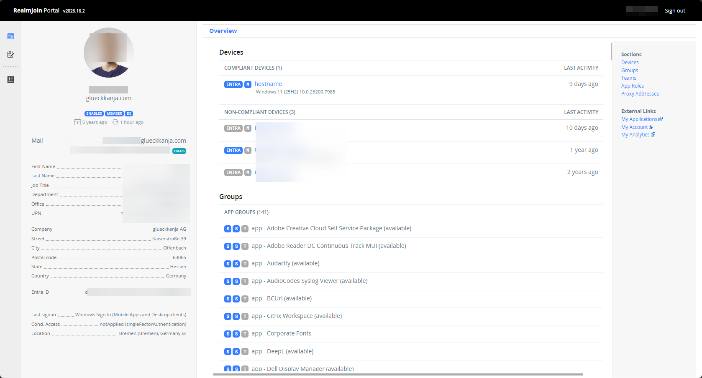
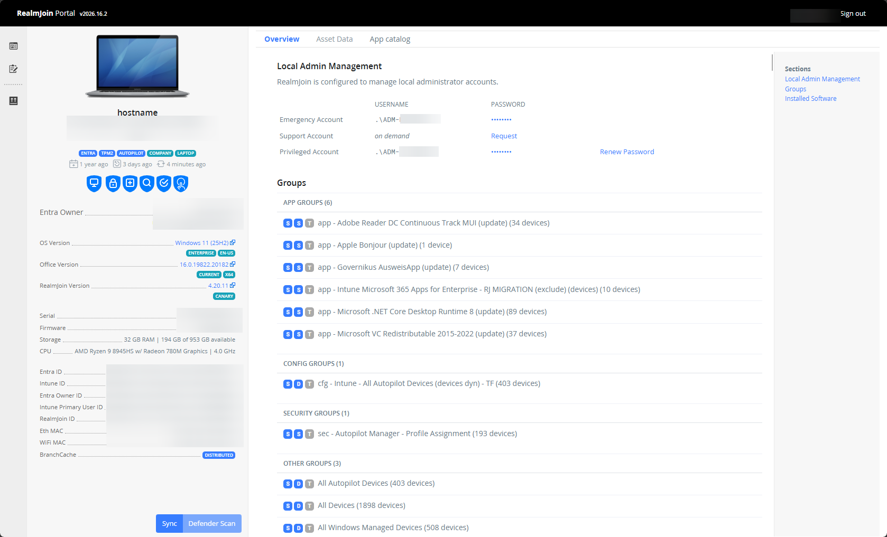
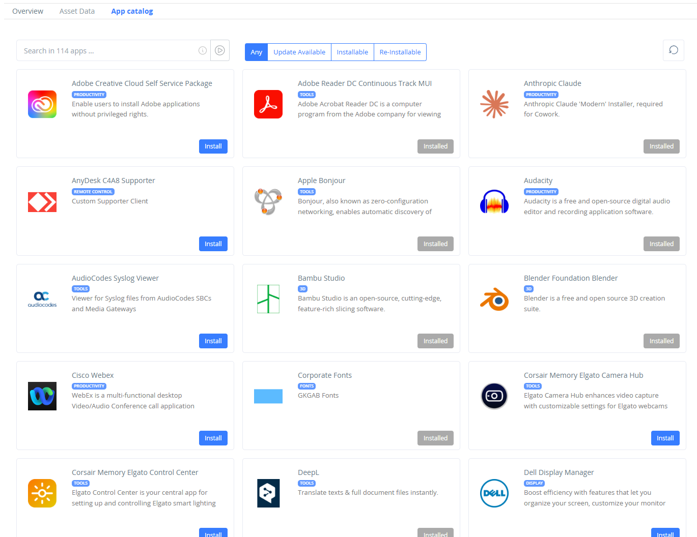

# Self Service Portal

The RealmJoin Self-Service Portal (SSP) is a central web-based interface that bridges the gap between IT administration and end-user autonomy.
\
By providing a transparent view of the RealmJoin environment, it allows users to manage their own devices, software, and identity attributes, reducing the volume of standard IT support tickets.

* **Public Access URL:** [portal.realmjoin.com](https://portal.realmjoin.com)
* **Authentication:** Integrated via Entra ID (Single Sign-On).

***

## User Profile Dashboard

Upon successful authentication, the portal presents a user-centric dashboard. This view is designed to provide immediate visibility into the user's digital footprint within the corporate environment.

#### User Identity Sidebar (Left)

The persistent sidebar on the left side of the dashboard provides high-level object details, including:

* **User Principal Name (UPN):** The primary identity string.
* **Department/Location:** Metadata pulled from the identity provider.
* **Identity GUIDs:** Unique identifiers used for backend troubleshooting.

#### &#x20;Primary Data Objects

The main interface displays five primary categories:

* **Devices:** A comprehensive list of hardware assigned to the user.
* **Groups:** Real-time visibility into Entra-ID group memberships, allowing users to verify their access levels.
* **Teams:** A list of Microsoft Teams where the user is an active member or owner.
* **App Roles:** Specific application-level permissions or roles assigned to the user profile.
* **Proxy Addresses**: List of all proxy addresses for the user.

<figure><figcaption>
User profile overview
</figcaption></figure>

### Device View

Clicking on a windows device navigates the user to the [**Device detail view**](https://docs.realmjoin.com/ugd-management/user-list/device-details). This section is the core of the self-service troubleshooting experience.

#### Device Control Sidebar&#x20;

This sidebar focuses on the specific hardware asset:

* **Metadata:** Displays Device Name, Hardware Flags (e.g., Autopilot status), Entra owner, and Intune/RJ Device IDs.
* **Sync Action:**
  * **Sync**: Triggers the Intune MDM (Mobile Device Management) check-in as well the local RealmJoin agent to pull the latest configurations and app assignments and upload log files if applicable.&#x20;
  * **Defender Scan**: Start the defender scan of the device. Only available with the RealmJoin admin role.&#x20;

#### **Overview Tab**

The landing page for device details. It provides:

* **Local Admin Management:** If the user is enabled for [selfLAPS](https://docs.realmjoin.com/realmjoin-agent/realmjoin-client/local-admin-password-solution-laps#support-account), the function allows to request a temporary support administrator account or a persistent administrator account for the device.
* **Groups:** All group memberships of the device
* **Installed Software:** List of applications found on the device. Glossary:&#x20;
  * **Choco:** Installed using the chocolatey engine, e.g. via RealmJoin.
  * **APPX:** Modern Windows applications (Windows Store / UWP packages).
  * **Win32:** "Classic" Windows applications (installed via .exe or .msi).
  * **Subscribed:** The current version available in the central application package repository.
  * **Deployed:** The version of the package that was last pushed/executed on this specific device.
  * **Installed:** The actual version currently detected on the local file system.
  * **Apparated:** Applications detected on the device that were not deployed via Intune or RealmJoin (i.e., sideloaded or manually installed).
  * **Not Installed:** An available software package that has been assigned but not yet executed on the device.
  * **Usage**: Displays the frequency of application launches (where telemetry data is available).

<figure><figcaption>
Device overview
</figcaption></figure>

#### **App Catalog Tab**

The App Catalog serves as a modern, web-based replacement for the legacy RealmJoin tray menu.

* **Visual Interface:** A clean, grid-based layout of all software packages assigned as available to the user/device.
* **User Actions:**
  * **Install:** Initiate a new software installation.
  * **Update:** Upgrade an existing application to the latest available version.
  * **Reinstall:** Repair or reset a software package.
* **Technical execution:** When an action is clicked, a command is sent to the **RealmJoin Agent**. The agent triggers the installer immediately on the local system.

<figure><figcaption>
App Catalog for self service
</figcaption></figure>


**Note:** After execution, the status update (e.g., "Installing" to "Success") may have a slight latency of a few seconds as the agent reports back to the portal.

Self service application installation via the App Catalog is **only available for deployment using the RealmJoin** agent.&#x20;


***

## Self Service Forms&#x20;

The portal can be configured to host interactive forms. These allow users to request specific changes, update their own metadata, or trigger automated backend scripts.

&#x20;[Learn more about Self-Service Forms](https://docs.realmjoin.com/realmjoin-settings/self-service-forms)

<figure><figcaption>
Self service forms
</figcaption></figure>

## Application Packaging Requests

Users can request new application packages that is not yet in the official catalog.

* **Permission-Based:** This option only appears if the user has been granted the necessary permissions in the RealmJoin backend.

&#x20;[Learn more about Packaging Requests](https://docs.realmjoin.com/app-management/packages/packaging-requests)

<figure><figcaption>
Package request form
</figcaption></figure>

***
