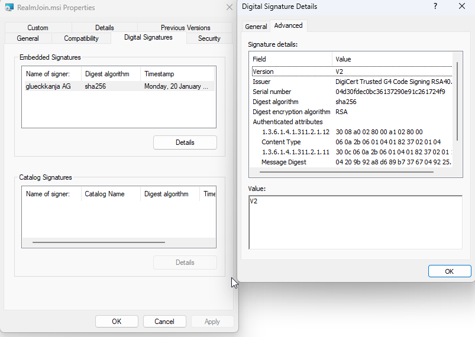

# Deploying the Agent

The RealmJoin Agent can be seamlessly deployed using Microsoft Intune. A ready-to-use package is available in our Package Store, simplifying the setup process.\
This guide outlines the recommended and supported method for installing the RealmJoin Agent via Intune.

## Automatic Deployment

### Microsoft Intune (intunewin)


Recommended and fully supported.


RealmJoin integrates directly with your Microsoft Intune tenant by adding and updating the agent as an intunewin package:

1. Open our **Package Store**.
2.  Select the banner "RealmJoin Agent" or use this direct link: [RealmJoin Agent (Device)](https://portal.realmjoin.com/packagestore/45935/overview)\


    <figure><figcaption></figcaption></figure>
3. Select "**Use Intune (managed)**" as deployment method and click "Continue".
4. Add this package to your "**Enrollment Status Page**" under "Block device use until required apps are installed if they are assigned to the user/device". This ensures that Intune waits for RealmJoin Agent installation during enrollment.
5. Please also activate "**Automation Main channel**".

<figure><figcaption></figcaption></figure>


RealmJoin agent will **check for newer versions** during **inital deployment** and **update if required**. To speed up this process, we still recommend "Automation Main channel". This ensures that the most current version is installed right from the start.



Please **do not use "Automate Preview channel"** as the **intunewin application ID can change** what will remove the package from your "Enrollment Status Page" configuration.


6. **Assign** the package to **devices** (if assigned to user objects, the agent might not start during deployment), e.g.:
   1. Add **single devices or device group/s** to the automatically created managed app groups
   2. Add "**All devices**" as **additional assignment via Intune** (note that you might need filters to exclude special devices like AVD or Kiosk)


Our store also offers the package "RealmJoin Agent (User)" which is running on user level (which was the default in the past). For **stability reasons**, we now **only recommend the device level version**.


## Beta and Canary channel


The RealmJoin release **channel** can be **adjusted via User and Group settings**: [Configure RealmJoin release channel](../ugd-management/user-and-group-settings/). Only **during initial deployment**, the **channel is defined and fixed by the installer** package. When using [Automatic Deployment](installation.md#automatic-deployment) with our Package store, deployments will always use the release channel.


For **testing initial deployments with other channels**, you can manually download and upload one of the following intunewin packages:

* Beta Channel (near to stable, for long-term testing):\
  [RealmJoin Beta Version](https://gkrealmjoin.s3.amazonaws.com/win-beta/RealmJoinSystemInstallEspDeviceSetupOnly.intunewin)
* Canary Channel (Experimental, first testing):\
  [RealmJoin Canary Version](https://gkrealmjoin.s3.amazonaws.com/win-canary/RealmJoinSystemInstallEspDeviceSetupOnly.intunewin)

When uploading to Intune, please use the suggested settings and:

* Program:
  * Device restart behavior: `Determine behavior based on return codes`
* Detection rules:
  * Manually configure detection rules
  * File:
    * Path: `C:\Program Files\RealmJoin`
    * File or folder: `RealmJoin.exe`
    * Detection method: `File or folder exists`
    * Associated with a 32-bit app on 64-bit clients: `No`

## Windows Defender Exceptions

RealmJoin has worked with the Microsoft Defender Team to be whitelisted from malware detection. Since Defender is using more and more machine learning mechanisms to identify potential threats and RealmJoin has several features like cloud downloaded application installations, RealmJoin might be recognized by **Windows Defender** as a possible threat.

While this behavior is not certain, it is recommended to implement additional **Windows Defender Antivirus exceptions**:

| Defender Exceptions                             |
| ----------------------------------------------- |
| **Files and Folders**                           |
| `%ProgramFiles%\RealmJoin`                      |
| `%ProgramFiles%\RealmJoin\RealmJoin.exe`        |
| `%ProgramFiles%\RealmJoin\RealmJoinService.exe` |
| `%ProgramFiles%\RealmJoin\RealmJoinUpdate.exe`  |
| **Processes**                                   |
| `%ProgramFiles%\RealmJoin`                      |
| `%ProgramFiles%\RealmJoin\RealmJoin.exe`        |
| `%ProgramFiles%\RealmJoin\RealmJoinService.exe` |
| `%ProgramFiles%\RealmJoin\RealmJoinUpdate.exe`  |


It\`s important to configure the same path in **Files and Folders** and **Processes**. In some cases, Microsoft only checks one of this Defender Exceptions.


## Additional Information

### Automatic Deployment

#### Legacy: Microsoft Intune (MSI)


This **legacy deployment method** is provided for reference purposes only and is **no longer supported**.

Also note that [Microsoft does not recommend to mix MSI and intunewin deployment](https://learn.microsoft.com/en-us/intune/intune-service/apps/lob-apps-windows): "If you mix the installation of Win32 apps and line-of-business apps during Windows Autopilot enrollment, the app installation may fail as they both use the Trusted Installer service at the same time."


RealmJoin can be deployed via [MSI installer](installation.md#msi-installer) as a Line-of-Business app. When uploading to Intune, ensure that "Ignore app version" is set to "Yes".

<figure><figcaption></figcaption></figure>

### Interactive Installation via Command Line

If an administrator wants to install RealmJoin Agent on a device without mass deployment or the Microsoft Intune infrastructure, one may download the MSI and do an interactive installation. As alternative, you can also copy one of the command lines below to download and run the Agent in a single step.

#### MSI installer and EXE

* Stable release:\
  [MSI](https://gkrealmjoin.s3.amazonaws.com/win-release/RealmJoin.msi) or [EXE](https://gkrealmjoin.s3.amazonaws.com/win-release/RealmJoin.exe)
* Beta Channel (near to stable, for long-term testing):\
  [MSI](https://gkrealmjoin.s3.amazonaws.com/win-beta/RealmJoin.msi) or [EXE](https://gkrealmjoin.s3.amazonaws.com/win-beta/RealmJoin.exe)
* Canary Channel (Experimental, first testing):\
  [MSI](https://gkrealmjoin.s3.amazonaws.com/win-canary/RealmJoin.msi) or [EXE](https://gkrealmjoin.s3.amazonaws.com/win-canary/RealmJoin.exe)

#### Release Channel

```
@powershell -NoProfile -ExecutionPolicy unrestricted -Command "((new-object net.webclient).DownloadFile('https://gkrealmjoin.s3.amazonaws.com/win-release/RealmJoin.exe', 'realmjoin.exe'))" && .\realmjoin.exe
```

#### Beta Channel

```
@powershell -NoProfile -ExecutionPolicy unrestricted -Command "((new-object net.webclient).DownloadFile('https://gkrealmjoin.s3.amazonaws.com/win-beta/RealmJoin.exe', 'realmjoin.exe'))" && .\realmjoin.exe
```

#### Canary Channel

```
@powershell -NoProfile -ExecutionPolicy unrestricted -Command "((new-object net.webclient).DownloadFile('https://gkrealmjoin.s3.amazonaws.com/win-canary/RealmJoin.exe', 'realmjoin.exe'))" && .\realmjoin.exe
```

### Silent Installation

When installing RealmJoin during unattended OS installation or any other non-interactive deployment method you may decide not to have any UI interaction during installation. To install RealmJoin in such a scenario, use the silent installation option:

```
reamjoin.exe -install
```

### Signed MSI

The RealmJoin.MSI is SHA2 (256 bit) signed by RealmJoin and therefore recognized by Windows as safe to install.



