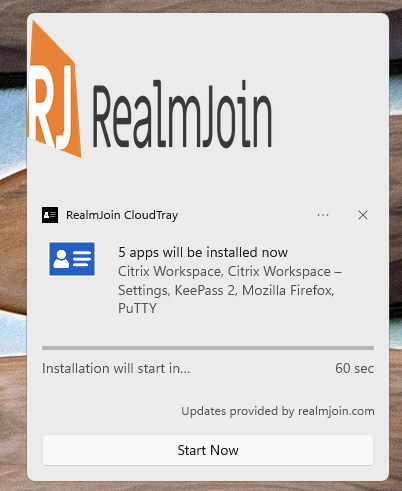

# RealmJoin App Notification

When deploying packages/configurations via RealmJoin Agent, notifications inform the user or allow to interact with the installation process.

<figure><figcaption></figcaption></figure>

The screen above shows the RealmJoin app notification with a customizable **hero image** (for more information about hero images, click [here](https://docs.microsoft.com/en-us/windows/uwp/design/shell/tiles-and-notifications/adaptive-interactive-toasts#hero-image))

Below this hero image you can see information on packages and a comment when the installation will start. You can also start it immediately.&#x20;

## Configuration

You can configure the app notification and especially the hero image with a [Group setting](../../ugd-management/user-and-group-settings/) within the RealmJoin Portal:

```
SoftwarePackaging.Toast
```


```json
{
  "Countdown": {
    "Hero": {
      "Source": "https://[Your Cloudstorage URL]/[Your Filename (SHA-1 Hash of the file)].png"
    }
  }
}
```



Please note that the filename must match the SHA-1 value of the hero image file. \
Please generate it, rename the file and upload it afterwards to your desired Cloud Storage (You can also use the [RealmJoin WCS Feature](../../realmjoin-settings/workplace-cloud-storage.md))\
\
Please also be aware of the file size and the image dimensions defined by Microsoft.&#x20;


<figure><figcaption></figcaption></figure>

