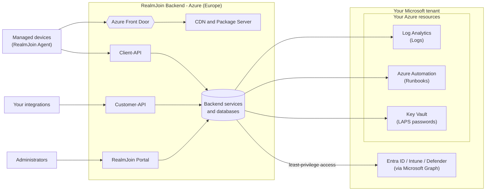
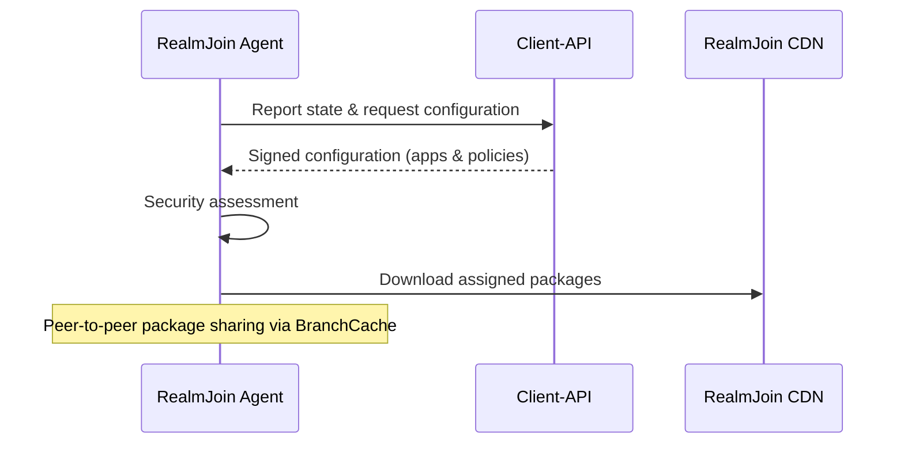

# Architecture Overview

RealmJoin is a cloud-native, multi-tenant SaaS and the **Application Lifecycle and Management companion to Microsoft Intune**. It manages application deployment, user/group/device management and process automation across your Entra ID tenant — **with no on-premise servers or local infrastructure**. All backend services are operated by glueckkanja in **Microsoft Azure, hosted in Europe**.

RealmJoin covers three areas:

* **Application Management** – packaging, deployment, a self-service catalog and software reporting.
* **User, Group and Device Management** – a single, unified view that combines data from Intune, Entra ID, Microsoft Defender, Windows Autopilot and sign-in logs.
* **Process Automation** – runbooks that run in *your own* Azure Automation account.

## The big picture

RealmJoin connects to your tenant through **least-privilege Entra ID applications** that you consent to during onboarding. Every action the backend performs is filtered through RealmJoin's **internal role-based access control (RBAC)** model, which evaluates Entra group and role membership.

## Backend components

The backend is a set of independently deployed services running in Microsoft Azure:

| Component | Purpose | Who connects to it |
| --- | --- | --- |
| **RealmJoin Portal** | The web interface administrators use to manage applications, devices, users, groups and automation. | Administrators, via Entra ID sign-in (OAuth 2.0 / OpenID Connect). |
| **Client-API** | The endpoint the optional RealmJoin Agent on each device talks to. | Managed devices, authenticated by device identity (Entra token + device certificate). |
| **Customer-API** | A programmatic API for your own integrations and automation. | Your systems and tools, using a per-customer API key. |
| **CDN and Package Server** | Delivers application packages and content to devices. | Managed devices. |

Behind these, RealmJoin runs background processing services and stores data in managed Azure databases and storage. Internal-facing services (such as billing and background jobs) are not reachable from the internet.

## The RealmJoin Agent

The RealmJoin Agent is an **optional** Windows component. When installed, it:

* reports device state to the Client-API on a regular schedule,
* retrieves a **signed** device configuration (software and policy assignments),
* runs a local **security assessment** (encryption, patch level, firewall, antivirus) before applying mandatory apps,
* delivers applications efficiently using an enhanced Chocolatey engine plus **BranchCache** peer-to-peer distribution,
* supports **LAPS** (local admin password) — passwords are generated on the device and stored in **your own Azure Key Vault**.

For details on package delivery and BranchCache, see [Infrastructure Considerations](infrastructure/README.md).

## Process automation (runbooks)

Runbooks run in **your own Azure Automation account** — not in RealmJoin's backend. RealmJoin keeps your runbook library in sync with a curated, open GitHub repository and manages and monitors job execution from the Portal. The runbooks act through the Automation account's **managed identity**, so the permissions they use stay entirely within your control.

See [Connecting Azure Automation](../automation/connecting-azure-automation/README.md) and [Runbooks](../automation/runbooks/README.md) for more.

## Application delivery

Packages are produced by RealmJoin's packaging pipeline and delivered to devices through the RealmJoin **CDN** and **Package Server**, with geo-replicated storage and BranchCache for efficient in-network distribution. Applications can be delivered either through **RealmJoin Deployment** (via the Agent) or as **Intune Deployment** (an intunewin package pushed to your tenant).

## Resources in your own environment

Several capabilities use resources in **your own Microsoft tenant and Azure subscription**, so sensitive data stays under your control:

* **Azure Key Vault** – stores the LAPS local-admin passwords generated on your devices.
* **Azure Automation** – runs your runbooks under a managed identity you control.
* **Log Analytics** – stores audit logs and archived runbook logs.

RealmJoin accesses these — and Entra ID, Intune and Defender via Microsoft Graph — using only the least-privilege permissions you grant during onboarding. See [Portal Required Permissions](required-permissions.md) for the full list.

## Security, hosting and data residency

* **Hosting:** All backend services run in **Microsoft Azure**, primarily in the **West Europe** region with backup in **North Europe**. **Customer data does not leave Europe.**
* **Delivery:** The Portal and APIs are reached directly over HTTPS. Application packages and content are delivered through the RealmJoin **CDN**, fronted by **Azure Front Door** for globally load-balanced distribution.
* **Encryption in transit:** All connections use HTTPS/TLS.
* **Identity:** Administrator access uses Entra ID (OAuth 2.0 / OpenID Connect); devices authenticate with their Entra device identity and a device certificate; programmatic APIs use per-customer keys.
* **Tenant isolation:** Each customer's data is separated, and all backend code paths operate within a per-tenant context.
* **Least privilege:** RealmJoin's Entra applications request only the permissions needed for the features you enable, and all actions are governed by RealmJoin's internal RBAC model.
* **Resilience:** Redundant infrastructure with automated failover and point-in-time database recovery; infrastructure is fully defined as code (Terraform).


Externally reachable endpoints are the **Portal, Client-API, Customer-API, CDN and Package Server**. For the full list of hosts to allow in your firewall, see [Infrastructure Considerations](infrastructure/README.md). For more detail on data handling and tenant separation, see [Security & Privacy](../security-and-privacy/README.md).

