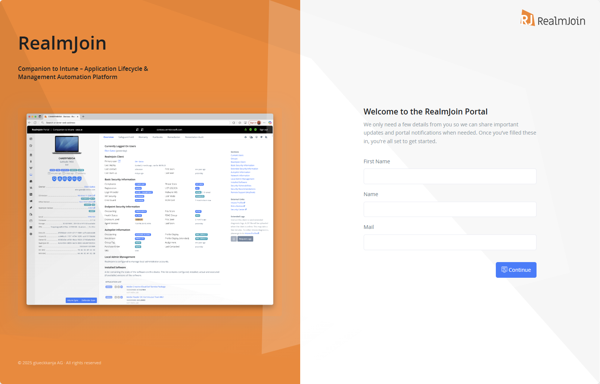
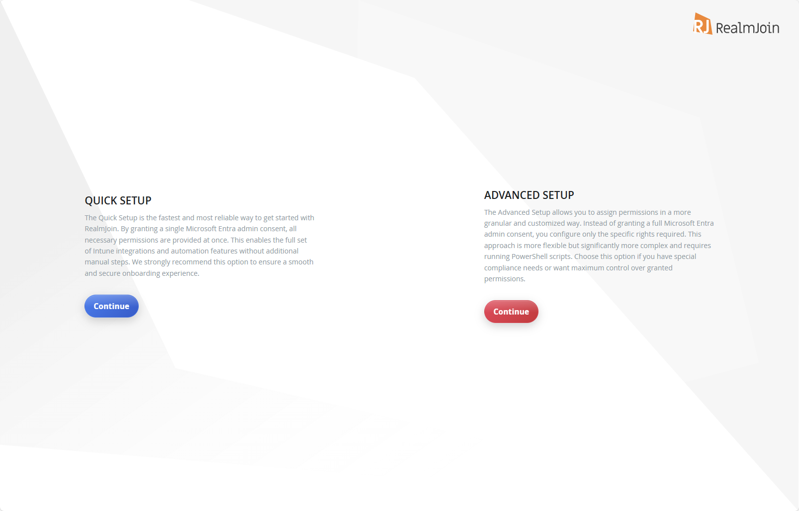

# Onboarding

## Self-onboard RealmJoin Portal



### Sign in as a Global Admin

Visit [https://portal.realmjoin.com](https://portal.realmjoin.com) and sign in as **Global Admin** of your Entra ID Tenant.

<figure><figcaption></figcaption></figure>




### Accept Permissions

Select "Consent on behalf of your organization" to approve the RealmJoin Portal on behalf of your organization.&#x20;

<figure><figcaption>
The App will request basic permissions needed to interact with the RealmJoin Portal. These permissions are required for any user interacting with RealmJoin Portal - e.g. to use self-services.
</figcaption></figure>



### Fill in the form

The nominated email will receive important updates and portal notifications.

<figure><figcaption></figcaption></figure>




### Select "Quick Setup" or "Advanced Setup"

* "Quick Setup" provides core RealmJoin Portal functionality
* "Advanced Setup" provides full RealmJoin functionality. Additionally, choose "Advanced Setup" if your organization has special compliance needs or requires maximum control over granted permissions.

| Features                                 | Quick Setup | Advanced Setup |
| ---------------------------------------- | :---------: | :------------: |
| Core Portal Functionality                |      ☑️     |       ☑️       |
| Autopilot                                |             |       ☑️       |
| RealmJoin Client                         |             |       ☑️       |
| Remediation Scripts                      |             |       ☑️       |
| Privileged Device Actions                |             |       ☑️       |
| Intune LAPS                              |             |       ☑️       |
| Security Features (MDE license required) |             |       ☑️       |
| Audit Logs                               |             |       ☑️       |

<figure><figcaption></figcaption></figure>




[advanced-setup.md](advanced-setup.md)


## Decision Matrix
