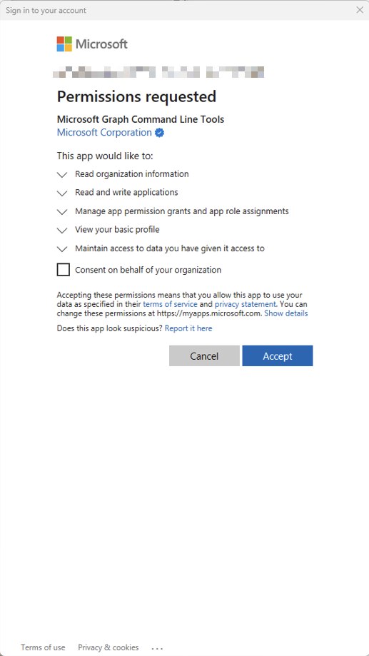
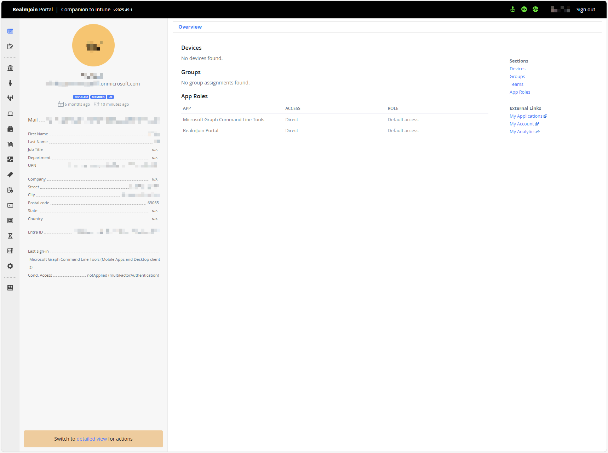

# Advanced Setup

## Recommended Setup

The setup command displayed by the RealmJoin Portal will provide permissions for:

* Core features
* Intune LAPS
* Sign-in data
* Remediation scripts
* Autopilot
* Intune device actions

To add all features or individual features, see [Other Commands](advanced-setup.md#other-commands).



### Open PowerShell on Windows/Mac

We recommend installing and running the RealmJoin PowerShell module on your device's PowerShell rather than Azure CloudShell.



### Copy and Run the RealmJoin Onboarding Script

The script will prompt you to authenticate with Microsoft Graph. Sign in with your Global Administrator.

<figure><figcaption></figcaption></figure>

<figure><figcaption></figcaption></figure>

<figure><figcaption></figcaption></figure>



### Begin using RealmJoin

Once finished, the script will launch the RealmJoin Portal

<figure><figcaption></figcaption></figure>



## Other Commands

### Interactive Setup

For a guide, menu-driven experience:

```
Show-RJInteractiveSetup 6>&1
```

### Custom Configuration

#### Minimal Features (only mandatory features)

```
New-RJTenant -Features @() 6>&1
```

#### Full Feature Set

```
New-RJTenant -All 6>&1
```

#### Read-Only Permissions

```
New-RJTenant -ReadOnly 6>&1
```

#### Custom Feature Selection

```
New-RJTenant -Features @('RealmJoinPortal', 'IntuneLAPS', 'Autopilot') 6>&1
```

### Updating Existing Configuration

#### Add New Features

```
Update-RJTenant -AddFeatures @('SecurityFeatures') 6>&1
```

#### Remove Features

```
Update-RJTenant -RemoveFeatures @('ShowSignin') 6>&1
```

#### Switch to Read-Only Permissions

```
Update-RJTenant -ReadOnly 6>&1
```

#### Preview Changes

```
Update-RJTenant -AddFeatures @('SecurityFeatures') -WhatIf 6>&1
```

### Getting Help

```
Get-Help New-RJTenant -Full
Get-Help Update-RJTenant -Examples
Get-Help Show-RJInteractiveSetup -Detailed
```


