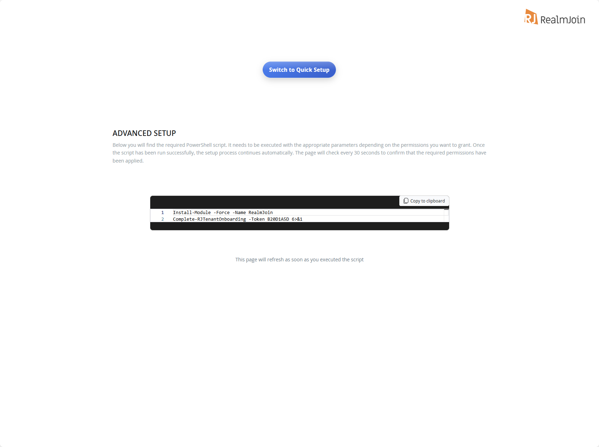
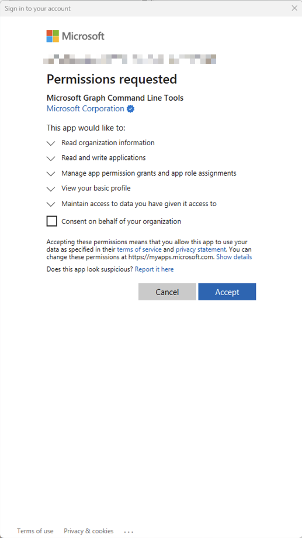
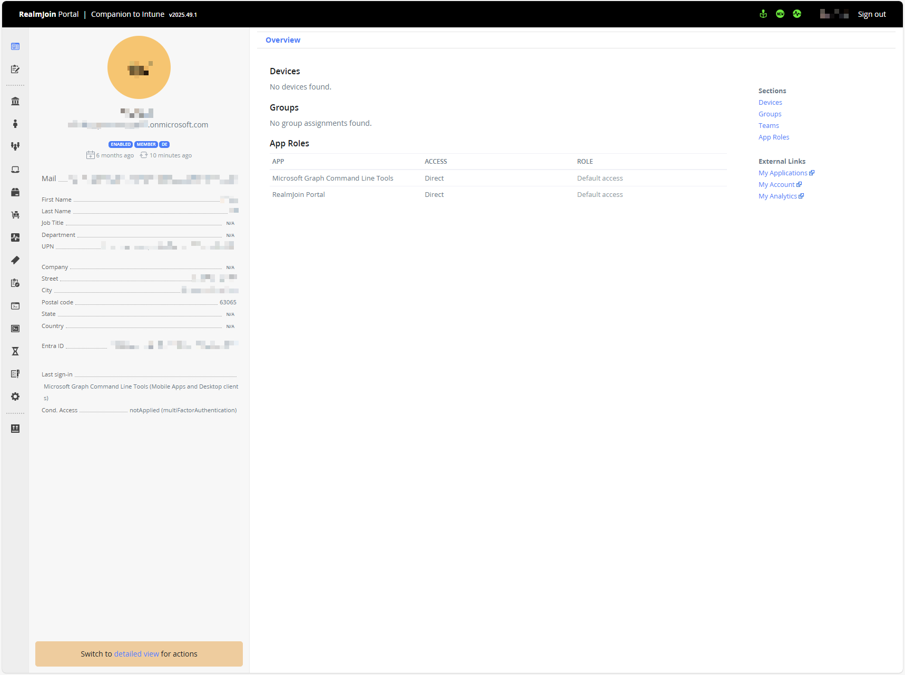

# Advanced Setup

The RealmJoin PowerShell module automates the setup of your RealmJoin tenant. It:

* Creates the required Microsoft Entra ID service principals for the RealmJoin applications
* Assigns the appropriate Microsoft Graph permissions based on the features you select
* Configures RealmJoin features (Portal, Intune LAPS, Autopilot, device actions, remediation scripts, security features)
* Cleans up legacy applications from previous configurations

The module is published on the [PowerShell Gallery](https://www.powershellgallery.com/packages/RealmJoin).

## Prerequisites


The required Microsoft Graph PowerShell modules are installed automatically the first time you run a command.


* **PowerShell 5.1** or later
* Sign in as a **Global Administrator** of your Entra ID tenant when prompted
* The following Microsoft Graph permissions are needed to create the service principals and assign permissions:
  * `Organization.Read.All`
  * `Application.ReadWrite.All`
  * `AppRoleAssignment.ReadWrite.All`

## Recommended Setup

The setup command displayed by the RealmJoin Portal will provide permissions for:

* Core features
* Intune LAPS
* Sign-in data
* Remediation scripts
* Autopilot
* Intune device actions

To add all features or individual features, see [Other Commands](advanced-setup.md#other-commands).



#### Open PowerShell on Windows/Mac

We recommend installing and running the RealmJoin PowerShell module on your device's PowerShell rather than Azure CloudShell.



#### Copy and Run the RealmJoin Onboarding Script

The script will prompt you to authenticate with Microsoft Graph. Sign in with your Global Administrator.

```powershell
Install-Module -Force -Name RealmJoin
Complete-RJTenantOnboarding -Token 1234ABCD 6>&1
```


**About `6>&1`:** These commands write their progress updates to PowerShell's Information stream. The `6>&1` redirection displays that output in the console — without it you won't see the detailed progress messages during execution.


<figure><figcaption></figcaption></figure>

<figure><figcaption></figcaption></figure>



#### Begin using RealmJoin

Once finished, the script will launch the RealmJoin Portal

<figure><figcaption></figcaption></figure>



## Other Commands

### Interactive Setup

For a guided, menu-driven experience:

```powershell
Show-RJInteractiveSetup 6>&1
```

To review the available features before configuring anything:

```powershell
Show-RJFeatureInfo 6>&1
```

### Custom Configuration

#### Default Features

Enables the mandatory core portal functionality plus the default optional features (everything except the RealmJoin Client):

```powershell
New-RJTenant 6>&1
```

#### Minimal Features (only mandatory features)

```powershell
New-RJTenant -Features @() 6>&1
```

#### Full Feature Set

```powershell
New-RJTenant -All 6>&1
```

#### Read-Only Permissions

Assigns read-only permissions where available (for example, `Group.ReadWrite.All` becomes `Group.Read.All`):

```powershell
New-RJTenant -ReadOnly 6>&1
```

#### Custom Feature Selection

```powershell
New-RJTenant -Features @('RealmJoinPortal', 'IntuneLAPS', 'Autopilot') 6>&1
```

### Updating Existing Configuration

`Update-RJTenant` adjusts an already-configured tenant. The alias `Complete-RJTenantOnboarding` can be used interchangeably with `Update-RJTenant`.

#### Add New Features

```powershell
Update-RJTenant -AddFeatures @('SecurityFeatures') 6>&1
```

#### Remove Features

```powershell
Update-RJTenant -RemoveFeatures @('ShowSignin') 6>&1
```

#### Switch to Read-Only Permissions

```powershell
Update-RJTenant -ReadOnly 6>&1
```

#### Preview Changes

```powershell
Update-RJTenant -AddFeatures @('SecurityFeatures') -WhatIf 6>&1
```

## Available Features

Use these feature names with the `-Features`, `-AddFeatures`, and `-RemoveFeatures` parameters. Mandatory features are always enabled. The default configuration (`New-RJTenant` without parameters) enables every feature except **Client**.

| Feature              | Description                                                                | Default |
| -------------------- | -------------------------------------------------------------------------- | :-----: |
| `RealmJoinPortal`    | Core portal functionality for user self-service and admin interaction (mandatory) | ☑️ |
| `IntuneLAPS`         | Retrieve and manage local admin passwords via Intune LAPS                  | ☑️ |
| `ShowSignin`         | Display user sign-in history and audit logs                                | ☑️ |
| `Autopilot`          | View Windows Autopilot deployment profiles and status                      | ☑️ |
| `DeviceIntuneActions`| Execute privileged device actions (sync, restart, wipe, etc.)              | ☑️ |
| `DeviceHealthScript` | Manage and deploy PowerShell remediation scripts to devices                | ☑️ |
| `SecurityFeatures`   | Advanced threat protection and security analytics (requires MDE licenses)  |    |
| `Client`             | RealmJoin Agent — client application for device management                 |    |

## Troubleshooting


**"Insufficient permissions"** — Ensure the account you sign in with is a Global Administrator and can consent to the Microsoft Graph permissions listed under [Prerequisites](advanced-setup.md#prerequisites).


If the module cannot be found, confirm the PowerShell Gallery is available and reinstall:

```powershell
Get-PSRepository 6>&1
Install-Module -Name RealmJoin -Force 6>&1
```

### Getting Help

```powershell
Get-Help New-RJTenant -Full
Get-Help Update-RJTenant -Examples
Get-Help Show-RJInteractiveSetup -Detailed
```
