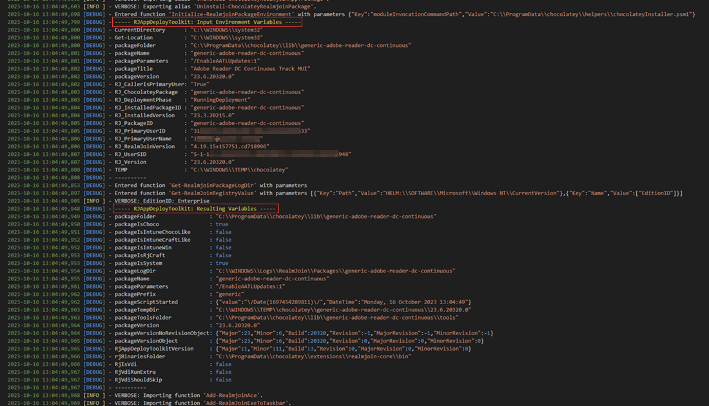

# Analysing chocolatey.log

## Requirements

The following items are required or helpful for troubleshooting:

* Log files, especially `chocolatey.log`.
* Text editor of your choice with advanced search capabilities, recommended: Notepad++, Visual Studio Code.
* Package ID of the failed package, like `generic-mozilla-firefox`.
* Timestamp of failed installation(s) (not mandatory, but helpful).

## Log file structure

### Entry point and debug information

To find the entry point of the package installation inside the `chocolatey.log` use this exact search string (adapt package id accordingly): `generic-mozilla-firefox --version=` (if you are sure about the version string you can add it of course, but it is not mandatory)

This way you will find the starting point(s) of the choco process for the installation or upgrade for the given package ID.

The complete line in the log may look like this, instead of `upgrade` may also be  `install` depending of the operation:



```log
2023-08-22 15:05:36,664 [DEBUG] - Command line: "C:\ProgramData\chocolatey\choco.exe" upgrade generic-mozilla-firefox --version=117.0.0.0 --force --yes --ignore-package-exit-codes --timeout=14400 --params="/BlockAddons:1"
```


<figure><figcaption><p>Entry point of a choco installation inside chocolatey.log</p></figcaption></figure>

This line already contains some important information, like the package version number to be installed, as well as the used params (package arguments configured in the RealmJoin Portal).

The following lines will contain a lot of (non-relevant) debug information, among others, the complete content of chocolateyInstall.ps1 will be printed out.\
Inside the debug information you will the two sections `RJAppDeployToolkit: Input Environment Variables` and `RJAppDeployToolkit: Resulting Variables`. Both section are located next to each other and show variables and values provided by the `RJAppDeployToolkit`

<figure><figcaption><p>Output of RJAppDeployToolkit</p></figcaption></figure>

### Installation process

The acutal package installation script starts after the following log message:


```log
2023-08-22 15:05:47,000 [DEBUG] - Running 'C:\ProgramData\chocolatey\lib\generic-mozilla-firefox\tools\chocolateyInstall.ps1'
```


Depending on the package installation script and the state of the client, the first step will usually be a check if the software is already installed. This is done to determine if an uninstallation will be required prior the actual installation.\
In the logs this can be tracked using one or more of the following log messages:


```log
2023-08-22 15:05:47,057 [DEBUG] - Entered function 'Get-RealmjoinRegistryUninstallInfo' with parameters [...]]
```



```log
2023-08-22 15:05:47,053 [DEBUG] - Entered function 'Uninstall-RealmjoinPackage' with parameters [...]]
```


After the checks and the possible uninstallations have been executed, the main installation of the application will start, indicated by the following log message (filename will differ of course):


```log
2023-08-22 15:05:47,858 [INFO ] - Starting RealmJoin-Install of Git-2.42.0-64-bit.exe
```


The installation will usually start with the download of the binary file. Start and end of the download are represent by the following log messages:


```log
2023-08-22 15:05:48,273 [INFO ] - Downloading generic-git-git from 'https://cdn.realmjoin.com/blobs/generic/generic-git-git/Git-2.42.0-64-bit.exe'

[...]

2023-08-22 15:05:57,293 [INFO ] - Download of Git-2.42.0-64-bit.exe (58.35 MB) completed.
```


After completing the download, chocolatey will check the hash of the downloaded file and compare it to the expected value. If the hashed match, the setup file will finally be executed.\
The log message for the execution, can be found by the following log message:


```log
2023-08-22 15:06:00,743 [DEBUG] - Elevating Permissions and running ["C:\WINDOWS\TEMP\chocolatey\generic-git-git\2.42.0.0\Git-2.42.0-64-bit.exe" /verysilent /norestart /log="C:\WINDOWS\Logs\RealmJoin\Packages\generic-git-git\2023-08-22_15-05-47.916_generic-git-git_2.42.0.0_install_Git-2.42.0-64-bit.exe.log" ]. This may take a while, depending on the statements.
```


This message includes the filepath to the setup file, as well as the complete command line, including all (silent-)parameters used to start the setup file. It will also help in finding the relevant setup log file path, if offered by the setup file and included in the package script.

After the process has exited, another log message will be written, again including the complete file path and all parameters. Additionally this message will also include the exit code returned by the setup process, the most important indicator for a success- or unsuccessful installation:


```log
2023-08-22 15:06:52,321 [DEBUG] - Command ["C:\WINDOWS\TEMP\chocolatey\generic-git-git\2.42.0.0\Git-2.42.0-64-bit.exe" /verysilent /norestart /log="C:\WINDOWS\Logs\RealmJoin\Packages\generic-git-git\2023-08-22_15-05-47.916_generic-git-git_2.42.0.0_install_Git-2.42.0-64-bit.exe.log" ] exited with '0'.
```


Depending on the package, the package installation may now be followed by so called 'postActions', which may be some registry settings, removal of desktop icons, or even running another setup file (starting over with download of that file). The postActions part will be indicated by the following begin and end messages in the log file:


```log
2023-09-13 16:49:18,550 7224 [INFO ] - Running postActions...
2023-09-13 16:49:20,894 7224 [INFO ] - postActions finished.
```


The chocolatey installation process will be closed with the following log message (wording may differ depending of install / upgrade ):


```log
2023-09-13 17:01:39,433 8336 [INFO ] - The install of generic-google-chrome was successful.
```


