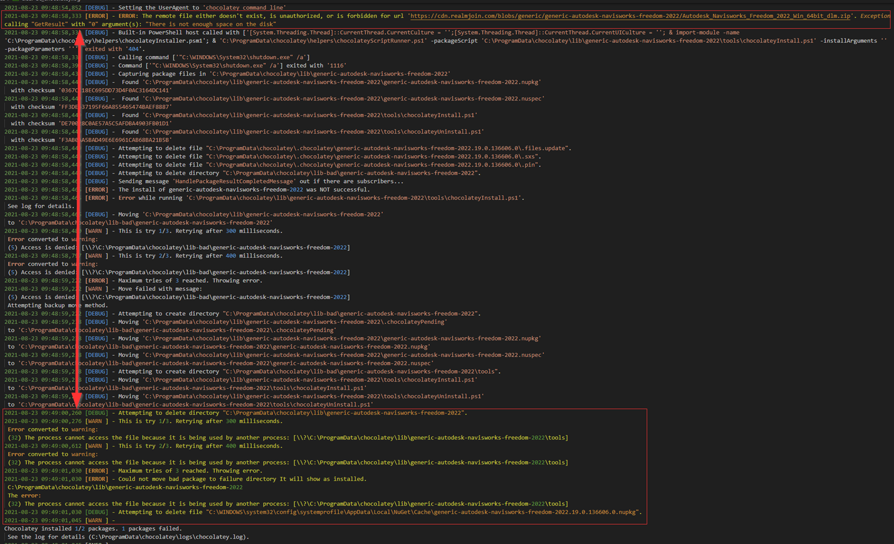

# Troubleshooting failed chocolatey packages

As explained in the previous section, a chocolatey package installation consists of several stages:

1. Initialization of the chocolatey environment and variables
2. Checking for existing installations of the software to be installed
3. Possible uninstallation of existing installations
4. Downloading binary files
5. Actual installation using the downloaded setup binaries.
6. Post actions to be executed after installation

Even though every stage has a chance to fail and cause the installation to abort, the highest probability for failures are in stage 3, 4 and 5.

## Finding the correct error message

It is important to know that every failed installation will return standard chocolatey error stack messages, which will look similar to this:


```log
2021-08-23 09:48:58,465 [DEBUG] - Moving 'C:\ProgramData\chocolatey\lib\generic-autodesk-navisworks-freedom-2022'
 to 'C:\ProgramData\chocolatey\lib-bad\generic-autodesk-navisworks-freedom-2022'
2021-08-23 09:48:58,480 [WARN ] - This is try 1/3. Retrying after 300 milliseconds.
 Error converted to warning:
 (5) Access is denied: [\\?\C:\ProgramData\chocolatey\lib-bad\generic-autodesk-navisworks-freedom-2022]
```


The `Access is denied` message belongs to the standard error stack of chocolatey and must be ignored. The actual error which is causing the package installation to fail is located somewhere in the previous lines of the log file. Searching for the tag `[ERROR]` will help in finding the correct messages.

See how in this example the actual error happens at the top (404 for the download), but the chocolatey error stack prints some misleading 'Access is denied' messages later on.

<figure><figcaption><p>Actual download error on top followed by chocolatey standard error stack at the bottom, may be misleading.</p></figcaption></figure>

## Examples for failed installations

### Errors happening during initialization

During the initialization phase, errors can happen for the following reasons:

* Problem with the chocolatey installation itself (broken config, missing files):


```log
2023-10-10 10:28:32,523 [ERROR] - Error deserializing response of type chocolatey.infrastructure.app.configuration.ConfigFileSettings:
 '.', hexadecimal value 0x00, is an invalid character. Line 1, position 1.
2023-10-10 10:28:32,535 [ERROR] - '.', hexadecimal value 0x00, is an invalid character. Line 1, position 1.
2023-10-10 10:28:32,537 [DEBUG] - Exiting with 1
```



Be careful, as this (slightly similar) message may occur in the `chocolatey.log` as well, but this is safe to ignore and requires no action!


```log
2023-11-21 11:46:10,365 [ERROR] - Error serializing type chocolatey.infrastructure.app.configuration.ConfigFileSettings:
 Access to the path 'C:\ProgramData\chocolatey\config\chocolatey.config.update' is denied.
```



* Network problem, when the RealmJoin nuget server cannot be reached, (see [#realmjoin-connection-endpoints](../../realmjoin-client/infrastructure/#realmjoin-connection-endpoints "mention")):


```log
2023-09-08 13:01:47,335 [ERROR] - generic-adobe-reader-dc-continuous not installed. The package was not found with the source(s) listed.
```


* Problem with missing mandatory package arguments:


```log
2023-09-14 13:53:33,982 [ERROR] - ERROR: Mandatory arg 'Serial' not provided, aborting!
```



### Errors happening during download

For errors involving the download of the binaries, the error message will usually include the download url containing `cdn.realmjoin.com`, examples:


```log
2023-10-16 13:04:52,952 [ERROR] - ERROR: The remote file either doesn't exist, is unauthorized, or is forbidden for url 'https://cdn.realmjoin.com/blobs/generic/generic-adobe-acrobat-dc-continuous/AcrobatDCUpd2300620320.msp'. Exception calling "GetResult" with "0" argument(s): "Unable to read data from the transport connection: An established connection was aborted by the software in your host machine."
```



```log
2021-08-23 09:36:08,874 [ERROR] - ERROR: The remote file either doesn't exist, is unauthorized, or is forbidden for url 'https://cdn.realmjoin.com/blobs/generic/generic-adobe-acrobat-dc-continuous/AcrobatDCUpd2300620320.msp'. Exception calling "GetResult" with "0" argument(s): "There is not enough space on the disk"
```



### Errors happening during (un-)installation process

Errors occuring during the actual (un-)installation process using the downloaded binary file can best be troubleshooted using two things:

1. The exit code returned by the setup process.
2. The logfile written by the setup process, found inside `C:\WINDOWS\Logs\RealmJoin\Packages\<package-id>\`, if possibility to write log is provided by the installer.


When an MSI installer was used, the exit codes are standardized and can be looked up [here](https://learn.microsoft.com/en-us/windows/win32/msi/error-codes). Additionally MSI installers will always write log files to the folder mentioned above. Especially when exit code `1603` was returned (generic MSI error), the MSI log file will be mandatory for troubleshooting.

