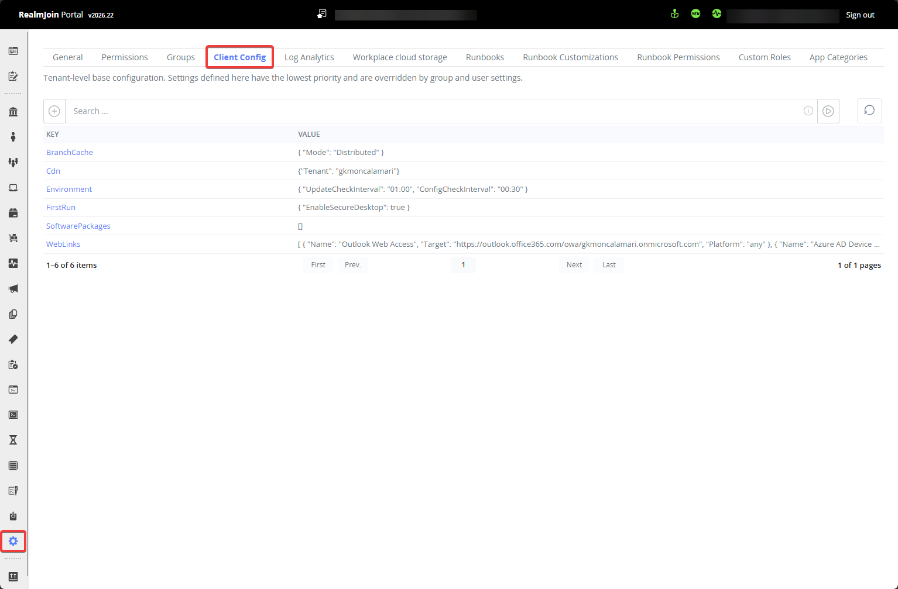

# User and Group Settings

## Overview

Settings can be used to control RealmJoin Client's behavior and configure features like [LAPS](../../realmjoin-agent/realmjoin-client/local-admin-password-solution-laps/).

If settings have been created/assigned to users, you can review them under .png>) - User Settings

Accordingly, if settings have been applied to any group, including "**RealmJoin - All Users"**, these can be reviewed under .png>) - Group Settings.

## Tenant Default Values

Default setting values can be defined at different scopes. The broadest scope is the tenant-wide client configuration, found in the Settings section of the RealmJoin Portal and accessible to any administrator. Settings defined there apply to all users unless overridden at a narrower scope.

<figure><figcaption></figcaption></figure>

The built-in RealmJoin group "RealmJoin - All Users" can be used to override tenant-wide defaults across all users. Settings assigned to a real user or group scope will in turn override both of these, as individual group and user assignments carry the highest priority.

The resulting priority order is: tenant-wide client config < RealmJoin - All Users < any user or group scope.

Example:

To define a baseline channel for all users, set the RealmJoin Agent Channel to "release" in the tenant-wide client config. To override this for all users at once, set "beta" on the "RealmJoin - All Users" group. To target only a specific set of users, assign "beta" directly to a dedicated group. The more specific scope always takes precedence.

## Settings Editor

<figure><figcaption>
Settings Editor
</figcaption></figure>

Be aware: The value of the setting must be valid JSON, which includes singular values like `true` or strings (without brackets).

The switches in the lower half of the wizard allow scoping this setting to certain scenarios like VDI / Windows365 machines.

You can modify and delete settings from the Settings Editor. You cannot create new settings here - Please navigate to the user or group you want a setting applied to and create the setting there.

See [Available Settings](additional-settings.md) to review which settings can be used.
