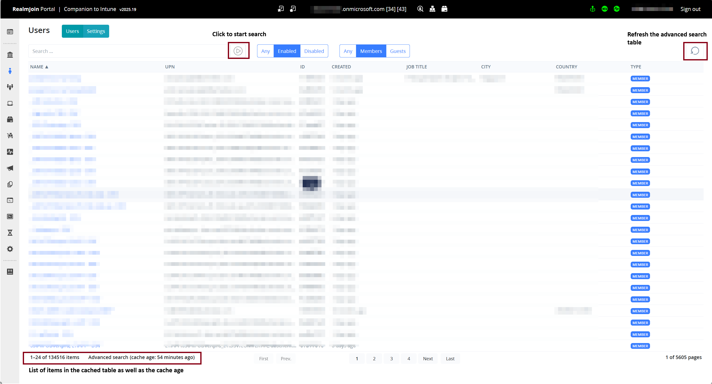

# Advanced Search

From May 9th, RealmJoin introduces a revamped search mechanism that enables real-time access to tenant data. This enhancement ensures efficient performance even for tenants with a large volume of user, device, and group objects.

Tables can be searched using the _basic_ or the _advanced_ search feature.&#x20;


<mark style="background-color:yellow;">**All searches have to be confirmed by either using the**</mark><mark style="background-color:yellow;">**&#x20;**</mark>_<mark style="background-color:yellow;">**enter key**</mark>_<mark style="background-color:yellow;">**&#x20;**</mark><mark style="background-color:yellow;">**or the**</mark>   <mark style="background-color:yellow;">**symbol.**</mark>&#x20;


### Basic Search

Basic search involves directly querying tenant data using the Graph API. This method provides real-time data as it queries all objects during the search process. However, it may cause delays if a large number of objects need to be searched.

### Advanced Search

RealmJoin's advanced search feature uses caching and tokenization, making searches fast and reliable, and supports Unicode characters like Ø. This tokenization enables partial name searches, so a query like "Ma Mu" can locate a user named "Maren Müller".&#x20;

Additionally, information not displayed in the table is also searchable, like post-codes or UPN.&#x20;

<figure><figcaption></figcaption></figure>

### FAQ

#### How often is the data cached?

The table is cached on a schedule, currently set to 1 hour.&#x20;

#### Can I refresh the data manually?

In the top right corner of each table, there's a button to refresh the cached data.

#### Can other users use my refreshed data?

The table is available for all users in the same RealmJoin portal instance. Thus, a triggered rebuild will do so for all those users.&#x20;

#### What is an RealmJoin portal instance?

The RealmJoin portal has three different instances for load balancing and redundancy reasons. This is indicated by the numbers after the tenant name in the top middle of the RealmJoin portal.&#x20;

#### How long will a rebuild/refresh of the advanced search take?

The rebuild time depends on the size of the tenant and the number of objects. It is not uncommon, that the rebuild might take several minutes. During the rebuild, only the basic search is activate, all data is queried directly via Graph, thus reducing the speed.
