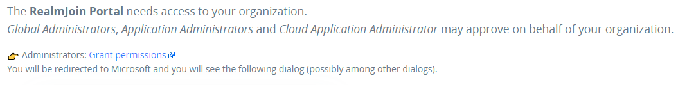

# Onboarding RealmJoin Portal

## Self-onboard RealmJoin Portal

#### App Permissions

Visit [https://portal.realmjoin.com](https://portal.realmjoin.com) and sign in as Global Admin of your AzureAD Tenant.

The App will request basic permissions needed to interact with RealmJoin Portal. This permission are required for any user interacting with RealmJoin Portal - e.g. to use self-services.

'Accept' and continue.

After successful login it will try to interact with Azure AD for the first time and will ask you to grant minimum permissions to access Azure AD. Press 'Grant Permissions'.

The wizard will present a success message.

#### Feature Selection

Follow the link to [Feature selection](https://portal.realmjoin.com/organization/features).

Now you can choose the extent of permissions to be given to RealmJoin:

| Permission Level          | Description                                                                                                                                                                                       |
| ------------------------- | ------------------------------------------------------------------------------------------------------------------------------------------------------------------------------------------------- |
| Core Features (read only) | RealmJoin has permission to show all Core Features but does not have permissions to change settings in your Microsoft 365 tenant.                                                                 |
| Core Features             | RealmJoin has permissions for all main features, but not for the security features.                                                                                                               |
| Security Features         | 
RealmJoin has permissions for all main features and Microsoft Defender for Endpoint based features like Risk Score and Exposure Level. You must have Defender for Endpoint to use this.
 |

If you are testing, you might want to start with "Activate Core Features (read-only)". This will not allow RealmJoin Portal to change users, groups or devices.

In most cases continue by clicking "Activate Core Features".

#### Next steps

If you want to use [runbooks](../../runbooks/) to automate daily operations, please continue by connecting to [Azure Automation](../connecting-azure-automation/).
