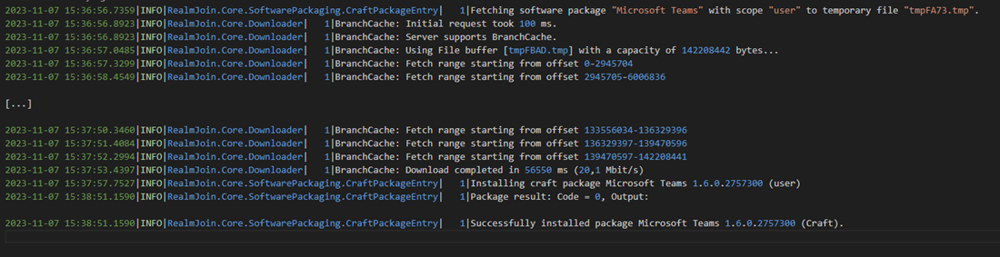
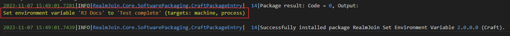

# Troubleshooting failed craft packages

For craft packages there are no separate logs (unless explicitly written by an installer inside the craft package).\
Depending on the scope they are executed within `system` or `user`, the (very basic) output will be found in the `tray.log` (for user scope) or in the `realmjoin.log` (for system scope).

## User scope craft packages

For craft packages running in user scope, as mentioned above, the output will be found in the `tray.log` file. Instead of the package id the relevant lines can be found using the configured display name of the package:


```log
2023-11-07 15:37:57.7527|INFO|RealmJoin.Core.SoftwarePackaging.CraftPackageEntry|   1|Installing craft package Microsoft Teams 1.6.0.2757300 (user)
```


&#x20;This will be followed more or less instantly (depending on installation time) by:


```log
2023-11-07 15:38:51.1590|INFO|RealmJoin.Core.SoftwarePackaging.CraftPackageEntry|   1|Package result: Code = 0, Output:

2023-11-07 15:38:51.1590|INFO|RealmJoin.Core.SoftwarePackaging.CraftPackageEntry|   1|Successfully installed package Microsoft Teams 1.6.0.2757300 (Craft).
```


<figure><figcaption><p>Example output of successful craft user package installation</p></figcaption></figure>


## System scope craft packages

The relevant logs for craft packages running in system scope will be split across `tray.log` for download and initialization information, and `realmjoin.log` for the actual output and return code. Other than that, it's the same as for user craft package installation.

The example below shows how package output is included in the log file:

<figure><figcaption><p>Output of craft package script as it appears in the log file.</p></figcaption></figure>

The `tray.log` file will always include a hint in parentheses after the version number whether the package is run in system or user scope:


```log
2023-11-07 15:48:58.5875|INFO|RealmJoin.Core.SoftwarePackaging.CraftPackageEntry|   1|Installing craft package RealmJoin Set Environment Variable 2.0.0.0 (system)
```

