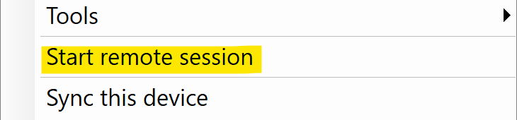

# AnyDesk Integration

AnyDesk allows access to devices including the option to elevate rights by using the RealmJoin [LAPS](../local-admin-password-solution-laps) feature. AnyDesk can be installed on Windows and macOS.

ID numbers are used by AnyDesk to establish connections between two computers. Share your ID number with another user (this user needs AnyDesk as well). This user has to enter the ID number in the AnyDesk menu. When you accept the request, the other user will have access to your desktop.

RealmJoin Client for Windows allows to skip the ID number sharing because every ID number in an organization is linked to single user. An administrator just needs to know the user and can request access to the desktop. However, the user has to be able to accept this request.

## Deployment Workflow

1. The customer sends a request to [glueckkanja-gab (GKGAB)](mailto:support@glueckkanja-gab.com), for a quote on AnyDesk.
2. GKGAB orders a license from AnyDesk.
3. AnyDesk sends a license and login credentials to GKGAB
4. GKGAB deploys AnyDesk
5. GKGAB sends the 'public download' URL to the customer
6. The customer configures the AnyDesk Group Settings in [RealmJoin Classic Portal](https://realmjoin-web.azurewebsites.net)
7. GKGAB does the backend integration in RealmJoin
8. AnyDesk is deployed

## Using the Tray Icon (Windows)

Once everything has been set up, the tray icon can be used to get support without sharing the ID number or downloading executables by hand. The users are instructed by their support agent to open the tray menu and click *Start remote session*.

 This text can be changed! Create a setting with the key `Integration.AnyDesk.Ui.TrayMenuTextEnglish` in the backend. 

This will download the appropriate executable and send the ID number to the RealmJoin Portal. The support agent will be notified as soon as the process is finished and then may connect to the user's desktop.

### Using this outside of the tray menu
This process may also be initiated outside of RealmJoin's UI. Simply create a Windows shortcut with the target `realmjoin:remotesupport:default`. This will trigger RealmJoin and behave as if the user had clicked the menu entry.
