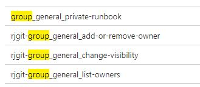
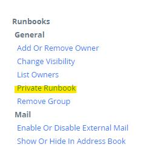

# Naming conventions

## Filenames in Github

We expect a certain file and naming structure in the [shared runbook repository](https://github.com/realmjoin/realmjoin-runbooks). Realmjoin will import these folders and files from GitHub into the customers Azure Automation Account.

Dashes ("-") will be converted into spaces. Folders are used to separate runbooks into "context" and "category", e.g. `user\general`. File names should be describing the purpose of the script.&#x20;

All imported runbooks have a prefix of `rjgit-`, followed by the context, either `org`, `group`, `user` then category, for example `_general_`, `_security_`, `_mail_` and the name of the script itself like `add-additional-alias`.

### Example:

A file in Github in `user\general` named `add-additional-alias.ps1` will be named `rjgit-user_general_add-additional-alias` as runbook in the Azure Automation Account and is shown in RealmJpoin Portal as "Add Additional Alias" on a user object in the runbook category "General".

Common categories

* General
* Security
* Mail
* Userinfo

You can define additional categories, but not contexts.

### What is the purpose of this?

This allows to automagically fill and name the runbooks in the RealmJoin Portal. Also, the `rjgit-` prefix allows to avoid naming conflicts with local/customer runbooks. Also runbooks not having this prefix will not be touched by RealmJoin's import logic.

## Private- / Customer-specific Runbooks

You can host customer-specific (local) runbooks in the Azure Automation Account which are offered in RealmJoin Portal just like the shared runbooks. Local runbooks will not be touched by our sync process and will not be visible to other customers.

To create a local runbook, remove the `rjgit-` prefix from the naming convention while keeping the rest of the naming structure intact.

Example: You want to offer a runbook "Private Runbook" in the context of Azure AD groups and the category "General". You would name it `group_general_private-runbook` in your Azure Automation Account.

This will look like this in Azure Automation:

It will be presented in RealmJoin Portal:

