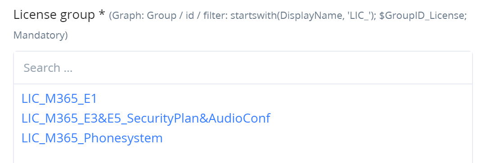
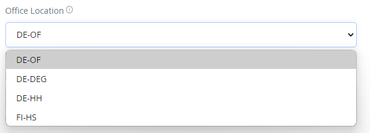

# Runbook Customization

## Overview

The RealmJoin runbook implementation offers customizing capabilities to a runbook's author or an environments administrator, so that he/she can:

* host customer/tenant specific parameters and templates
* offer UI elements like user-pickers or dropdown selections
* present human readable explanations of parameters
* hide unneeded UI elements


The customizings can be included in the runbook itself and/or stored in the customers RealmJoin Portal instance. By default, we will try to offer sensible defaults in the runbooks offered on [GitHub](https://github.com/realmjoin/realmjoin-runbooks).

Some runbooks will come with examples of how to configure customer specific templates like specifying office locations for the user on-boarding.

### Format

The customizing can be defined (in descending order of priority)

* Block of JSON in [RealmJoin Portal settings](https://portal.realmjoin.com/settings/runbooks-customizations), overriding default runbook behavior
* Block of JSON in the header of a runbook

Additionally (with least priority)

* per parameter in the runbook header
* per parameter in the runbooks param block (using the RJRb Helper Module)

Some functionality (like templates) is only available in JSON format. Some functionality (like creating a user picker) is only available by specifying a data type in the param block. You can combine multiple types of customizings for best results.

## Runbook Param Block

The RealmJoin Portal parses a runbooks PowerShell param block to determine which input fields to render. Where possible, it will also validate the inputs according to the .NET type given for a variable.

The following data types are currently understood:

* `[bool]`, `[boolean]` - will present a binary toggle
* `[string` - will present a textbox to type any alphanumeric input
* `[int]` - will present a textbox, only allowing numeric inputs
* `[DateTime]`, `[DateTimeOffset]` - Will present a date/time picker

You can apply standard PowerShell modifiers to parameters. Especially RealmJoin Portal will understand if you specify `[Parameter(Mandatory = $true)]` to indicate a mandatory parameter and enforce this parameters being filled.

Where possible, RealmJoin Portal will also read and present given default values in the UI.

Be aware, default values from the runbook can be overridden by customizings. Also, parameters can be completely hidden by customizing.

### Customizing Parameters

To be able to customize parameters, please make sure to include RealmJoin's Runbook Helper PS Module in your runbook:

`#Requires -Modules @{ModuleName = "RealmJoin.RunbookHelper"; ModuleVersion = "0.6.0" }`

You can then include `[ValidateScript( { Use-RJInterface ... } )]` statements in the parameter definitions. For example the following will create a user picker, allowing to choose an AzureAD user and will pass its object id as string the runbook.

```powershell
param(
    [ValidateScript( { Use-RJInterface -DisplayName "Assign device to this user (optional)" -Type Graph -Entity User } )]
    [string] $AssignedUserId = ""
)
```

Let's take this piece by piece. `[ValidateScript...]` is a modifier to the next parameter defined in the param-block. In this case the variable `$AssignedUserId`.

`Use-RJInterface` is part of our [RealmJoin Runbook Helper](https://github.com/realmjoin/RealmJoin.RunbookHelper) PowerShell Module. It allows you to specify what kind of input you expect using -Type and -Entity, if that is not already fully defined by the type of variable.

`-DisplayName` allows you to pass a human readable prompt / description for this parameter to RealmJoin Portal.

#### Graph resources

In the example above, the source of information is MS Graph, as described by `-Type Graph`. For MS Graph, use `-Entity` to specify which kind of resource you expect. Available entities are `User`, `Group`, `Device`. This will produce a picker for either users, groups or devices in the given AzureAD.

The picker includes a quick search, to easily pin down the required resource.


Currently, no multiselect is possible using a picker.

By default, a MS Graph picker will return the object's id. If you require e.g. the user principal name instead, make sure the include "name" as suffix in your variables name. So, basically, to get a user's id, name the parameter `$userid`. If you want a UPN, name it `$username`.

#### Graph Filtering

If you are using a MS Graph based picker, you can also specify `-Filter` and use an [ODATA-Filter](https://docs.microsoft.com/en-us/graph/query-parameters?context=graph%2Fapi%2F1.0\&view=graph-rest-1.0#filter-parameter) to limit the objects offered in the picker.

The following example will list only groups from AzureAD starting with "LIC\_".

```powershell
param(
    [Parameter(Mandatory = $true)]
    [ValidateScript( { Use-RJInterface -Type Graph -Entity Group -Filter "startswith(DisplayName, 'LIC_')" -DisplayName "License group" } )]
    [String] $GroupID_License
)
```

You can prepare filters and reuse them across multiple scripts using the central [RealmJoin Customizing datastore](https://portal.realmjoin.com/settings/runbooks-customizations) . In this case just reference the filter by name using `-Filter "ref:LicenseGroup"`, where `ref:` indicates to look for a stored filter. This specific example `ref:LicenseGroup` is available by default without further configuration.



## Runbook Header

The Portal can parse a runbooks [comment based help](https://docs.microsoft.com/en-us/powershell/module/microsoft.powershell.core/about/about\_comment\_based\_help?view=powershell-5.1) section, if present.

Here is an example:

```powershell
<#
  .SYNOPSIS
  (Un-)Assign a license to a user via group membership.

  .DESCRIPTION
  (Un-)Assign a license to a user via group membership. More detailed description...

  .PARAMETER DefaultGroups
  Comma separated list of groups to assign. e.g. "DL Sales,LIC Internal Product"

  .NOTES
  Permissions:
  MS Graph (API):
  - User.Read.All
  - GroupMember.ReadWrite.All 
  - Group.ReadWrite.All

  .INPUTS
  RunbookCustomization: {
        "Parameters": {
            "UserName": {
                "Hide": true
            },
            "Remove": {
                "DisplayName": "Assign or Remove License",
                "SelectSimple": {
                    "Assign License to User": false,
                    "Remove License from User": true
                }
            }
        }
    }
#>
```

`.SYNOPSIS` - Give a very brief description of your runbook's function. This will be displayed in the list of available runbooks.

`.DESCRIPTION` - Give a description of your runbook's function. Can contain slightly more detail, as this will be displayed inside the runbooks execution / parameter dialogue.

`.PARAMETER` - Needs to be followed by a parameters name. Allows you to give a detailed explanation of the expected input for the parameter in question.

`.INPUTS` - Can contain a block of JSON-based Runbook Customization.

`.NOTES` - Is not parsed / rendered. Please use this space to write down which permissions and requirements exist for your runbook.

`.EXAMPLE` - Is not parsed / rendered. Can contain an example of a JSON-based Customizing to use in the RealmJoin Datastore in your tenant. These can be examples of how to create templates e.g. for different workflows or user classes.

## JSON Based Customizing

### Central Datastore

Each AzureAD tenant can host a "Runbook Customizations" datastore, found at [https://portal.realmjoin.com/settings/runbooks-customizations](https://portal.realmjoin.com/settings/runbooks-customizations) .

The format is JSON with comments, allowing trailing commas. Currently, there are three relevant sections, `Runbooks`, `Templates`, `Runbooks`.

```json
{
    "Settings": {
    },
    "Templates": {
    },
    "Runbooks": {
    }
}
```

### Runbooks section

`Runbooks` is parsed by the portal when starting a runbook. If a section named like the current Azure Automation Runbook exists, its contents will be used to customize the frontend displayed to the user.

Assume the following simple demonstration runbook, called `rjgit-device_demo-runbook-customizing`.

```powershell
<#
  .SYNOPSIS
  Demonstrate Runbook Customizing

  .DESCRIPTION
  Demonstrate Runbook Customizing, like dropdown/select
#>

#Requires -Modules @{ModuleName = "RealmJoin.RunbookHelper"; ModuleVersion = "0.6.0" }

param(
    [string] $DeviceId,
    [bool] $ExtraWorkflow = $true,
    [int] $ExtraWorkflowTime = 15
)

"## Doing stuff to Device '$DeviceID'"

# Highly optional complicated workflow
if ($ExtraWorkflow) {
    "## Executing Meditation..."
    Start-Sleep -Seconds $ExtraWorkflowTime
}
```

If not customized, it will be presented like this in the frontend:


Thoughts:

* As this runbook is started from a device's context in portal, the `$DeviceId` is redundant information for a user. I already know which device I am working on.
* What happens if I enable or disable the "Extra Workflow"? Do I need to think about "Extra Workflow Time" if I disable "Extra Workflow"?

Let us improve on that. The following example JSON in the central datastore will modify the UI for the runbook.

```json
{
    "Runbooks": {
        "rjgit-device_demo-runbook-customizing": {
            "ParameterList": [
                {
                    "Name": "DeviceId",
                    "Hide": true
                }, 
                {
                    "Name": "ExtraWorkflow",
                    "Hide": true
                },
                {
                    "Name": "ExtraWorkflowTime",
                    "DisplayName": "How long to meditate?",
                },
                {
                    "DisplayName": "Execute Extra Workflow",
                    "DisplayBefore": "ExtraWorkflowTime",
                    "Select": {
                        "Options": [
                            {
                                "Display": "Execute Meditation (optional)",
                                "Customization": {
                                    "Default": {
                                        "ExtraWorkflow": true
                                    }
                                }
                            },
                            {
                                "Display": "Skip Device Mindfulness",
                                "Customization": {
                                    "Default": {
                                        "ExtraWorkflow": false
                                    },
                                    "Hide": [
                                        "ExtraWorkflowTime"
                                    ]
                                }
                            }
                        ],
                        
                    },
                    "Default": "Skip Device Mindfulness"
                }
            ]
        }
    }
}
```

You can use the same notation / features in your [runbook header](runbook-customization.md#runbook-header).

#### ParameterList

Each parameter has its own section in `ParameterList`. [Modifiers](runbook-customization.md#modifiers) allow to change the behaviour of that parameter.

The result will look like this:


Choosing the additional workflow, will present (unhide) more parameters:


This shows less clutter in comparison to before applying customizing. At the same time more information about the alternatives of "Extra Workflow" is available to the user. Also, a user now will only worry about "Extra Workflow Time" if it is relevant.

As you can see, the parameter `$DeviceId` is completely hidden. This is done by setting the `"Hide": true` for this parameter.

Parameters can have a `DisplayName`. We offered a human friendly `DisplayName` to replace `$ExtraWorkflowTime` in the UI. See other [modifiers](runbook-customization.md#modifiers) for more.

You can insert "unnamed" parameters (missing the `Name` statement) like the "Execute Extra Workflow" section, if you want to offer UI elements without directly returning a value. This is normally only used in conjunction with `Select`.

#### Select

We used `Select`, to display a list of `Options` in a dropdown. Each option can `Display` text, or trigger a `Customization`, like setting `Hide` or a `Default` value on other parameters. In our example, we used it to (un)hide `$ExtraWorkflowTime` and override `$ExtraWorkflow`'s value.

`$ExtraWorkflowTime` is thus only shown when relevant and the binary switch `$ExtraWorkflow` is now replaced with meaningful alternatives from a user's perspective.

In case of a `Select` for a named parameter, each option should have a `"ParameterValue": "..."` to pass to the runbook. You can place a `"ShowValue: false"` inside the `Select` block to only show the dropdown and not a field for the resulting parameters value.

Named Paramter example:

```json
{
    "Name": "ExtraWorkflow",
    "DefaultValue": true,
    "DisplayName": "Execute Extra Workflow",
    "DisplayBefore": "ExtraWorkflowTime",
    "Select": {
        "Options": [
            {
                "Display": "Execute Meditation (optional)",
                "ParameterValue": true
            },
            {
                "Display": "Skip Device Mindfulness",
                "ParameterValue": false,
                "Customization": {
                    "Hide": [
                        "ExtraWorkflowTime"
                    ]
                }
            }
        ],
        "ShowValue": false
    }
}
```

The `Default` / `DefaultValue` statement in the parameter also specifies the initial state of the dropdown. In case of an unnamed parameter, use the `DisplayName` of the desired option, otherwise give a default return value, like "true" or "false" or some string.

#### Parameters

If you only have named parameters, you can use the slightly shorter `Parameters` format instead of `ParameterList`.

For an example see SelectSimple

#### SelectSimple

If not the full power of a `Select` is needed and you just want to offer a list of possible values in a dropdown (without applying additional customizing), you can use `SelectSimple`.

`SelectSimple` is only usable for named parameters.

Example:

```json
{
    "Runbooks": {
        "rjgit-device_demo-runbook-customizing": {
            "Parameters": {
                "DeviceId": {
                    "Hide": true
                }, 
                "ExtraWorkflow": {
                    "Name": "ExtraWorkflow",
                    "DisplayName": "Execute Extra Workflow",
                    "Default": false,
                    "SelectSimple": {
                        "Execute Meditation (optional)": true,
                        "Skip Device Mindfulness": false
                    }
                },
                "ExtraWorkflowTime": {
                    "DisplayName": "How long to meditate?"
                }
            }
        }
    }
}
```

The biggest difference (other than being much shorter) to our example before is that `$ExtraWorkflowTime` is always visible.

#### Modifiers

Each parameter can have one or more of the following modifiers:

* `"DisplayName": "text"` - Display "text" as name for the parameter in the UI
* `"Hide": true / false` - Hide this parameter
* `"Mandatory": true / false` - Require this parameter to be filled
* `"ReadOnly": true / false` - Protect this parameter from beeing changed from its default value
* `"DefaultValue": "..."` - Set a default value for this parameter. (You can also use `Default` instead.)
* `"GraphFilter": "startswith(DisplayName, 'LIC_')"` - see [Graph Filtering](runbook-customization.md#graph-filtering)
* `"AllowEdit": true / false` - Protect this parameter from manual editing (combine this with templates)

### Settings

`Settings` allows you to store configuration data like Azure Storage Account names in central place, while still keeping them separate from your runbooks.

You can access individual values from a runbooks param-Block using `Use-RJInterface`.

Let us take this example param-block of a runbook:

```powershell
param(
    [ValidateScript( { Use-RJInterface -Type Setting -Attribute "CaPoliciesExport.Container" } )]
    [string] $ContainerName,
    [ValidateScript( { Use-RJInterface -Type Setting -Attribute "CaPoliciesExport.ResourceGroup" } )]
    [string] $ResourceGroupName,
    [ValidateScript( { Use-RJInterface -Type Setting -Attribute "CaPoliciesExport.StorageAccount.Name" } )]
    [string] $StorageAccountName,
    [ValidateScript( { Use-RJInterface -Type Setting -Attribute "CaPoliciesExport.StorageAccount.Location" } )]
    [string] $StorageAccountLocation,
    [ValidateScript( { Use-RJInterface -Type Setting -Attribute "CaPoliciesExport.StorageAccount.Sku" } )]
    [string] $StorageAccountSku
)
```

Portal will try to prefill each parameter with values from the central datastore - if present. This also works if the parameter has been hidden in the UI.

A possible JSON in the datastore for this runbook would be:

```json
{
    "Settings": {
        "CaPoliciesExport": {
            "ResourceGroup": "rj-runbooks-01",
            "StorageAccount": {
                "Name": "rjrbexports01",
                "Location": "West Europe",
                "Sku": "Standard_LRS"
            }
        }
    }
}
```

The missing `Container` element will simply not be prefilled in the UI.

### Templates

`Templates` use JSON-references to pull in data - for example a lengthy list of office locations - when using a `Select` statement.

This allows to keep a customizing neutral/reusable/separated from actual data.

Let us take the example of onboarding new users. You might have have multiple given options for departments or office locations, where assigning a office location also mandates a certain street address, country, state etc.

The following example of a runbook customization uses the `$ref` inside the `Runbooks` section to reference/import a subtree from the `Templates` section. Look out for the `$id`/`$values` keywords. Be aware that `$id`/`$values` have to defined before referencing them using `$ref`. That is why `Templates` is defined ahead of `Runbooks` in this example.

In this example we tell the portal to grab the subtree with the `$id` called `LocationOptions` and include its `$values`, replacing the `$ref` statement. So, the portal will render a `Select` as described in the `Runbooks` section but include the actual options from `Templates`.

A template can contain any statement that is supported in the referencing location. In this example, we use a `Customization` statement to modify other parameters like `StreetAddress`.

So, we can have a runbook specific customziation in `Runbooks` reusable accross multiple environments, while keeping actual data separate.

```json
{
    "Templates": {
        "Options": [
            {
                "$id": "LocationOptions",
                "$values": [
                    {
                        "Display": "DE-OF",
                        "Customization": {
                            "Default": {
                                "StreetAddress": "Kaiserstraße 39",
                                "PostalCode": "63065",
                                "City": "Offenbach",
                                "Country": "Germany"
                            }
                        }
                    },
                    {
                        "Display": "DE-DEG",
                        "Customization": {
                            "Default": {
                                "StreetAddress": "Lateinschulgassse 24-26",
                                "PostalCode": "94469",
                                "City": "Deggendorf",
                                "Country": "Germany"
                            }
                        }
                    },
                    {
                        "Display": "DE-HH",
                        "Customization": {
                            "Default": {
                                "StreetAddress": "Hans-Henny-Jahnn-Weg 53",
                                "PostalCode": "22085",
                                "City": "Hamburg",
                                "Country": "Germany"
                            }
                        }
                    },
                    {
                        "Display": "FI-HS",
                        "Customization": {
                            "Default": {
                                "StreetAddress": "Somewhere 42",
                                "PostalCode": "12345",
                                "City": "Helsinki",
                                "Country": "Finland"
                            }
                        }
                    }
                ]
            },
            {
                "$id": "CompanyOptions",
                "$values": [
                    {
                        "Id": "gkg",
                        "Display": "glueckkanja-gab",
                        "Value": "glueckkanja-gab AG"
                    },
                    {
                        "Id": "pp",
                        "Display": "PRIMEPULSE",
                        "Value": "PRIMEPULSE SE"
                    }
                ]
            }
        ]
    },
    "Runbooks": {
        "rjgit-org_general_add-user": {
            "ParameterList": [
                {
                    "DisplayName": "Office Location",
                    "DisplayAfter": "CompanyName",
                    "Select": {
                        "Options": {
                            "$ref": "LocationOptions"
                        }
                    }
                },
                {
                    "Name": "CompanyName",
                    "Select": {
                        "Options": {
                            "$ref": "CompanyOptions"
                        },
                        "AllowEdit": false
                    }
                }
            ],
            "ReadOnly": [
                "StreetAddress",
                "PostalCode",
                "City",
                "Country"
            ]
        }
    }
}
```

This will create the following UI:




