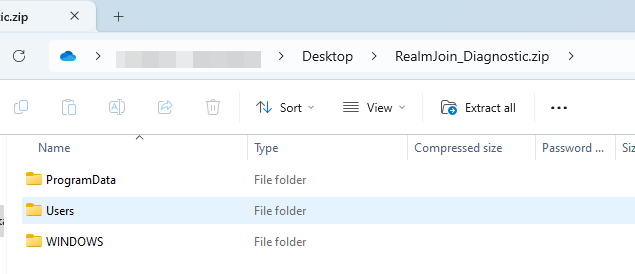

# Package Installation Issues

This guide will focus on troubleshooting failed RealmJoin software package installations.

## Required log files

Without log files a failed software package installation cannot be properly troubleshooted.\
The required log files needed for troubleshooting failed installations reside in several location on the local client:

* `C:\WINDOWS\Logs\realmjoin*.log`
* `C:\WINDOWS\Logs\RealmJoin`
* `%LOCALAPPDATA%\RealmJoin\tray*.log`
* `%LOCALAPPDATA%\RealmJoin\Logs`
* `C:\ProgramData\chocolatey\logs\`

Please always provide the ZIP file containing the logs with any service request raised to the RealmJoin support.

<figure><figcaption>
File structure of a RealmJoin exported logs ZIP file
</figcaption></figure>

\
The following chapters will explain on how to obtain the logs, how to analyze them, and will explain some common issues and fixes for these common issues.
