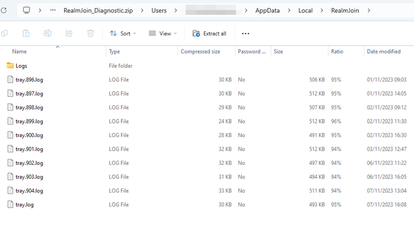
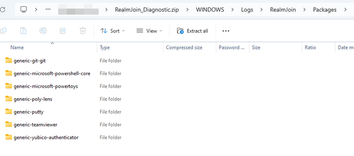

# Logfiles Structure

## User-Context Logfiles

The user-context logfiles written by RealmJoin can be found in `%LOCALAPPDATA\RealmJoin`. This folder contains `tray.log` files and the subfolder `Logs`.

### tray.log

The `tray.log` files are written by the RealmJoin tray application, which is running in the logged on users session. `tray.log` is the most-recent log file, older ones are suffixed with an ascending number, where the highest number is the second-most recent log file. The lower the number, the older the log file.

<figure><figcaption>
tray.log is the most recent file, tray.904.log the second-most recent. The logs subfolder may contain individual setup logs.
</figcaption></figure>

The `tray.log` includes information about various tasks carried out by the RealmJoin tray application:

* Information about assigned packages, including dependencies, order, contraints, planned operations, restrictions
* Package inventory with status (Installed, Outdated, NotInstalled)
* Running and completed deployment phases
* RealmJoin config and client updates
* RealmJoin tray startup information
* Changes to LAPS accounts
* Commandline output from user context installation packages.

### Logs subfolder

In the `%LOCALAPPDATA\RealmJoin\Logs` folder you may find folders named like package IDs. Only craft packages running in user context will potentially write individual setup logs in this folder.\
As this is not always the case, this folder may also be empty.\
If the user craft installation included a MSI or EXE file, you maybe able to find setup logs inside the corresponding package folder.

## Chocolatey Logfiles

The chocolatey log files are written to `C:\ProgramData\chocolatey\logs\`. There are two different log files `chocolatey.log` and `choco.summary.log`.\
As the `choco.summary.log` only includes basic information, solely `chocolatey.log` is used for troubleshooting.

## System-Context Logfiles

The system-context log files are located inside `C:\WINDOWS\Logs`. Inside the folder you will find `realmjoin.log` files as well as the `RealmJoin` folder.

### realmjoin.log

The `realmjoin.log` files are written by the RealmJoin CloudConnector service, which is started on-demand by the RealmJoin tray application. The RealmJoin CloudConnector service is running in the Local Sytem account. `realmjoin.log` is the most-recent log file, older ones are suffixed with an ascending number, where the highest number is the second-most recect log file. The lower the number, the older the log file.

As the `realmjoin.log` file contains information from the RealmJoin service, it includes logs about tasks that need to be executed with system priviliges:

* RealmJoin service startup information
* Creation and deletion of LAPS accounts
* Commandline output from system context / choco installation packages.

### Logs folder 

In the `C:\WINDOWS\Logs\RealmJoin\Packages` folder you will find folders named like package IDs. If supported by the setup file and package, logs written by the setup file will be found in the equivalent folder. The logfilename will usually include the timestamp of the installation, package id, setup filename, package version and the action taken (install/uninstall). As this is not always the case, these (sub)folders may also be empty.

<figure><figcaption>
Packages folder containing subfolders for each package, which may contain installer-written log files.
</figcaption></figure>
