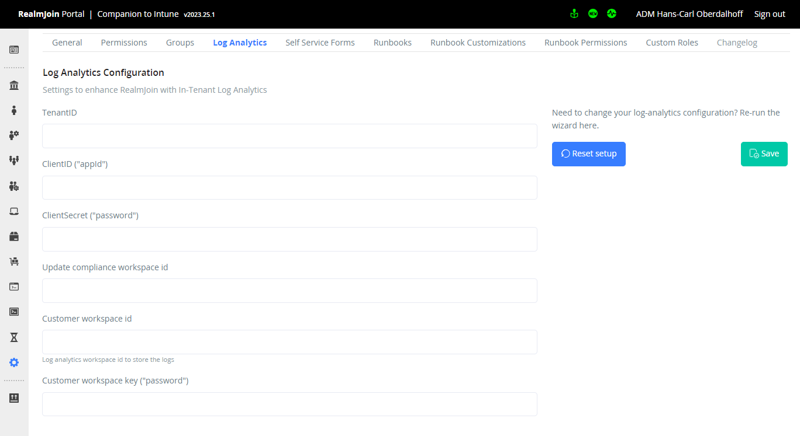

# Group Details

 (1) (1) (1) (1) (1) (1).png>)

This page shows you details regarding a single group.

### Object Types

The category "groups" includes:

* AzureAD static and dynamic groups
* Exchange Online mail-enabled groups and distribution groups
* Microsoft Office365 groups and teams

### **Object Properties**

Every group details page will show an overview of the core properties like

* Name
* AzureAD Object ID
* Additional properties&#x20;

on the left side of the screen in a glanceable way. This part will not scroll and be always visible in any tab.

### Status information

The core properties include some glanceable information about the status of a user object:

* **Unified** - A Office365 group or Team group
* **Security** - An AzureAD (non-Office365) group
* **Mail enabled** - This group can receive eMail
* **Teams** - This group represents a Team
* **Static** - Members are assigned statically (manually) to a group
* **Dynamic** - Members are chosen via a membership rule, typically to group devices

Be aware of the different types of groups accross AzureAD and Exchange Online. A group is either a "**Security**" or a "**Unified**" group. Also, some groups like "**Security**" groups that are "**Mail enabled**" (like Distribution groups) can only be managed via Exchange Online, not AzureAD.

### Members

RealmJoin Portal will show you the current members of a group. It will show internal and external ("Guest") users separately. You can search/filter the members of a group using the on-screen search fields.

On AzureAD groups ("Non-mail enabled security" and "Unified") you can use RealmJoin Portal to add or remove members - if you have the appropriate permissions.&#x20;

Please use a [runbook ](../../runbooks/)to change owners of a group or to change memberships to Exchange Online groups, like Distribution Groups.

 (1) (1) (1).png>)

#### Adding Members

Using the "**Add**" button will show a dialogue where you can search for users to add to the group. You can search for users via Name or User Principal Name / eMail address.

 (1) (1) (1) (1) (1).png>)

Press "+" to add a member to the group. The resulting membership will take a short time and not be immedaitely visible.

#### Removing Members

Using the "**Remove**" button will not show a new dialogue but add a "x" icon in front of existing members. You can still search/filter for members via Name or User Principal Name / eMail address while this is active.

 (1).png>)

Press the "x" icon to remove a member. The resulting change will take a short time and not be immedaitely visible.

### Runbooks Tab

If you have been given Supporter or Admin-Permissions, this gives you access to runbooks that can be executed on this group object. For example to change an email-address of a distribution list.

See[ Process Automation](../../runbooks/) for more information.

### Settings Tab

You can assign Key-Value pairs of data to specific groups of users to control RealmJoin Clients behavior for these users.

<figure><figcaption>
Settings for this group
</figcaption></figure>

You can add a setting assigned to this group using , alternatively open an existing setting by clicking on its name/key or search by name/key.

Clicking a name/key will open a UI allowing you to manipulate/create the setting.&#x20;

<figure><figcaption>
Settings Editor
</figcaption></figure>

Be aware: The value of the setting must be valid JSON, which includes singular values like `true` or strings (without brackets).

The switches in the lower half of the wizard allow scoping this setting to certain scenarios like VDI / Windows365 machines.

Please see [Available Settings](../../realmjoin-client/additional-settings.md) for more information on which settings can be used.

### Tabs

The right side of the screen shows the contents of the current tab, which can be&#x20;

* "Overview" with more information about the object
* "[Runbooks](../../runbooks/)" showing available runbooks - as the name implies
* Raw [data sources](../#data-sources), like AzureAD, Sign in logs etc display in JSON. Only available for RealmJoin administrators.
